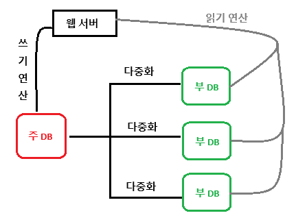
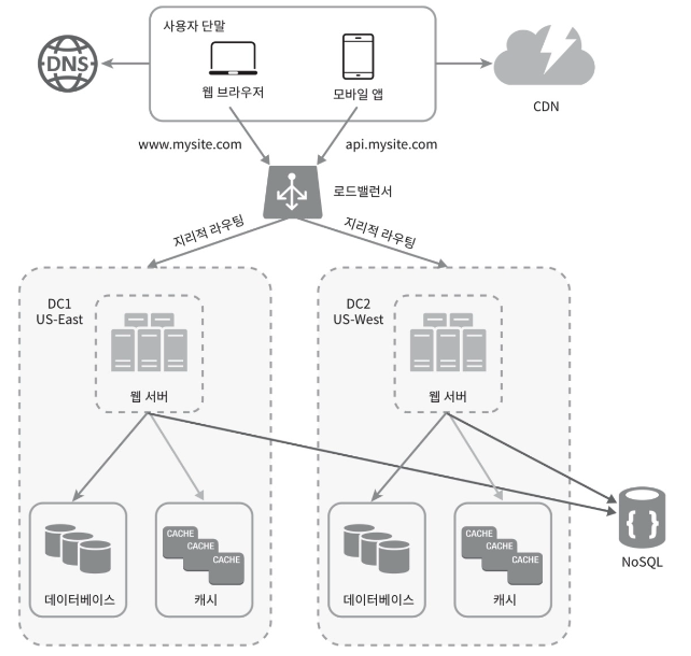
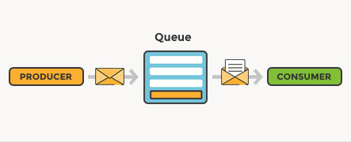
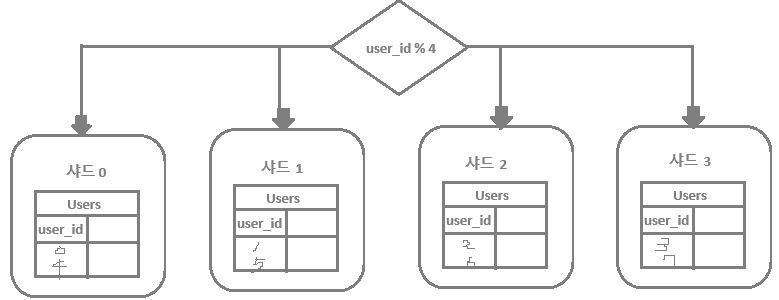
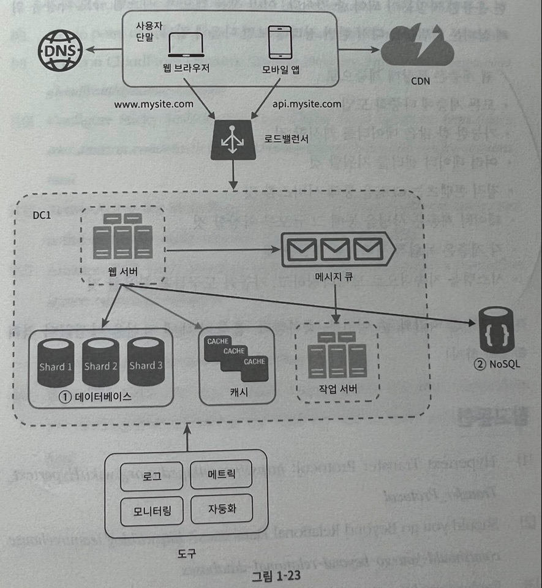

## 01. 사용자 수에 따른 규모 확장성

### 데이터베이스
* 관계형 데이터 베이스(RDB, RDBMS) : 자료를 테이블과 열, 칼럼으로 표현한다. SQL을 사용하면 여러 테이블에 있는 데이터를 그 관계에 따라 조인하여 합칠 수 있다.
    * ex. MySQL, 오라클 DB, PostgreSQL
* 비 관계형 데이터 베이스(NoSQL) : 일반적으로 조인 연산은 지원하지 않는다.
    * 종류류
        1. 키-값 저장소
        2. 그래프 저장소
        3. 칼럼 저장소
        4. 문서 저장소
    * NoSQL 선택 기준
        * 아주 낮은 응답 지연시간(latency)이 요구됨.
        * 다루는 데이터가 비정형(unstructered)이라 관계형 데이터가 아님.
        * 데이터(JSON, YAML, XML 등)를 직렬화하거나 역직렬화 할 수 있기만 하면 됨.
        * 아주 많은 양의 데이터를 저장할 필요가 있음.

### 수직적 규모 확장 VS 수평적 규모 확장
* 수직적 규모 확장 ( = 스케일 업(scale up)) : 서버에 고사양 자원(더 좋은 CPU, 더 많은 RAM 등)을 추가하는 행위
    * 좋은 선택 : 서버로 유입되는 트래픽의 양이 적을 때 
    * 장점 : 단순함.
    * 단점 : 한 대의 서버에 CPU나 메모리를 무항대로 증설할 수 없음(확장 한계). 장애에 대한 자동복구(failover) 방안이나 다중화(re-dundancy) 방안을 제시하지 않음.( => 서버 장애 발생 시 완전히 중단됨.)
* 수평적 규모 확장 ( = 스케일 아웃(scale out)) : 더 많은 서버를 추가하여 성능을 개선하는 행위
    * 좋은 선택 : 대규모 애플리케이션을 지원할 때
    * 웹 계층 시 로드 밸런서 사용. 데이터 계층 시 데이터 베이스 다중화 사용

#### 로드 밸런서(웹 계층)
* when? 너무 많은 사용자가 접속하여 웹 서버가 한계 상황에 도달하게 되면 응답 속도가 느려지거나 서버 접속이 불가능해질 수 있다. 이 때, 문제를 해결하는데는 부하 분산기 또는 로드밸런서를 도입하는 것이 최선이다.
* **로드 밸런서** : 부하 분산 집합에 속한 웹 서버들에게 트래픽 부하를 고르게 분산하는 역할.
    * 흐름 : 사용자는 로드밸런서의 공개 IP 주소로 접속 -> 서버 간 통신에는 사설 IP 주소를 사용해 웹 서버에 접속한다
    > 사설 IP 주소 : 같은 네트워크에 속한 서버 사이의 통신에만 쓰일 수 있는 IP 주소
    * 장점 : 장애를 자동복구할 수 있으며, 웹 계층의 가용성(availability)은 향상된다.
        * ex. 서버 1이 다운 시 모든 트래픽은 서버 2로 전송된다. 따라서 웹 사이트 전체가 다운되는 일이 방지된다.
        * ex. 웹 사이트로 유입되는 트래픽이 가파르게 증가하면 로드 밸런서가 있기에 웹 서버 계층에 더 많은 서버를 추가하기만 하면 된다. 그러면 로드 밸런서가 자동적으로 트래픽을 분산한다. 

#### 데이터베이스 다중화(데이터 계층)
* 데이터베이스 다중화 : 서버 사이에 주(master)-부(slave) 관계를 설정하고 데이터 원본은 주 서버에, 사본은 부 서버에 저장하는 방식
    * 대부분 애플리케이션은 <u>읽기 연산의 비중 > 쓰기 연산의 비중</u> 이다. <br/>
    => 따라서 부 DB의 수가 주 DB보다 많다.
    * 장점
        * 더 나은 성능 : 모든 데이터 변경 연산은 주 DB가 읽기 연산은 부 DB로 분산되어, 병렬로 처리될 수 있는 질의(query)의 수가 늘어나므로 성능이 좋아짐.
        * 안정성(reliability) : DB 서버 일부가 파괴되어도 데이터는 보존됨. 데이터를 지역적으로 떨어진 여러 장소에 다중화 시켜 놓을 수 있음. 
        * 가용성(availability) : 데이터를 여러 지역에 복제해 둠으로써, 한 DB 서버에 장애가 발생하더라도 다른 서버에 있는 데이터를 가져와 계속 서비스할 수 있게 된다.
    * ex 1. 주 DB가 다운되면 한 대의 부 DB가 주 DB로 수행되며 새로운 부 DB서버가 추가된다. : 부 DB에 보관된 데이터가 최신 상태가 아닐 경우 없는 데이터는 복구 스크립트를 돌려서 추가해야 한다.(다중 마스터나 원형 다중화 방식을 도입하면 이런 상황에 대처하는데 도움이 될 수 있음.)
    * ex 2-1. 부 DB가 1대 뿐인데 다운되면 주 DB에 한시적으로 읽기 연산이 전달된다. 그리고 즉시 새로운 부 DB 서버가 장애 서버를 대체한다. 
    * ex 2-2. 부 DB가 여러대인데 한 대가 다운되면 나머지 부 DB에  읽기 연산이 분산된다. 그리고 즉시 새로운 부 DB 서버가 장애 서버를 대체한다. 
* 주 DB : 쓰기 연산은 마스터에서만 지원한다. 데이터베이스를 변경하는 명령어들(insert, delete, update)는 주 DB에서만 사용해야 한다.
* 부 DB : 주 DB로부터 그 사본을 전달받으며, 읽기 연산만을 지원한다.


##### LB + DB 다중화
1. 사용자는 DNS로부터 로드밸런서의 공개 IP 주소를 받는다.
2. 사용자는 해당 IP 주소를 사용해 로드 밸런서에 접속한다.
3. HTTP 요청은 서버 1이나 서버 2로 전달된다.
4. 웹 서버는 사용자의 데이터를 부 DB 서버에서 읽는다.
5. 웹 서버는 데이터 변경 연산(insert, delete, update)을 주 DB로 전달한다.

### 캐시
* when? 응답 시간은 캐시(cache)를 붙이고 정적 콘텐츠를 콘텐츠 전송 네트워크(content Delivery Network, CDN)로 옮기면 개선할 수 있다.
* **캐시** : 값비싼 연산 결과 또는 자주 참조되는 데이터를 메모리를 안에 두고 뒤이은 요청이 보다 빨리 처리될 수 있도록 하는 저장소.
> 애플리케이션의 성능 : DB를 얼마나 자주 호출하느냐

* 캐시 계층 : 데이터가 잠시 보관되는 곳. DB보다 훨씬 빠름.
    * 장점 : 성능이 개선되며 DB의 부하를 줄일 수 있고, 캐시 계층의 규모를 독립적으로 확장시키는 것도 가능해진다.
    * 읽기 주도형 캐시 전략
        1. 웹 서버의 요청이 캐시에 있으면 캐시에서 데이터를 읽음.
        2. 데이터가 캐시에 없다면 DB에서 해당 데이터를 읽어 캐시에 씀. 
    * 캐시 서버를 이용하는 방법
        ```java
        // memcached API
        SECONDS = 1
        cache.set('myKey', 'hi there', 3600 * SECONDS)
        cache.get('myKey')
        ```

* 캐시 사용 시 유의할 점
    * 캐시는 어떤 상황에 바람직한가?
        * 데이터 갱신은 자주 일어나지 않지만 참조는 빈번하게 일어난다면 고려
    * 어떤 데이터를 캐시에 두어야 하는가?
        * 캐시는 데이터를 휘발성 메모리에 두므로, 영속적으로 보관할 데이터를 두면 x.(= 캐시 서버가 재시작되면 캐시 내의 모든 데이터는 사라짐으로 중요 데이터는 지속적 저장소에 두어야 함.)
    * 캐시에 보관된 데이터는 어떻게 만료되는가?
        * 만료된 데이터는 캐시에서 삭제되어야 하며 만료 정책이 없으면 데이터는 캐시에 계속 남게 된다.
        * 만료 시간이 짧으면 DB를 너무 자주 읽음. 길면 원본과 차이가 날 가능성이 높아짐.
    * 일관성(consistency)은 어떻게 유지되는가? 
        * 일관성 : 데이터 저장소의 원본과 캐시 내의 사본이 같은지 여부
        * 저장소의 원본을 갱신하는 연산과 캐시를 갱신하는 연산이 단일 트랜잭션으로 처리되지 않으면 일관성이 깨질 수 있다.
    * 장애에는 어떻게 대처할 것인가?
        * 캐시 서버를 한 대만 두는 경우 해당 서버는 단일 장애 지점(Single Point of Failure, SPOF)이 되어보릴 수 있다.
        * 단일 장애 지점 : 어떤 특정 지점에서의 장애가 전체 시스템의 동작을 중단시켜버릴 수 있는 경우, 해당 지점을 단일 장애 지점이라고 부름.
        * 결과적으로, SPOF를 피하려면 여러 지역에 걸쳐 캐시 서버를 분산시켜야 한다.
    * 캐시 메모리는 얼마나 크게 잡을 것인가?
        * 캐시 메모리를 과할당(overprivision)한다.
        * 캐시 메모리가 너무 작으면 액세스 패턴에 따라서는 데이터가 너무 자주 캐시에서 밀려나버려 캐시의 성능이 떨어지게 된다.
    * 데이터 방출(eviction) 정책은 무엇인가?
        * 캐시 데이터 방출 정책 : 캐시가 꽉 차버리면 추가로 데이터를 넣어야 할 때 기존의 데이터를 내보내는 방법
        * LRU(Leaset Recently Used) : 마지막으로 사용된 시점이 가장 오래된 데이터를 내보내는 방법. (일반적)
        * LFU(Least Frequently Used) : 사용된 빈도가 가장 낮은 데이터를 내보내는 방법.
        * FIFO(First In First Out) : 가장 먼저 캐시에 들어온 데이터를 가장 먼저 내보내는 방법.

### 콘텐츠 전송 네트워크(CDN)
* CDN : 정적 콘텐츠를 전송하는데 쓰이는, <u>지리적으로 분산된 서버의 네트워크.</u> 이미지, 비디오, CSS, JavaScript 등을 캐시할 수 있음.
    > 동적 콘텐츠 캐싱 : 요청 경로, 질의 문자열, 쿠키, 요청 헤더 등의 정보에 기반하여 HTML 페이지를 캐시하는 것.
    * 동작 : 사용자가 웹 사이트 방문 -> 그 사용자에게 가장 가까운 CDN 서버가 정적 콘텐츠를 전달함. (사용자가 CDN 서버로부터 멀면 멀수록 웹사이트는 천천히 로드됨.) 
    * 장점 : 사이트 로딩 시간을 개선해줌.

* CDN 사용 시 고려해야 할 사항
    * 비용 : CDN은 보통 제 3 사업자(third-party provider)에 의해 운영되며, 우리는 CDN으로 들어가고 나가는 데이터 전송 양에 따라 요금을 내게 된다.
    * 적절한 만료 시간 : 시간에 민감한 콘텐츠의 경우 만료 시점을 잘 설정해야 함.
    * CDN 장애에 대한 대처 방안 : 가령 일시적으로 CDN이 응답하지 않을 경우, 해당 문제를 감지하여 원본 서버로부터 직접 콘텐츠를 가져오도록 클라이언트를 구성하는 것이 필요할 수 있다.
    * 콘텐츠 무효화(invalidation) 방법 : 아직 만료되지 않은 콘텐츠라 하더라도 아래 방법을 사용하면 CDN에서 제거할 수 있다.
        * 방법 1 : CDN 서비스 사업자가 제공하는 API를 이용하여 콘텐츠 무효화
        * 방법 2 : 콘텐츠의 다른 버전을 서비스하도록 오브젝트 버저닝(object versioning)이용. 콘텐츠의 새로운 버전을 지정하기 위해서는 URL 마지막에 버전 번호를 인자로 주면 된다.(ex. image.png?v=2)

### 무상태(stateless) 웹 계층
* 웹 계층을 수평적으로 확장할 때 필요한 점 : 상태 정보(사용자 세션 데이터와 같은)를 웹 계층에서 제거하기. 
    * 바람직한 전략 : 상태 정보를 관계형 데이터베이스나 NoSQL 같은 지속성 저장소에 보관하고, 필요할 때 가져오도록 하기. <u>== **무상태 웹 계층**</u>이다.

* 상태 정보 의존적인 아키텍쳐 : 서버는 클라이언트 정보(상태)를 유지하여 요청들 사이에 공유되도록 한다.
    * 문제 사항 : 같은 클라이언트로부터의 요청은 항상 같은 서버로 전송되어야 함.<br>
    => 대부분의 로드밸런서가 이를 지원하기 위해 고정 세션(sticky session)의 기능을 제공하지만 이는 로드밸런서에 부담을 준다.<br>
    => 또한 로드밸런서 뒷단에 서버를 추가하거나 제거하기도 까다로워지며 서버의 장애를 처리하기도 복잡해진다.

* 무상태 아키텍쳐 : 사용자로부터의 HTTP 요청은 어떤 웹 서버로도 전달될 수 있다.
    * 웹 서버는 상태 정보가 필요할 경우 공유 저장소로부터 데이터를 가져온다. 따라서 상태 정보는 웹 서버로부터 물리적으로 분리되어 있다.<br>
    => 공유 저장소 ex : 관계형 DB, Memcached/Redis 캐시 시스템, NoSQL .. 등
    * 이런 구조의 장점 : 단순하고 안정적이며 규모 확장이 쉽다.
    * 웹 서버의 자동 규모 확장 : 트래픽 양에 따라 웹 서버를 자동으로 추가하거나 삭제하는 기능으로, 상태 정보가 웹 서버들로 제거되었으므로 이 기능이 가능하게 되었다.

### 데이터 센터
* when? 웹사이트가 핫해졌을 때 가용성을 높이고 전 세계 어디서도 쾌적하게 사용할 수 있게 하기 위해서는 여러 데이터 센터를 지원하는 것이 필수다.
* 장애가 없는 상황에서 사용자는 지리적으로 가까운 데이터 센터로 안내된다.
    * 지리적 라우팅 사용 : 사용자의 위치에 따라 도메인 이름을 어떤 IP 주소로 변환할 지 결정할 수 있도록 하는 DNS 서비스
    * 한 쪽이 장애가 있을 경우 모든 트래픽은 장애가 없는 데이터 센터로 전송됨.
* **데이터 센터** : 지리적으로 있는 웹 서버 + DB + 캐시
* 다중 데이터 센터 아키텍쳐를 만들기 위한 기술적 난제
    * 트래픽 우회 : 올바른 데이터 센터로 트래픽을 보내는 효과적인 방법 찾기 (GeoDNS : 사용자에게서 가장 가까운 데이터 센터로 트래픽 보내기)
    * 데이터 동기화(syncronization) : 데이터를 여러 데이터센터에 걸쳐 다중화 하는 것. (ex. 데이터 센터마다 별도의 데이터베이스를 사용할 때, 장애가 자동으로 복구되어 트래픽이 다른 데이터센터로 우회되도 해당 데이터센터에는 찾는 데이터가 없을 수 있다.)
    * 테스트와 배포(deployment) : 여러 데이터 센터를 사용하도록 시스템이 구성된 상황일 때 웹 사이트 또는 애플리케이션을 여러 위치에서 테스트해보는 것이 중요함.


### 메시지 큐
* when? 시스템의 컴포넌트를 분리하여 각기 독립적으로 확장될 수 있도록 하여야 한다. 이 때 메시지 큐는 많은 실제 분산 시스템이 이 문제를 풀기 위해 채용하고 있는 핵심적 전략 중 하나이다. 
* **메시지 큐** : 메시지의 무손실(durability, 즉 메시지 큐에 일단 보관된 메시지는 소비자가 꺼낼 때까지 안전히 보관된다는 특성)을 보장하는 비동기 통신을 지원하는 컴포넌트
    * 메시지의 버퍼 역할을 하며, 비동기적으로 전송한다.
    * 기본 아키텍쳐 : 
        1. 생산자(발행자)라고 불리는 입력 서비스가 메시지를 만들어 메시지 큐에 발행(publish)한다.
        2. 큐에는 보통 소비자 혹은 구독자라 불리는 서비스(서버)가 연결되어 있는데, 메시지를 받아 그에 맞는 동작을 수행하는 역할을 한다.
        
    * 장점 : 
        * 서비스 또는 서버 간 결합이 느슨해져서, 규모 확장성이 보장되어야 하는 안정적 애플리케이션을 구성하기 좋다.
        * 생산자는 소비자 프로세스가 다운되어 있어도 메시지를 발행할 수 있고, 소비자는 생산자 서비스가 가용한 상태가 아니더라도 메시지를 수신할 수 있다.
    * 사용 예 : 이미지의 크로핑, 샤프닝, 블러링 등을 지원하는 사진 보정 애플리케이션. <br/>
    => 이런 보정은 시간이 오래 걸리 수 있는 프로세스이므로 비동기적으로 처리하면 편리하다.
    => 1. 웹 서버는 사진 보정 작업(job)을 메시지 큐에 넣는다. <br/>
    => 2. 사진 보정 작업(worker) 프로세스들은 이 작업을 메시지 큐에서 꺼내어 비동기적으로 완료한다.<br/>
    => 이렇게 하면 생산자와 소비자 서비스의 규모는 각기 독립적으로 확장될 수 있다.<br/>

### 로그, 메트릭 그리고 자동화
* 웹 사이트의 규모가 커질 때는 로그나 메트릭, 자동화 도구에 필수적으로 투자해야 한다.
* **로그** : 시스템의 오류와 문제들을 보다 쉽게 찾아낼 수 있도록 하는 에러 로그를 모니터링하는 것은 중요함.
* **메트릭** : 메트릭을 잘 수집하면 사업 현황에 관한 유용한 정보를 얻을 수도 있고 시스템의 현재 상태를 손쉽게 파악할 수 있음.
    * 호스트 단위 메트릭 : CPU, 메모리, 디스크 I/O에 관한 메트릭
    * 종합 메트릭 : 데이터베이스 계층의 성능, 캐시 계층의 성능
    * 핵심 비즈니스 메트릭 : 일별 능동 사용자, 수익, 재방문 같은 것들
* **자동화** : 생산성을 높이기 위해 자동화 도구를 활용해야 함. 개발 생산성 향상. 지속적 통합(continuous integration)을 도와주는 도구를 활용하면 개발자가 만드는 코드가 어떤 검증 절차를 자동으로 거치도록 할 수 있어서 문제를 쉽게 감지 할 수 있음. 

##### MQ + 로그, 메트릭, 자동화 등을 반영
* MQ는 각 컴포넌트가 보다 느슨히 결합될 수 있도록 하고, 결함에 대한 내성을 높인다.
* 로그, 모니터링, 메트릭, 자동화 등을 지원하기 위한 장치를 데이터 센터에 추가.

### 데이터베이스의 규모 확장
* 저장할 데이터가 많아지면 DB에 대한 부하도 증가할 때, DB를 증설할 방법
    1. 수직적 규모 확장법
    2. 수평적 규모 확장법

##### 수직적 확장 (=스케일 업)
* 수직적 확장 : 기존 서버에 더 많은 고성능의 자원(CPU, RAM, 디스크 등)을 증설하는 방법
    * ex. 아마존 AWS의 RDS는 24TB RAM을 갖춘 서버도 상품으로 제공중. (천만명의 사용자 전부를 단 한대의 마스터 데이터베이스로 처리할 수 있음.)
    * 약점
        * DB 서버 하드웨어에는 한계가 있으므로 CPU, RAM 등을 무한 증설할 수는 없다. 사용자가 계속 늘어나면 한 대 서버로는 결국 감당하기 어려움.
        * SPOF(Single Point of Failure)로 인한 위험성이 크다.
        * 비용이 많이 든다. 고성능 서버로 갈수록 가격이 올라가게 된다.

##### 수평적 확장 (=스케일 아웃 = 샤딩)
* 샤딩 : 대규모 데이터베이스를 샤드(shard)라고 부르는 작은 단위로 분할하는 기술. <br/>
=> DB의 수평적 확장. <u>더 많은 서버를 추가함으로써 성능을 향상시키는 것.</u> 
    * 모든 샤드는 같은 스키마를 쓰지만 샤드에 보관되는 데이터 사이에는 중복이 없다.
    * ex. 샤드로 분할된 DB의 예 : 사용자 데이터를 어느 샤드에 넣을지는 사용자 ID에 따라 해시함수를 사용하여 정함.
        

* 샤딩 전략을 구현할 때 가장 중요한 것 : **샤딩 키(sharding key)를 어떻게 정하느냐**
* 샤딩 키 = 파티션 키 : 데이터가 어떻게 분산될지 정하는 하나 이상의 칼럼으로 구성됨. (위의 예시로는 user_id가 샤딩키)
    * 샤딩 키를 통해 올바른 데이터베이스에 질의를 보내어 데이터 조회나 변경을 처리하므로 효율을 높일 수 있다.
    * 샤딩 키를 정할 떄는 데이터를 고르게 분할 할 수 있도록 하는게 가장 중요함.
* 샤딩키 도입으로 인한 새로운 문제
    * 데이터의 재샤딩(resharding) : (1) 데이터가 너무 많아져서 하나의 샤드로는 더 이상 감당하기 어려울 때와 (2)샤드 간 데이터 분포가 균등하지 못하여 어떤 샤드에 할당된 공간 소모가 다른 샤드에 비해 빨리 진행될 때(= 샤드 소진) 재 샤딩이 필요함. 안정 해시 기법 추천
    * 유명인사 문제 (= 핫스팟 키 문제) : 특정 샤드에 질의가 집중되어 서버에 과부하가 걸리는 문제.
        * ex. 유명인사들이 같은 샤드에 저장되는 문제
    * 조인과 비정규화 : 일단 하나의 DB를 여러 샤드 서버로 쪼개고 나면, 여러 샤드에 걸친 데이터를 조인하기가 힘들어짐. => 해결방법 : 데이터베이스를 비정규화하여 하나의 테이블에서 질의가 수행될 수 있도록 함.

##### DB 샤딩 적용
* DB에 대한 부하를 줄이기 위해 굳이 관계형 DB가 요구되지 않는 기능은 NoSQL로 이전함.


### 백만 사용자, 그리고 그 이상
* 시스템의 규모를 확장하는 것은 지속적이고 반복적인 과정 => 시스템을 최적화하고 더 작은 단위의 서비스로 분할해야 할 수도 있다.

### 정리
* 시스템 규모 확장을 위한 기법들
    1. 웹 계층은 무상태 계층으로
    2. 모든 계층에 다중화 도입
    3. 가능한 한 많은 데이터를 캐시할 것
    4. 여러 데이터 센터를 지원할 것
    5. 정적 콘텐츠는 CDN을 통해 서비스할 것
    6. 데이터 계층은 샤딩을 통해 그 규모를 확장할 것
    7. 각 계층은 독립적 서비스로 분할할 것
    8. 시스템을 지속적으로 모니터링하고, 자동화 도구들을 활용할 것