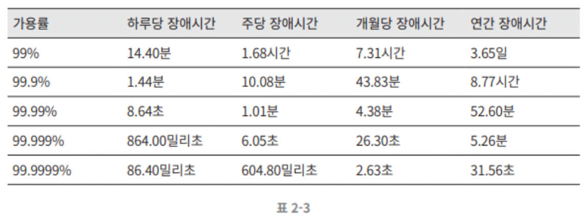

## 02. 개략적인 규모 추정
* 개략적인 규모 추정 : 보편적으로 통용되는 성능 수치상에서 사고 실험을 행햐여 추정치를 계산하는 행위로, 어떤 설계가 요구사항에 부할할 것인지 보기 위한 것
* 2의 제곱수, 응답지연 값, 가용성에 관계된 수치들 잘 알기

### 2의 제곱수
* 데이터 볼륨 단위의 최소 단위 : 1바이트 = 8비트 (ASCII 문자 하나의 메모리 크기 = 1바이트)
* 데이터 볼륨 단위
    |2의 X 제곱|근사치|이름|축약형|
    |---------|-----|-----|-----|
    |10|1천|1킬로바이트|1KB|
    |20|1백만|1메가바이트|1MB|
    |30|10억|1기가바이트|1GB|
    |40|1조|1테라바이트|1TB|
    |50|1000조|1페타바이트|1PB|

### 모든 프로그래머가 알아야 하는 응답지연 값

* 위의 수치들의 분석 결과
    * 메모리는 빠르지만 디스크는 아직 느림
    * 디스크 탐색(seek)은 가능한 한 피하기
    * 단순한 압축 알고리즘은 빠르다.
    * 데이터를 인터넷으로 전송하기 전에 가능하면 압축하라.
    * 데이터 센터는 보통 여러 지역에 분산되어 있고, 센터들 간에 데이터를 주고받는데는 시간이 걸린다.

### 가용성에 관계된 수치들
* **고가용성(high availability)** : 시스템이 오랜 시간 동안 지속적으로 중단 없이 운영될 수 있는 능력 (100% = 시스템이 단 한 번도 중단된 적이 없었음)
    * 가용시간은 관습적으로 9를 사용하며, 9가 많을 수록 좋음.
* SLA(Service Level Agreement) : 서비스 사업자와 고객 사이에 맺어진 합의 (여기에 서비스 사업자가 제공하는 서비스의 가용시간(uptime)이 공식적으로 기술되어 있음.)
* 가용시간의 9의 개수와 시스템 장애 시간(downtime) 사이의 관계
    

### 예제 : 트위터 QPS와 저장소 요구량 추정
* 가정
    * 월간 능동 사용자는(MAU) : 3억명
    * 50%의 사용자가 트위터를 매일 사용함.
    * 평균적으로 각 사용자는 매일 2건의 트윗을 올림.
    * 미디어를 포함하는 트윗은 10% 정도다.
    * 데이터는 5년간 보관된다.
* 추정
    * QPS(Query Per Second) 추정치
        * 일간 능동 사용자(DAU) = 3억 * 50% = 1.5억
        * QPS = 1.5억 * 2트윗 / 24시간 / 3600초 = 약 3500
        * 최대 QPS(Peek QPS) = 2 * QPS = 약 7000
    * 미디어 저장을 위한 저장소 요구량
        * 평균 트윗 크기
            * tweet_id에 64바이트
            * 텍스트에 140바이트
            * 미디어에 1MB
        * 미디어 저장소 요구량 = 1.5억 * 2 * 10% * 1MB = 30TB/일
        * 5년간 미디어를 보관하기 위한 저장소 요구량 = 30TB * 365 * 5 = 약 55PB 

### 팁 
* 문제 해결 능력 중점
    * 근사치를 활용한 계산
    * 가정들은 적어두기
    * 단위를 붙이기
    * 많이 출제되는 개략적 규모 추정 문제 : QPS, 최대 QPS, 저장소 요구량, 캐시 요구량, 서버 수 등을 추정하는 것