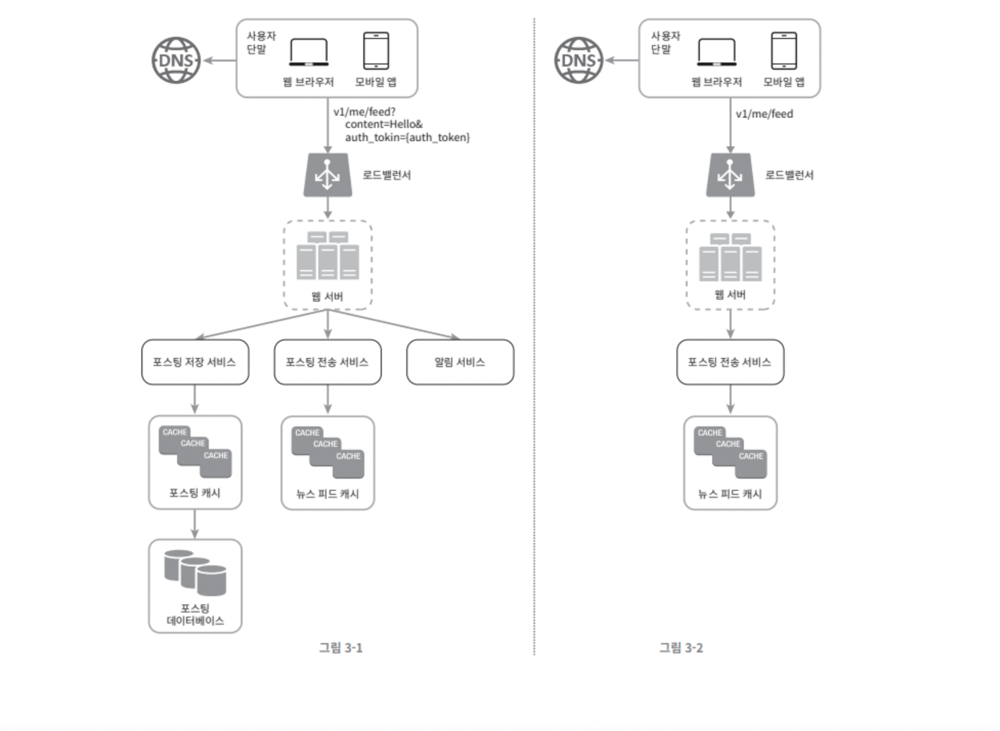

## 03. 시스템 설계 면접 공략법
* 시스템 설계 면접 : 두 명의 동료가 모호한 문제를 풀기 위해 협력하여 그 해결책을 찾아내는 과정에 대한 시뮬레이션
* 협력에 적합한지, 압박이 심해도 잘 헤쳐 나갈지, 모호한 문제를 건설적으로 해결할 능력이 있는지, 좋은 질문을 던질 능력이 있는지 등을 살펴봄.
* 설계의 순수성에 집착해 과도한 엔지니어링을 하는지(시스템 전반의 비용이 올라간다는 사실을 알아채지 못하고 값비싼 대가를 치름), 완고한지, 편협한지 살펴봄

### 시스템 설계 문제를 공략하는 효과적 면접을 위한 4단계 접근법
1. 문제 이해 및 설계 범위 확정
    * 요구사항과 가정들을 분명히 하라.
    * 엔지니어가 가져야 할 가장 중요한 기술 : 올바른 질문을 하는 것, 적절한 가정을 하는 것, 시스템 구축에 필요한 정보를 모으는 것
    * 생각해볼 질문들
        * 구체적으로 어떤 기능들을 만들어야 하나?
        * 제품 사용자 수는 얼마나 되나?
        * 회사의 규모는 얼마나 빨리 커지리라 예상하나? 3개월, 6개월, 1년 뒤의 규모는 얼마가 되리라 생각하는가?
        * 회사가 주로 사용하는 기술 스택은 무엇인가? 설계를 단순화 하기 위해 활용할 수 있는 기존 서비스로는 어떤 것들이 있는가?
    * ex. 뉴스 피드 시스템을 설계하라
        * 모바일 앱과 웹 앱 중 어느쪽을 지원해야 하는가? 둘 다?
        * 가장 중요한 기능은 무엇인가?
        * 피드는 시간 어느 정렬 기준을 갖고 있는가?(피드에 올라갈 때마다 다른 가중치가 부여되는지 - 가령 가까운 친구의 포스트가 사용자 그룹에 올라갈 포스트보다 중요하다거나)
        * 한 사용자는 최대 몇 명의 사용자와 친구를 맺을 수 있는가?
        * 사이트로 오는 트래픽 규모는 어느 정도인가?
        * 피드에 이미지나 비디오도 올라올 수 있는가? 아니면 그저 텍스트 인가?
    * 결론 : 이 단계에서 요구사항을 이해하고 모호함을 없애는 것이 가장 중요한 점

2. 개략적인 설계안 제시 및 동의 구하기
    * 초점 : 개략적인 설계안을 제시하고 면접관의 동의를 얻기
    * 생각해볼 질문들
        * 설계안에 대해 최초 청사진을 제시하고 의견 구하기. : 면접관을 팀원인 것처럼 대하기
        * 화이트보드나 종이에 핵심 컴포넌트를 포함하는 다이어그램 그리기 : 클라이언트, API, 웹 서버, 데이터 저장소, 캐시, CDN, 메시지 큐
        * 최초 설계안이 시스템 규모에 관계된 제약사항을 만족하는지 개략적으로 계산하기. : 이런 계산 과정이 필요한지 미리 확인 필요
        * 시스템의 구체적 사용 사례도 살펴보기 : 엣지 케이스 발견을 위함
        * APi 엔드포인트나 DB 스키마도 보여야하는지 확인하기
    * ex. 뉴스 피드 시스템을 설계하라.
        * 개략적으로 2가지의 처리 플로 : 피드 발행, 피드 생성
        * 피드 발행 : 사용자가 포스트를 올리면 관련된 데이터가 캐시/데이터베이스에 기록되고, 해당 사용자의 친구 뉴스 피드에 뜨게 된다.
        * 피드 생성 : 어떤 사용자의 뉴스 피드는 해당 사용자 친구들의 포스트를 시간 역순으로 정렬하여 만든다.
        

3. 상세 설계
    * 설계 대상 컴포넌트 사이의 우선순위를 정하기
    * ex. 단축 URL 생성기 설계 : 해시 함수의 설계를 구체적으로 설명하는 것을 듣길 원함.
    * ex. 채팅 시스템에 관한 문제 : 어떻게 하면 지연시간을 줄이고 사용자의 온/오프라인 상태를 표시할 것인지

4. 마무리
    * 개선할 점은 언제나 있기 마련이라 완벽하다느니 개선할 부분이 없다느니 하지 말기
    * 만든 설계를 다시 한번 요약해주기
    * 오류 발생시 무슨 일이 생기는지(서버 오류, 네트워크 장애 등)
    * 운영 이슈 논의 : 메트릭은 어떻게 수집하고 모니터링할 것인가? 로그는? 시스템은 어떻게 배포해 나갈 것인가?
    * 미래에 대한 확장 규모 요구에 대한 대처

* 총 과정 중 해야 할 것
    * 질문을 통해 확인하라
    * 문제의 요구사항을 이해하라
    * 정답이나 최선의 답안은 없다
    * 면접관과 소통하라 : 나의 사고 흐름을 이해할 수 있도록.
    * 가능한 여러 해법을 제시하라
    * 개략적 설계에 면접관이 동의 시, 각 컴포넌트의 세부사항을 설명하기 시작하라(중요한 컴포넌트 부터)
    * 면접관의 아이디어를 이끌어내기
    * 포기하지 말기
* 하지 말아야 할 것
    * 전형적인 면접 문제들에도 대비하지 않은 상태로 가기
    * 요구사항이나 가정을 분명히 하지 않고 가정하기
    * 처음부터 특정 컴포넌트의 세부사항을 깊게 설명하기
    * 진행중 막힐 때, 힌트를 안받으려하기
    * 소통을 주저하기
    * 설계안을 내놓고 면접이 끝났다고 생각하기

* 시간 배분 (ex. 45분)
    * 1단계 - 문제 이해 및 설계 범위 확정 : 3분 ~ 10분
    * 2단계 - 개략적 설계안 제시 및 동의 구하기 : 10분 ~ 15분
    * 3단계 - 상세 설계 : 10분 ~ 25분
    * 4단계 - 마무리 : 3분 ~ 5분 