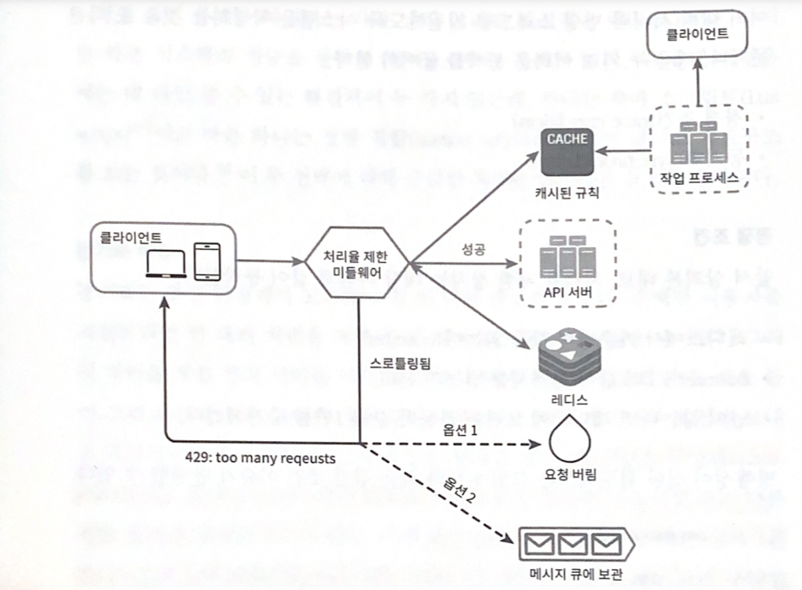

## 04. 처리율 제한 장치의 설계
* 처리율 제한 장치 : 서비스가 보내는 트래픽의 처리율을 제어하기 위한 장치
    * HTTP : API 요청 횟수가 제한 장치에 정의된 임계치를 넘어서면 이후의 호출은 모두 중단된다.
    * ex1. 사용자는 초당 2회 이상의 새글을 올릴 수 없다. 
    * ex2. 같은 IP 주소로는 하루에 10개 이상의 계정을 생성할 수 없다.
    * ex3. 같은 디바이스로는 주당 5회 이상 리워드를 요청할 수 없다.
* API에 처리율 제한 장치를 둠으로써 장점
    * DoS(Denial of Service) 공격에 의한 자원 고갈 방지
    * 비용 절감 : 추가 요청에 대한 처리를 제한하면 서버를 많이 두지 않아도 됨.
    * 서버 과부하를 막는다 : 봇에서 오는 트랙픽이나 사용자의 잘못된 이용 패턴으로 유발된 트래픽을 걸러내는데 처리율 제한 장치를 사용할 수 있다.

### 1. 문제 이해 및 설계 범위 확정
1. 문제 이해 및 설계 범위 확정
    * 어떤 종류의 처리율 제한 장치인가? 클라이언트측? 서버측? : 서버측 API를 위한 장치
    * 기준은 어떠한가? IP 주소? 사용자 ID? : 다양한 형태의 제어 규칙을 제어할 수 있는 유연한 시스템
    * 시스템 규모는? 스타트업 정도? 큰 기업을 제품? : 대규모 요청을 처리할 수 있을 정도
    * 분산 환경에서 동작해야 하는가? : yes
    * 이 처리율 제한 장치는 독립된 서비스인가? 아니면 애플리케이션 코드에 포함될 수 있는가? : 본인 마음대로
    * 사용자의 요청이 처리율 제한 장치에 의해 걸러진 경우 사용자에게 그 사실을 알려야 하는가? : yes
    * 요약된 요구사항
        * 설정된 처리율을 초과하는 요청은 정확하게 제한한다.
        * 낮은 응답시간 : HTTP 응답시간에 나쁜 영향을 주지 말기
        * 가능한 한 적은 메모리 사용
        * 분산형 처리율 제한 : 하나의 처리율 제한 장치를 여러 서버나 프로세스에서 공유할 수 있어야 함.
        * 예외 처리 : 요청이 제한되었을 때는 그 사실을 사용자에게 분명하게 보여주어야 함.
        * 높은 결함 감내성 : 제한 장치에 장애가 생기더라도 전체 시스템에 영향을 주어서는 안됨.

### 2. 개략적 설계안 제시 및 동의 구하기
2. 개략적 설계안 제시 및 동의 구하기
    * **처리율 제한 장치는 어디에 둘 것인가?**
        * 클라이언트 측에 둔다면 : 클라이언트는 요청의 위변조가 가능해 처리울 제한을 안정적으로 걸 수 있는 장소가 못됨.
        * 서버 측에 둔다면 : <u>API서버측에 두는 방법</u>과 <u>미들웨어를 만들어 통제하는 방법</u>이 있음. (HTTP 상태 코드 : 429 - Too many requests) 
        * 클라우드 마이크로서비스의 경우, 처리율 제한 장치는 보통 API 게이트웨이라 불리는 컴포넌트에 구현됨.
            * API 게이트웨이 : 미들웨어. 처리율 제한, SSL 종단, 사용자 인증, IP 허용 목록 관리 등을 지원하는완전 위탁관리형 서비스로 클라우드 업체가 유지 보수를 담당하는 서비스
        * 적용 기준 : 기술 스택 점검(서버 측 구현이 용이한지), 처리율 제한 알고리즘 서치, API 게이트웨이가 이미 설계에 있다면 처리율 제한 기능 또한 게이트웨이에 포함, 인력 생각
    * **처리율 제한 알고리즘**
        * 토큰 버킷
            * 지정된 용량을 갖는 컨테이너. 토큰당 요청을 처리하며 토큰이 없을경우 요청은 버려짐.
            * 필수 인자 : 버킷 크기(버킷에 담을 수 있는 최대 토큰수), 토큰 공급률(초당 버킷에 공급되는 토큰수)
            * API 엔드포인트마다 별도의 버킷을 사용. IP주소별의 경우 IP주소별로 버킷을 할당. 전체 시스템 처리율을 초당 제한 시 하나의 버킷을 공유하도록 할당함.
            * 장점 : 구현이 쉬움. 메모리 사용이 효율적. 짧은 시간에 집중되는 트래픽도 처리 가능함
            * 단점 : 버킷 크기와 토큰 공급률을 적절하게 튜닝하는 것이 까다로움.
        * 누출 버킷
            * FIFO. 토큰 버킷과 비슷하지만 요청 처리율이 고정되어 있다.
            * 큐를 사용하여 큐에 자리가 있을 경우 요청을 추가. 자리가 없을 경우 새 요청은 버림. 지정된 시간마다 큐에서 요청을 꺼내어 처리함.
            * 필수 인자 : 버킷 크기(버킷에 담을 수 있는 최대 토큰수 = 큐 사이즈), 토큰 공급률(초당 버킷에 공급되는 토큰수)
            * 장점 : 큐의 크기가 제한되어 있어 메모리 사용량 측면에서 효율적임. 고정된 처리율을 갖고 있어 메모리 사용량 측면에서 효율적임.
            * 단점 : 단기간에 많은 트래픽이 몰리는 경우 큐에는 오래된 요청이 쌓이게 되고 그 요청들을 제때 처리 못하면 최신 요청들은 버려지게 됨. 버킷 크기와 토큰 공급률을 적절하게 튜닝하는 것이 까다로움.
        * 고정 윈도 카운터
            * 타임라인을 고정된 간격의 윈도로 나누고 각 윈도마다 카운터를 붙임.
            * 문제점 : 윈도 경계 부근에 순간적으로 많은 트래픽이 집중될 경우 윈도에 할당된 양보다 더 많은 요청이 처리될 수 있다.
            * 장점 : 메모리 효율이 좋음. 이해하기 쉬움. 윈도가 닫히는 시점에 카운터를 초기화하는 방식은 특정한 트래픽 패턴을 처리하기에 적합함.
            * 단점 : 윈도 경계 부근에서 일시적으로 많은 트래픽이 몰려드는 경우, 기대했던 시스템의 처리 한도보다 많은 양의 요청을 처리하게 됨.
        * 이동 윈도 로그
            * 요청의 타임스템프를 추적하여 새 요청의 타임스탬프를 로그에 넣는다. 로그의 크기가 허용치보다 같거나 작으면 요청을 시스템에 전달하고 그렇지 않을 경우 처리 거부
            * 장점 : 처리율 제한 메커니즘이 아주 정교함. 어느 순간의 윈도를 보더라도 허용되는 요청의 개수는 시스템의 처리율 한도를 넘지 않음.
            * 단점 : 다량의 메모리를 사용함.(거부된 요청의 타임스탬프도 보관하기 때문에)
        * 이동 윈도 카운터
            * 고정 윈도 카운터 + 이동 윈도 로깅 : 현재 1분간의 요청 수 + 직전 1분간의 요청 수 x 이동 윈도와 직전 1분이 겹치는 비율 (3+5*70% = 6.5개)
            * 장점 : 이전 시간대의 평균 처리율에 따라 현재 윈도의 상태를 계산하므로 짧은 시간대에 몰리는 트래픽에도 잘 대응함. 메모리 효율이 좋음.
            * 단점 : 직전 시간대에 도착한 요청이 균등하게 분포되어 있다고 가정한 상태에서 추정치를 계산하기 때문에 다소 느슨함.
    * 개략적인 아키텍쳐
        * 처리율 제한 알고리즘의 기본 아이디어 : 얼마나 많은 요청이 접수되었는지를 추적할 수 있는 카운터를 추적 대상별(사용자별, IP별, API 엔드포인트별..)로 두고, 이 카운터 값이 어떤 한도를 넘어서면 한도를 넘어 도착한 요청은 거부하는 것
        * 해당 카운터는 어디에 보관할 것인가? DB는 디스크 접근 때문에 느려서 사용 x. 메모리 상에서 동작하는 캐시가 바람직함.(빠르고 시간에 기반한 만료 정책을 지원하기 때문에)
            * redis는 처리율 제한 장치를 구현할 떄 자주 사용되는 메모리 기반 저장장치로서, INCR와 EXPIRE의 2가지 명령어를 지원함.
                * INCR : 메모리에 저장된 카운터의 값을 1만큼 증가시킴
                * EXPIRE : 카운터에 타임아웃 값을 설정함. 설정된 시간이 지나면 카운터는 자동으로 삭제됨.
        * 동작 원리
            1. 클라이언트가 처리율 제한 미들웨어에게 요청으로 보냄
            2. 처리율 제한 미들웨어는 레디스의 지정 버킷에서 카운터를 가져와서 한도에 도달했는지 아닌지를 검사함. 한도에 도달했다면 요청은 거부되고 도달하지 않았다면 요청은 API 서버로 전달된다.
            3. 미들웨어는 카운터의 값을 증가시킨 후 다시 레디스에 저장한다.

### 3. 상세 설계
3. 상세 설계
    * **처리율 제한 규칙**
        ```md
        # 시스템이 처리할 수 있는 마케팅 메시지의 최대치를 하루 5개로 제한
        domain: messaging
        descriptors:
            - key: message_type
                Value: marketing
                rate_limit:
                    unit: day
                    requests_per_unit: 5
        
        # 클라이언트가 분당 회 이상 로그인 할 수 없도록 제한
        domain: auth
        descriptors:
            - key: auth_type
                Value: login
                rate_limit:
                    unit: minute
                    requests_per_unit: 5
        ```
    * **처리율 한도 초과 트래픽의 처리**
        * HTTP 429 : too many requests
        * 한도 제한에 걸린 메시지를 큐에 보관하여 나중에 처리 가능. (ex. 주문이 시스템 과부하 때문에 한도 제한에 걸릴 때, 해당 주문들은 보관했다가 나중에 처리할 수 있다.)
            * **처리율 제한 장치가 사용하는 HTTP 헤더** - 클라이언트에게 전달 (클라이언트가 처리율 제한을 감지하는 법?! 👉 HTTP 응답 헤더를 통해!)
                * X-Ratelimit-Remaining: 윈도 내에 남은 처리 가능 요청의 수
                * X-Ratelimit-Limit: 매 윈도마다 클라이언트가 전송할 수 있는 요청의 수
                * X-Ratelimit-Retry-After: 한도 제한에 걸리지 않으려면 몇 초 뒤에 요청을 다시 보내야 하는지 알림
                * ex. 사용자가 너무 많은 요청을 보내면 429 오류를 X-Ratelimit-Retry-After 헤더와 함께 반환하도록 한다.
    * **상세 설계**
        
        * 처리율 제한 규칙은 디스크에 보관. 작업 프로세스(workers)는 수시로 규칙을 디스크에서 읽어 캐시에 저장한다.
        * 클라이언트의 요청 -> 처리율 제한 미들웨어에 도달
        * 처리율 제한 미들웨어는 제한 규칙을 캐시에서 가져옴. 카운터 및 마지막 요청의 타임스탬프를 레디스 캐시에서 가져온다.
            * 해당 요청이 처리율 제한에 걸리지 않을 떄 : API 서버로 보냄.
            * 해당 요청이 처리율 제한에 걸렸을 때 : 429 too many requests 에러를 클라이언트에 보냄 (해당 요청은 버릴 수도 메세지 큐에 저장할 수도 있음.)

    * **분산 환경에서의 처리율 제한 장치의 구현**
        * 여러 대의 서버와 병렬 스레드를 지원하도록 시스템을 확장할 경우 어려운 점 : 경쟁 조건(race condition), 동기화(synchronization)
        * **경쟁 조건**
            * 병행성이 심한 환경에서 동시에 레디스의 카운트 값을 읽고 증가시킬 경우
            * 해결책 : 락(성능을 상당히 떨어뜨림), 루아 스크립트, 정렬 집함(sorted set - 레디스 자료구조)
        * **동기화 이슈** 
            * 분산 환경에서 여러 서버들 사이의 동기화가 필요해짐
            * 해결책 : 고정세션(sticky session)을 활용하여 같은 클라이언트로부터의 요청은 항상 같은 처리율 제한 장치로 보내는 방법이 있지만 확장 가능성이나 유연성이 떨어져 비추, 레디스와 같은 중앙 집중형 데이터 저장소 사용하기(추천)
        * **성능 최적화**
            * 데이터 센터를 지원하는 문제 개선 : 데이터 센터에서 멀리 떨어진 사용자를 지원하려다보면 지연시간(latency)이 증가하니 에지 서버를 심어놓기
            * 제한 장치 간에 데이터를 동기화할 때 : 최종 일관성 모델 사용하기
        * **모니터링**
            * 역할 : 효과적으로 동작하고 있는지 보기 위한 방법
            * 확인하려는 것 : 채택된 처리율 제한 알고리즘이 효과적임. 정의한 처리율 제한 규칙이 효과적임.
            * ex. 처리율 제한 규칙이 너무 빡빡할 경우 : 많은 유효 요청이 처리되지 못하고 버려짐
            * ex. 깜짝 세일 같은 이벤트 때문에 트래픽이 급증할 때 처리율 제한 장치가 비효율적으로 동작한다면 알고리즘 고려 => 이런 때는 토큰 버킷이 적합함

### 4. 마무리
4. 마무리
    * 알고리즘 : 토큰 버킷, 누출 버킷, 고정 윈도 카운터, 이동 윈도 로그, 이동 윈도 카운터
    * 추가적으로 언급할 내용
        * 경성(hard) 또는 연성(soft) 처리율 제한
            * 경성 처리율 제한 : 요청의 개수는 임계치를 절대 넘어설 수 없다.
            * 연성 처리율 제한 : 요청 개수는 잠시 동안은 임계치를 넘어설 수 있다.
        * 다양한 계층에서의 처리율 제한
            *  애플리케이션 계층(HTTP: OSI 네트워크 계층도 기준으로 7번째 계층) 말고 Iptables(3번 계층)에서도 가능
            > OSI(Open Systems Interconnection model) : 1.물리, 2. 데이터 링크, 3. 네트워크, 4. 전송, 5. 세션, 6. 표현, 7. 애플리케이션
        * 처리율 제한을 회피하는 방법. 클라이언트를 어떻게 설계하는 것이 최선인가?
            * 클라이언트 측 캐시를 사용하여 API 호출 횟수를 줄인다.
            * 처리율 제한의 임계치를 이해하고, 짧은 시간 동안 너무 많은 메시지를 보내지 않도록 한다.
            * 예외나 에러를 처리하는 코드를 도입하여 클라이언트가 예외적으로 상황으로부터 우아하게 복구될 수 있도록 한다.
            * 재시도(retry) 로직을 구현할 때는 충분한 백오프(back-off) 시간을 둔다 