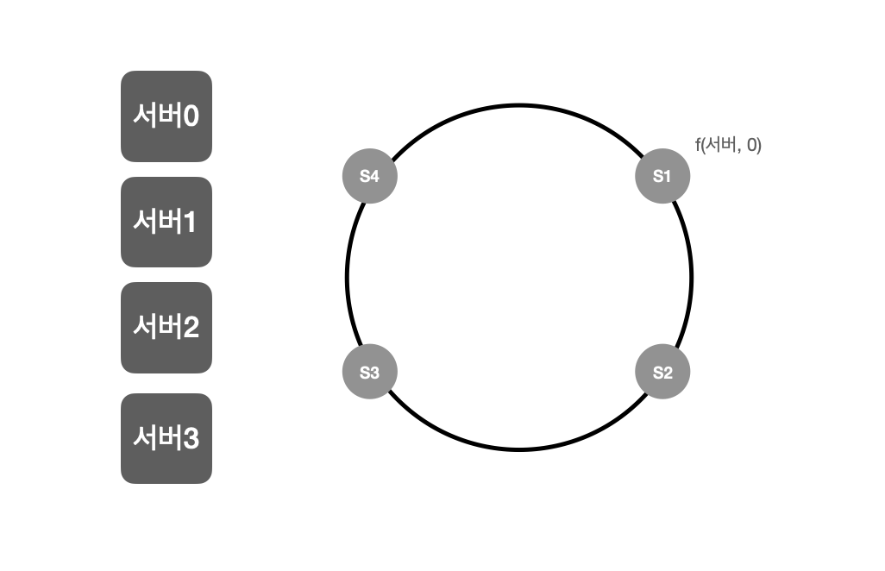
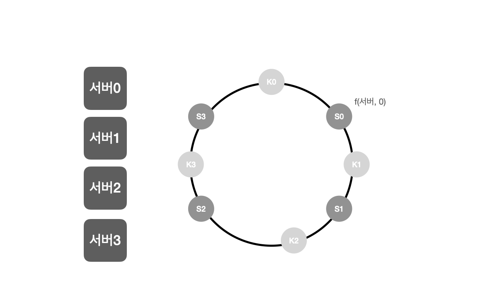
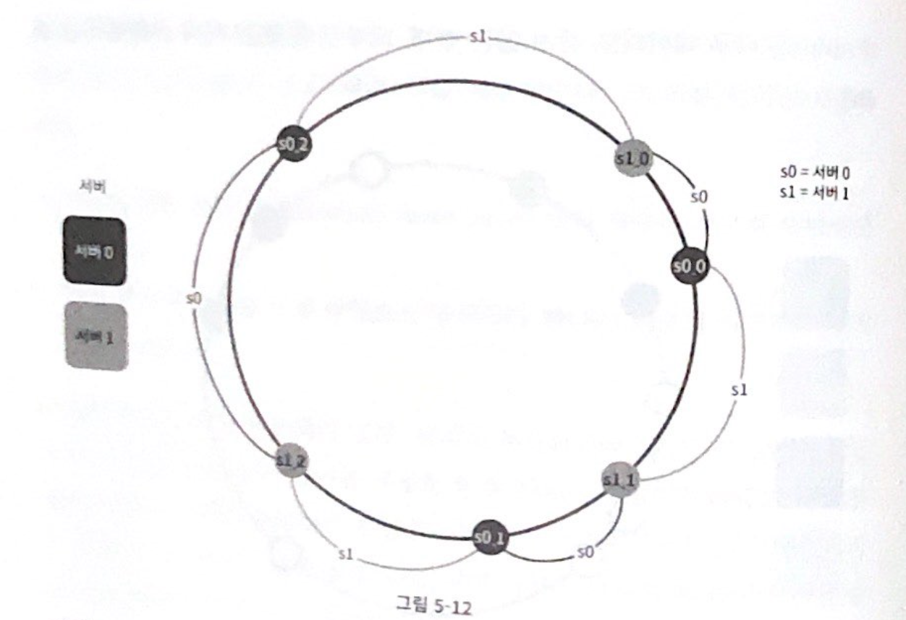

## 05. 안정 해시 설계
* 수평적 규모 확장성을 달성하기 위해서 : 요청 또는 데이터를 서버에 균등하게 나누는 것이 중요함.

### 해시 키 재배치(rehash) 문제
* 보편적 해시 함수(N개의 캐시 서버에 부하 나누기) : serverIndex = hash(key)%N
    * 서버 풀의 크기가 고정되어 있을 때, 데이터 분포가 균등할 때 잘 동작함.
    * 서버가 추가되거나 기존 서버가 삭제되면 문제가 생김 => 1번 서버가 죽으면 대부분 캐시 클라이언트가 데이터가 없는 엉뚱한 서버에 접속하게 됨. 그 결과 대규모 캐시 미스가 발생함. => 이 문제를 해결하기 위한 안정 해시

### 안정 해시
* 안정 해시 : 해시 테이블 크기가 조정될 때 평균적으로 오직 k/n개의 키만 재배치하는 해시 기술(k:키의 개수, n:슬롯의 개수)

##### 해시 공간과 해시 링
* 해시 함수 SHA-1의 해시 공간 범위 : 0 ~ 2^160 - 1 
* 해시 링 : 해시 함수의 공간을 길게 늘여뜨려 동그랗게 만든 모양

##### 해시 서버
* 서버 IP나 이름을 이 링 위의 어떤 위치에 대응시킬 수 있음

##### 해시 키
* 여기 사용된 해시 함수는 "해시 키 재배치 문제"에 언급된 함수와 다름. 나머지 연산(%)을 사용하고 있지 않음
* 예시로 key0는 서버0에 저장됨

##### 서버 조회
* 어떤 키가 저장되는 서버 : 해당 키의 위치로부터 시계 방향으로 링을 탐색해 나가면서 만나게 되는 첫번째 서버

##### 서버 추가
* 서버를 추가하더라도 키 가운데 일부만 재배치하면 됨.

##### 서버 제거
* 서버를 제거되면 키 가운데 일부만 재배치하면 됨.

##### 기본 구현법의 2가지 문제
* 절차
    1. 서버와 키를 균등 분포 해시 함수를 사용해 해시 링에 배치한다.
    2. 키의 위치에서 링을 시계 방향으로 탐색하다 만나는 최초의 서버가 키가 저장될 서버다.
* 문제점
    1. 파티션의 크기를 균등하게 유지하는 게 불가능함. => 삭제 또는 추가시 해당 부분만 넓어지거나 좁혀지기 때문에
    2. 키의 균등분포를 달성하기 어렵다. => 해결하기 위해 가상 노드(복제) 기법을 사용한다.

##### 가상 노드
* 가상 노드 : 실제 노드 또는 서버를 가리키는 노드로서, 하나의 서버는 링 위에 여러 개의 가상 노드를 가질 수 있다.
* 각 서버는 하나가 아닌 여러 개 파티션을 관리해야 함.

* 키의 위치로부터 시계방향으로 링을 탐색하다 만나는 최초의 가상 노드가 해당 키가 저장될 서버가 됨.
* 가상 노드의 개수를 늘리면 키의 분포는 점점 더 균등해진다.(표준 편차가 작아져서 데이터가 고르게 분포되기 때문에)

##### 재배치할 키 결정
* 해당 제거되고 새로 생긴 서버와 반시계방향으로 제일 1번째로 있는 서버까지의 키들

### 마치며
* 안정 해시의 이점
    * 서버가 추가되거나 삭제될 때 재배치되는 키의 수가 최소화됨.
    * 데이터가 보다 균등하게 분포하게 되므로 수평적 규모 확장성을 달성하기 쉬움.
    * 핫스팟 키 문제를 줄임: 특정한 샤드에 대한 접근이 지나치게 빈번하면 서버 과부하 문제가 생길 수 있음.
* 안정 해시 사용 예시 : 디스코드 채팅 앱, 아파치 카산드라클러스터에서의 데이터 파티셔닝, 아카마이 CDN, 매그레프 네트워크 부하 분산기