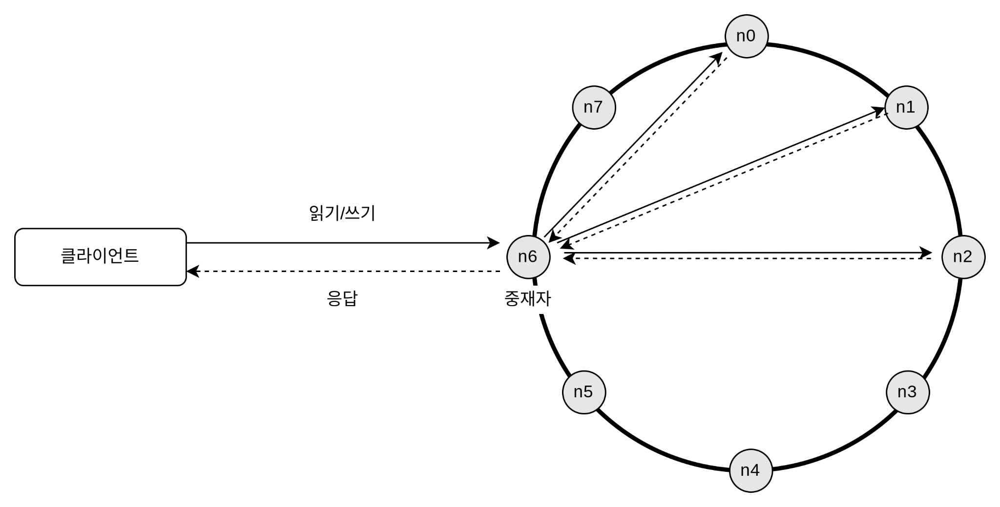

## 06. 키-값 저장소 설계
* 키-값 저장소(=키-값 데이터베이스) : 비 관계형 DB. 키는 유일하고 고유식별자여야 하며, 짧을수록 좋다.
* put(key, value)와 get(key) 연산을 지원하는 키-값 저장소 설계해보기

### 문제 이해 및 설계 범위 확정
* 읽기, 쓰기, 메모리 사용량 사이에 어떤 균형을 찾고 데이터 일관성과 가용성 사이에서 타협적 결정을 내린 설계정도면 ㅇㅋ
* 설계 범위
    * 키-값 쌍의 크기 : 10KB
    * 큰 데이터를 저장할 수 이써야 함.
    * 높은 가용성 제공 -> 따라서 시스템은 설사 장애가 있더라도 빨리 응답해야 함.
    * 높은 규모 확장성을 제공해야 한다. -> 따라서 트래픽 양에 따라 자동적으로 서버 증설/삭제가 이루어져야 함.
    * 데이터 일관성 수준은 조정이 가능해야 함.
    * 응답 지연시간(latency)이 짧아야 함.

### 단일 서버 키-값 저장소
* 단일일 경우 키-값 쌍 전부를 메모리에 해시 테이블로 저장하는 것 : but 빠른 속도를 보장하긴 하지만 모든 데이터를 메모리 안에 두는 것이 불가능함.
* 해결법 : 데이터 압축, 자주 쓰이는 데이터만 메모리에 두고 나머지는 디스크에 저장 
* 많은 데이터를 저장하려면 분산 키-값 저장소를 만들 필요가 있음.

### 분산 키-값 저장소
* 분산 키-값 저장소 = 분산 해시 테이블 : 키-값 쌍을 여러 서버에 분산시키기 때문에
* 분산 시스템 설계 시에는 CAP 정리를 이해하고 있어야 함. (CAP : Consistency, Availability, Partition Tolerance theorem)

##### CAP 정리
* CAP 정리 : 데이터 일관성, 가용성, 파티션 감내의 3가지 요구사항을 동시에 만족하는 분산 시스템을 설계하는것은 불가능하다.
    * 3가지 요구 사항
        * 데이터 일관성 : 분산 시스템에 접속하는 모든 클라이언트는 어떤 노드에 접속했느냐에 관계없이 언제나 같은 데이터를 보게 되어야 한다.
        * 가용성 : 분산 시스템에 접속하는 클라이언트는 일부 노드에 장애가 발생하더라도 항상 응답을 받을 수 있어야 한다.
        * 파티션 감내 : 파티션은 두 노드 사이에 통신 장애가 발생하였음을 의미하며, 파티션 감내는 네트워크에 파티션이 생기더라도 시스템은 계속 동작해야 한다는 의미
        * => 즉, CAP 정리는 이들 가운데 어떤 2가지를 충족하려면 나머지 하나는 반드시 희생되어야 한다는 것
        
    * 2가지를 충족할 경우
        * CP 시스템 : 일관성+파티션 감내를 지원하는 키-값 저장소. 가용성을 희생함.
        * AP 시스템 : 가용성+파티션 감내를 지원하는 키-값 저장소. 일관성을 희생함.
        * CA 시스템 : 일관성+가용성를 지원하는 키-값 저장소. 파티션 감내를 희생함. 하지만 통상 네트워크 장애는 피할 수 없는 일로 여겨지므로 분산 시스템은 반드시 파티션 문제를 감내할 수 있도록 설계되어야 한다.
    * ex. 3대의 복제 노드(n1,n2,n3)에 데이터를 복제하여 보관하는 상황
        * 이상적 상태 : 네트워크가 파티션되는 상황은 일어나지 않으며, n1에 기록된 데이터는 자동적으로 n2와 n3에 복제됨. 데이터 일관성과 가용성도 만족함. 
            
        * 실세계의 분산 시스템 : 파티션 문제를 피할 수 없다. n3에 장애 발생 시  n1,n2와 통신도 못하고 n3의 데이터를 n1,n2로 전달할 수 없다.
            
            * 일관성 선택 시 (CP 시스템) : 세 서버 사이에 생길 수 있는 데이터 불일치 문제를 피하기 위해 n1와 n2에 대해 쓰기 연산을 중단시킨다. 가용성이 깨짐. ex) 은행
            * 가용성 선택 시 (AP 시스템) : 설사 낡은 데이터를 반환할 위험이 있더라도 계속 읽기 연산을 허용하기. n1과 n2는 계속 쓰기 연산을 허용할 것이고 파티션 문제가 해결된 뒤에 새 데이터를 n3에 전송할 것이다.
    
##### 시스템 컴포넌트
* 키-값 저장소 구현에 사용될 핵심 컴포넌트들 및 기술들
    * 데이터 파티션
    * 데이터 다중화(replication)
    * 일관성(consistency)
    * 일관성 불일치 해소(inconsistency resolution)
    * 장애 처리
    * 시스템 아키텍처 다이어그램
    * 쓰기 경로(write path)
    * 읽기 경로(read path)
* 데이터 파티션
    * 데이터를 작은 파티션들로 분할한 다음 여러 대 서버에 저장하기
    * 데이터를 파티션 단위로 나눌 때 고려할 점 => <u>안정 해시</u>는 이런 문제를 푸는데 적합한 기술
        * 데이터를 여러 서버에 고르게 분산할 수 있는가
        * 노드가 추가되거나 삭제될 때 데이터의 이동을 최소화할 수 있는가
    * 안정 해시를 사용하여 데이터를 파티션하면 좋은점
        * 규모 확장 자동화(automatic scaling) : 시스템 부하에 따라 서버가 자동으로 추가되거나 삭제되도록 만들 수 있음.
        * 다양성(heterogeneity) : 각 서버의 용량에 맞게 가상 노드의 수를 조정할 수 있다. => 즉, 고성능 서버는 더 많은 가상 노드를 갖도록 설정할 수 있다.
* 데이터 다중화
    * 높은 가용성과 안정성을 확보하기 위새서는 데이터를 N개 서버에 비동기적으로 다중화하기.(N : 튜닝 가능한 값)
    
    * 가상 노드를 사용할 셩우 N개의 노드가 대응될 실제 물리 서버의 개수가 N보다 작아질 수 있다. 이 문제를 피하려면 노드를 선택할 때 같은 물리 서버를 중복 선택하지 않도록 해야 한다.
    * 같은 데이터 센터에 속한 노드는 정전 등의 문제를 동시에 겪을 가능성이 있다. 따라서 안정성을 담보하기 위해 데이터의 사본은 다른 센터의 서버에 보관하고 센터들은 고속 네트워크로 연결하기
* 데이터 일관성 
    * 여러 노드에 다중화된 데이터는 적절히 동기화가 되어 있어야 함. 정족수 합의 프로토콜 사용 시 읽기/쓰기 연산 모두에 일관성을 보장할 수 있음.
        * N : 사본 개수
        * W : 쓰기 연산에 대한 정족수. 쓰기 연산이 성공한 것으로 간주되려면 적어도 W개의 서버로부터 쓰기 연산이 성공했다는 응답을 받아야 함.
        * R : 읽기 연산에 대한 정족수. 읽기 연산이 성공한 것으로 간주되려면 적어도 R개의 서버로부터 읽기 연산이 성공했다는 응답을 받아야 함.
        * ex. N = 3
            
            * W = 1 : 데이터가 한 대의 서버에만 기록된다는 뜻이 x. 쓰기 연산이 성공했다고 판단하기 위해 중재자는 최소 1대 서버로부터 쓰기 성공 응답을 받아야 한다. 즉, s1로부터 성공 응답을 받았다면 s0, s2로부터의 응답은 기다릴 필요가 없다.
            * 중재자는 클라이언트와 노드 사이에서 프록시(proxy)역할을 한다.
            * W,R,N의 값을 정하는 것 : 응답 지연과 데이터 일관성 사이의 타협점을 찾는 전형적인 과정
            * W = 1 또는 R = 1 : 중재자는 한 대 서버로부터의 응답만 받으면 되니 응답속도는 빠름.
            * but, W > 1 또는 R > 1 : 데이터 일관성의 수준은 향상되지만 중재자의 응답속도는 가장 느린 서버로부터의 응답을 기다려야 하므로 느려질 것이다.
            * W + R > N : 강한 일관성이 보장됨
    * 설계 시 N, W, R 값 정하기
        * R = 1, W=N : 빠른 읽기 연산에 최적화된 시스템
        * W = 1, R=N : 빠른 쓰기 연산에 최적화된 시스템
        * W + R > N : 강한 일관성이 보장됨 (보통 N=3, W=R=2)
        * W + R <= N : 강한 일관성이 보장되지 않음.

    * **일관성 모델** : 키-값 저장소 설계 시 고려해야 할 중요한 요소
        * 종류
            * 강한 일관성 : 모든 읽기 연산은 가장 최근에 갱신된 결과를 반환함.
            * 약한 일관성 : 읽기 연산은 가장 최근에 갱신된 결과를 반환하지 못할 수 있다.
            * 최종 일관성 : 약한 일관성의 한 형태로, 갱신 결과가 결국에는 모든 사본에 반영(동기화)되는 모델
        * 강한 일관성을 달성하는 방법 : 모든 사본에 현재 쓰기 연산의 결과가 반영될 때까지 해당 데이터에 대한 읽기/쓰기를 금지하는 것(고가용성 시스템에 적합하지 x)
        * 최종 일관성 모델을 따를 경우 쓰기 연산이 병렬적으로 발생하면 시스템에 저장된 값의 일관성이 꺠어질 수 있는데, 이 문제는 클라이언트가 해결해야 함. ex) 카산드라
        * 클라이언트 측에서 데이터의 버전 정보를 활용해 일관성이 깨진 데이터를 읽지 않도록 하는 기법
            * **비 일관성 해소 기법 : 데이터 버저닝** : 데이터를 변경할 때마다 해당 데이터의 새로운 버전을 만드는 것. 각 버전의 데이터는 변경 불가능(immutable)하다.
            * **비 일관성 해소 기법 : 벡터 시계** : 2개의 서버의 값이 동시에 변경되었을 때 충돌되는 현상을 발견하고 자동으로 해결해냄. 
                * 동작 원리 : 데이터[서버, 버전](D([s1, v1],[s2,v2] ... [sn,vn]), D:데이터,v:버전 카운터,s:서버 번호)의 순서쌍으로 이루어져 있음.
                    * ex. 
                    1. ① 클라이언트가 데이터 D1을 시스템에 기록한다. 이 쓰기 연산을 처리한 서버는 Sx이다. 따라서 벡터 시계는 D1[Sx, 1]으로 변한다.
                    2. ② 다른 클라이언트가 데이터 D1을 읽고 D2로 업데이트한 다음 기록한다. D2는 D1에 대한 변경이므로 D1을 덮어쓴다. 이때 쓰기 연산은 같은 서버 Sx가 처리한다고 가정하자. 벡터 시계는 D2([Sx, 2])로 바뀔 것이다.
                    3. ③ 다른 클라이언트가 D2를 읽어 D3로 갱신한 다음 기록한다. 이 쓰기 연산은 Sy가 처리한다고 가정하자. 벡터 시계 상태는 D3([Sx, 2], [Sy, 1])로 바뀐다.
                    4. ④ 또 다른 클라이언트가 D2를 읽고 D4로 갱신한 다음 기록한다. 이때 쓰기 연산은 서버 Sz가 처리한다고 가정하자. 벡터 시계는 D4([Sx, 2], [Sz, 1])일 것이다.
                    5. ⑤ 어떤 클라이언트가 D3과 D4를 읽으면 데이터 간 충돌이 있다는 것을 알게 된다. D2를 Sy와 Sz가 각기 다른 값으로 바꾸었기 때문이다. 이 충돌은 클라이언트가 해소한 후에 서버에 기록한다. 이 쓰기 연산을 처리한 서버는 Sx였다고 하자. 벡터 시계는 D5([Sx, 3], [Sy, 1], [Sz, 1]) 로 바뀐다. 충돌이 일어났다는 것을 어떻게 감지하는지는 잠시 후에 더 자세히 살펴볼 것이다.
                    * 벡터 시계를 사용하면 어떤 버전 X가 버전 Y의 이전 버전인지 (따라서 충돌이 없는지) 쉽게 판단할 수 있다.
                * 단점 : 
                    1. 충돌 감지 및 해소 로직이 클라이언트에 들어가야 하므로 클라이언트 구현이 복잡해진다. 
                    2. [서버:버전]의 순서쌍 개수가 굉장히 빨리 늘어난다. => 해결 방법 : 길이에 어떤 임계치를 설정하고 임계치 이상으로 길이가 길어지면 오래된 순서쌍을 벡터 시계에서 제거하도록 해야 함. but 버전간 선후 관계가 정확하게 셜정될 수 없어서 충돌 해소 과정의 효율성이 낮아지게 됨. 

    * **장애 처리**
        * 장애 감지 -> 장애 해소
        * **장애 감지**
            * 분산 시스템에서는 2대 이상의 서버가 똑같이 서버 A의 장애를 보고해야 해당 서버에 실제로 장애가 발생했다고 간주함. => 모든 노드 사이에 멀티캐스팅 채널을 구축하는 것이 서버 장애를 감지하기 쉽다 => but, 서버가 많을 경우 비효율적
            * 분산형 장애 감지 솔루션인 "가십 프로토콜 솔루션" 채택이 효율적임
            > "가십 프로토콜 솔루션"
            > 
            > 1. 노드 s0은 멤버십 목록을 가진 상태다.
            > 2. 노드 s0은 노드 s2(멤버 ID=2)의 박동 카운터가 오랫동안 증가되지 않았다는 것을 발견한다.
            > 3. 노드 s0은 노드 s2를 포함하는 박동 카운터 목록을 무작위로 선택된 다른 노드에게 전달한다.
            > 4. 노드 s2의 박동 카운터가 오랫동안 증가되지 않았음을 발견한 모든 노드는 해당 노드를 장애 노드로 표시한다.  
        * **일시적 장애 처리**
            * 가십 프로토콜로 장애를 감지한 시스템은 가용성을 보장하기 위해 필요한 조치를 취해야 함.
            * 엄격한 정족수 접근법 : 읽기와 쓰기 연산을 금지
            * 느슨한 정족수 접근법 : 위 조건을 완화하여 가용성을 높임. 정족수 요구사항을 강제하는 대신, 쓰기 연산을 수행할 W개의 건강한 서버와 읽기 연산을 수행할 R개의 건강한 서버를 해시링에서 고름(장애 상태 서버는 무시함)
                * 일시적 장애 처리 방안 - <u>“단서 후 임시 위탁(hinted handoff)” 기법</u> : 장애 서버로 가는 요청은 다른 서버가 잠시 맡아 처리한다. 장애 서버가 복구되었을 때 그동안 발생한 변경사항은 일괄 반영하여 데이터 일관성을 보존한다. 이를 위해 임시로 쓰기 연산을 처리한 서버에는 그에 관한 단서(hint)를 남겨둔다.
        * **영구 장애 처리** 
            * 반-엔트로피 프로토콜 구현해 사본들을 동기화함.
            * 반-엔트로피 프로토콜은 사본들을 비교하여 최신 버전으로 갱신하는 과정을 포함한다. 가본 간의 일관성이 망가진 상태를 탐지하고 전송 데이터의 양을 줄이기 위해서는 머클(Merkle) 트리를 사용한다.
            * 머클 트리(=해시트리) : 각 노드에 그 자식 노드들에 보관된 값의 해시, 또는 자식 노드들의 레이블로부터 계산된 해시값을 레이블로 붙여두는 트리 - 이를 사용 시 대규모 자료 구조의 내용을 효과적이면서도 보안상 안전한 방법으로 검증할 수 있다.
            * 두 머클 트리의 비교는 루트 노드의 해시값을 비교하는 것으로 시작한다. 루트 노드의 해시 값이 일치한다면 두 서버는 같은 데이터를 갖는다. 그러면서 아래쪽으로 탐색해 나가다 보면 다른 데이터를 갖는 버킷을 찾을 수 있어서 그 버킷들만 동기화하면됨.
            * 머클 트리를 사용하면 동기화해야 하는 데이터의 양은 실제로 존재하는 차이의 크기에 비례할 뿐, 두 서버에 보관된 데이터의 총량과는 무관해짐 
        * **데이터 센터 장애 처리** 
            * 데이터 센터 장애에 대응할 수 있는 시스템을 만드려면 데이터를 여러 데이터 센터에 다중화하는 것이 중요함.
            * 한 데이터 센터가 완전히 망가져도 사용자는 다른 데이터 센터에 보관된 데이터를 이용할 수 있을 것임.

* 시스템 아키텍처 다이어그램
    
    * 클라이언트는 키-값 저장소가 제공하는 2가지 API로 통신한다(get, put)
    * 중재자는 클라이언트에게 키-값 저장소에 대한 프록시(proxy)역할을 하는 노드이다.
    * 노드는 안정 해시의 해시링 위에 분포한다.
    * 노드를 자동으로 추가, 삭제할 수 있도록 시스템은 완전히 분산된다.
    * 데이터는 여러 노드에 다중화된다.
    * 모든 노드가 같은 책임을 지므로, SPOF(Single Point of Failure)는 존재하지 않음.
    * 완전히 분산된 설계를 채택 시 지원해야 하는 기능 : 클라이언트 API, 장애 감지, 데이터 충돌 해소, 장애 복구 메커니즘, 다중화, 저장소 엔진 
    * **쓰기 경로** : 쓰기 요청이 특정 노드에 전달되면
        
        1. ① 쓰기 요청이 커밋 로그(commit log) 파일에 기록된다.
        2. ② 데이터가 메모리 캐시에 기록된다.
        3. ③ 메모리 캐시가 가득차거나 사전에 정의된 어떤 임계치에 도달하면 데이터는 디스크에 있는 SSTable에 기록된다.
        * SSTable은 Sorted-String Table의 약어로, <키, 값>의 순서쌍을 정렬된 리스트 형태로 관리하는 테이블이다.
    * **읽기 경로** : 읽기 요청이 특정 노드에 전달되면
        
        * 데이터가 메모리에 있는 경우
            1. ① 데이터가 메모리에 있는지 검사한다. 있으면 클라이언트에게 바로 반환한다.
        * 데이터가 메모리에 없을 경우
            1. ① 데이터가 메모리에 있는지 검사한다. 없으면 ②로 간다.
            2. ② 데이터가 메모리에 없으므로 블룸 필터를 검사한다.
            3. ③ 블룸 필터를 통해 어떤 SSTable에 키가 보관되어 있는지 알아낸다.
            4. ④ SSTable에서 데이터를 가져온다.
            5. ⑤ 해당 데이터를 클라이언트에게 반환한다.
            * 어느 SSTable에 찾는 키가 있는지 찾아내기 위해 Bloom filter가 흔히 사용된다.
            > 블룸 필터란? : 블룸 필터(Bloom filter)는 원소가 집합에 속하는지 여부를 검사하는데 사용되는 확률적 자료 구조이다.

### 요약
* 분산 키-값 저장소가 가져야 하는 기능과 그 기능 구현에 이용되는 기술

|목표/문제|기술|
|--------|----|
|대규모 데이터 저장|안정 해시를 사용해 서버들에 부하 분산|
|읽기 연산에 대한 높은 가용성 보장|데이터를 여러 데이터센터에 다중화|
|쓰기 연산에 대한 높은 가용성 보장|버저닝 및 벡터 시계를 사용한 충돌 해소|
|데이터 파티션|안정 해시|
|점진적 규모 확장성|안정 해시|
|다양성(heterogeneity)|안정 해시|
|조절 가능한 데이터 일관성|정족수 합의(quorum consenus)|
|일시적 장애 처리|느슨한 정족수 프로토콜(sloppy quorum)과 단서 후 임시 위탁(hinted handdoff)|
|영구적 장애 처리|머클 트리(Merkle tree)|
|데이터 센터 장애 대응|여러 데이터 센터에 걸친 데이터 다중화|

