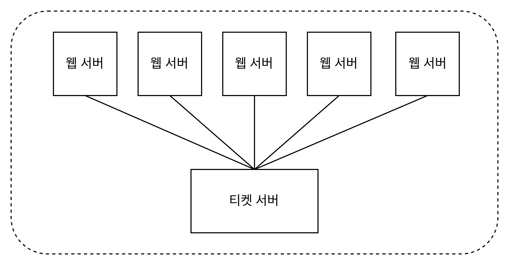
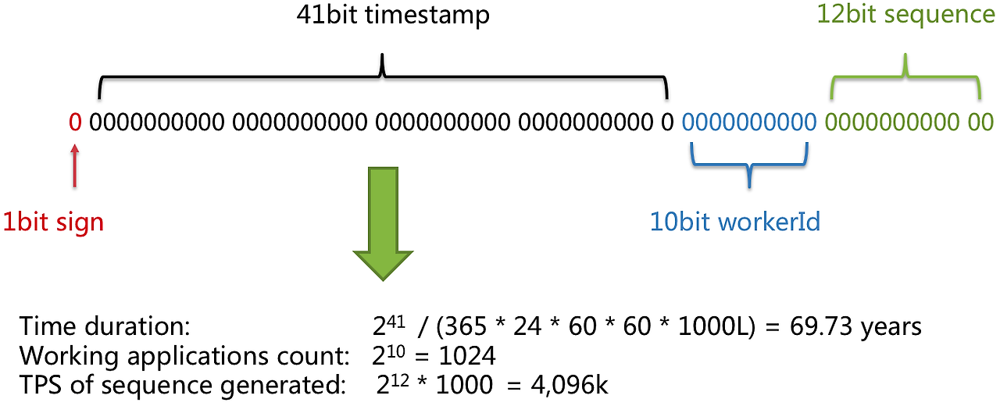
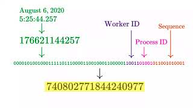

## 07. 분산 시스템을 위한 유일 ID 생성기 설계
* 분산 환경에서 auto_increment는 통하지 X

### 1단계: 문제 이해 및 설계 범위 확정
* ID 특성은 ? : 유일하고 정렬 가능해야 함
* 새로운 레코드에 붙일 ID는 항상 1만큼 큰값이여야 하는가? : 언제나 1은 아니더라도 더 늦게 만든게 더 큰 값을 가짐
* ID는 숫자로만 구성되는가? : yes
* 시스템 규모는 어느정도 인가? : 초당 10000ID를 생성할 수 있어야함.

### 2단계: 개략적 설계안 제시 및 동의 구하기
* 분산 시스템에서 유일성이 보장되는 ID를 만드는 방법
    * 다중 마스터 복제
    * UUID
    * 티켓 서버
    * 트위터 스노플레이크 접근법
    
#### **다중 마스터 복제**
* DB의 auto_increment 기능을 활용 : 다음 ID의 값을 구할 때 1만큼 증가시켜서 얻는 것이 아닌 k(: 현재 사용중인 DB서버의 수)만큼 증가시킴.
* 장점 : 규모 확장성 문제 해결 - DB수가 늘어날 때 초당 생산 가능 ID 수도 늘릴 수 있기 때문에
* 단점 : 
    * 여러 데이터 센터에 걸쳐 규모를 늘리기 어려움.
    * ID의 유일성은 보장되겠지만 시간순 정렬이 안됨.
    * 서버를 추가,삭제할 때도 잘 동작하게 하기 어려움
> * 참고
> * 실제로 Mysql에서 구현하려면 아래와 같이 increment 증가 값을 변경할 수 있다고 한다.
> * 특정 테이블에서만 증가 값을 변경하는 것은 불가능 하다고 하며
> * 특정 테이블에서만 증가 값을 핸들링 하고 싶다면 trigger 같은 것을 통해서 핸들링 해야한다고 한다.
> ```
> -- AUTO_INCREMENT 값을 k로 설정 SET @@auto_increment_increment=k;
> ```


#### **UUID(Universally Unique Identifier)**
* 유일성이 보장되는 ID를 만드는 방법.
* UUID : 컴퓨터 시스템에 저장되는 정보를 유일하게 식별하기 위한 128비트짜리 수.
* 충돌 가능성이 지극히 낮음 : 중복 UUID가 1개 생길 확률을 50%로 끌어올리려면 초당 10억개의 UUID를 100년 동안 계속 만들어야 함.
* 서버 간 조율 없이 독립적으로 생성 가능하며, 각 웹 서버에 별도의 ID 생성기를 붙여 사용할 수 있다.
* 장점
    * UUID를 만들기 단순함. 서버 사이의 조율이 필요 없어 동기화 이슈도 없다.
    * 규모 확장이 쉬움.
* 단점
    * ID가 128비트로 길다. (요구사항은 64비트)
    * 시간순 정렬 X
    * ID에 숫자가 아닌 값이 포함될 수 있다.
* ex. UUID (128비트): 보통 32자리 16진수 + 하이픈 (예: 550e8400-e29b-41d4-a716-446655440000)


#### **티켓 서버**

* <u>auto_increment 기능을 갖춘 데이터베이스 서버</u>, 즉 티켓 서버를 중앙 집중형으로 하나만 사용하는 것
* 장점 
    * 유일성 보장. 숫자로만 구성된 ID 쉽게 만들기
    * 구현이 쉽다. 중소 규모 애플리케이션에 적합함.
* 단점
    * 티켓 서버가 SPOF(Single-Point-of-Failure)가 됨. : 이 서버에 장애 발생 시 , 해당 서버를 이용하는 모든 시스템이 영향을 받는다. 해당 이슈를 피하려면 티켓 서버를 여러 대 준비해야 한다. => 하지만 그럴 경우 데이터 동기화 같은 새로운 문제가 발생함.

#### **트위터 스노플레이크 접근법**

* 스노플레이크는 트위터에서 공개한 ID 생성 기법이다.
* 위에서 살펴본 방식들 중에서 제대로 요구사항을 충족하는 방식은 없었다. 그러나 이 방식은 충족할 수 있다.
* 각개 격파 전략으로 생성해야 하는 ID의 구조를 여러 섹션으로 분할해보기
    
    * 사인(Sign) 비트: 1비트. 지금은 쓰임새가 없다. 나중을 위해 유보해둔 비트. 음양수 구별용
    * 타임스탬프(timestamp): 41비트를 할당. 기원 시간 이후 몇 밀리초(millisecond)가 경과했는지를 나타내는 값.
    * 데이터센터 ID: 5비트 할당. 32개의 데이터 센터를 지원할 수 있다.
    * 서버 ID: 5비트를 할당. 데이터 센터당 32개의 서버를 지원할 수 있다.
    * 일련번호: 12비트를 할당. 각 서버에서 ID를 생성할 때마다 이 일련 번호를 1만큼 증가시킨다. 이 값은 1밀리초가 경과할 때마다 0으로 초기화된다.

### 3단계: 상세 설계

* 트위터 스노플레이크 접근법을 사용한 상세 설계
* 데이터센터 ID와 서버 ID는 시스템이 시작할 때 결정되며, 운영중에는 바뀌지 않음. 데이터 센터ID나 서버ID를 잘못 변경하게 되면 ID 충돌이 일어날 수 이어 신중해야 함.
* 타임스탬프나 일련번호는 ID생성기가 돌고 있는 중에 만들어짐.

#### 타임스탬프
* 41비트를 차지함.
* 타임스탬프는 시간의 흐름에 따라 점점 큰 값을 갖게 되므로, 결국 ID는 시간 순으로 정렬 가능하게 될 것이다.

    * 앞부분을 십진수로 -> 트위터 기원시각 더하기 -> 결과로 얻어진 밀리초값을 UTC 시간으로 변환
    * 예제 JS 코드
        ```JS
        // 1. 현재의 timestamp를 구한다.
        let now = new Date();
        console.log(now.getTime());
        // 1685988380030

        // 기원 시간을 뺀다.
        // 트위터 기원 시간은 2010-11-04T01:42:54.657Z (1288834974657) 이다.
        // 시스템에 맞게 다시 재설정 하면 더 많은 데이터를 사용 가능할 것이다.
        let diff = now.getTime() - 1288834974657;
        console.log(diff)
        // 397153405373

        // 해당 값을 2진수로 변환하여 타임스탬프 부분에 넣는다.
        console.log(diff.toString(2));
        // 101110001111000001100000000100110111101
        ```
        > 41비트로 표현할 수 있는 시간은 약 69년

#### 일련번호
* 12비트로, 2^12=4096개의 값을 가질 수 있음.

### 4단계: 마무리
* 스노플레이크 선택 이유 : 모든 요구사항을 만족하면서도 분산 환경에서 규모 확장이 가능했기 때문에
* 추가 논의점
    * 시계 동기화(clock synchronization) : ID 생성 서버들이 전부 같은 시계를 사용하지 않을 경우. 하나의 서버가 여러 코어에서 실행될 경우 그럴 수 있음. => NTP(Network Time Protocol) 수단 사용
    * 각 절(section)의 길이 최적화 : 예를 들어 동시성(concurrency)이 낮고 수명이 긴 애플리케이션이라면 일련번호 절의 길이를 줄이고 타임스탬프 절의 길이를 늘리는 것이 효과적일 수 있다.
    * 고가용성(high availability) : ID 생성기는 필수 불가결(mission critical) 컴포넌트이므로 아주 높은 가용성을 제공해야 한다.