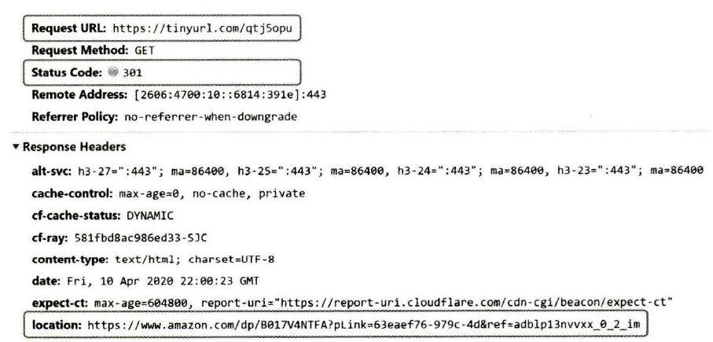
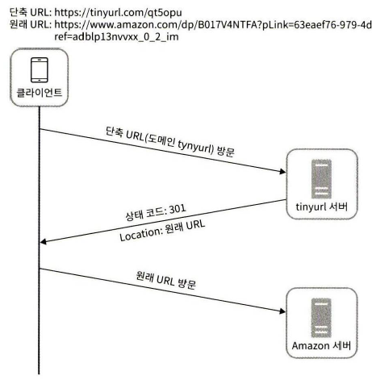
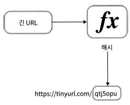
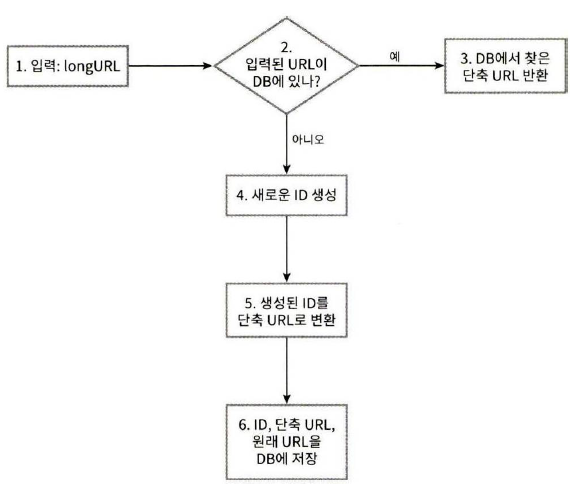
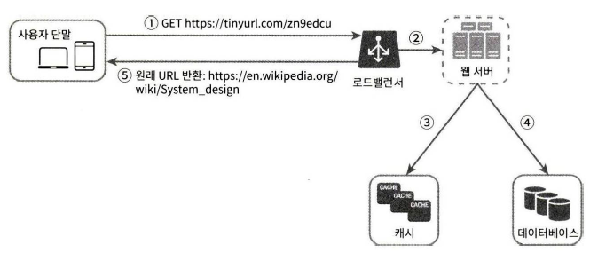

## 08. URL 단축기 설계

### 1단계: 문제 이해 및 설계 범위 확정
* URL 단축기가 어떻게 동작해야 하는지 예제를 보여달라 : https://aaa.com/q=aa&c=dd => https://b.com/dd33같이 단축 URL로 결과를 제공하고 이 URL에 접속 시 원래 URL로 갈 수 있어야 함.
* 트래픽 규모? : 매일 1억개의 단축 URL을 만들 수 있도록 함
* 단축 URL의 길이는 ? : 짧으면 짧을수록 좋음
* 단축 URL에 포함될 문자에 제한은 ? : 0-9, a-z, A-Z 만 가능
* 단축된 URL을 시스템에서 지우거나 갱신할 수 있는지? : 단순화를 위해 X
* 기본적 기능
    1. URL 단축
    2. URL 리디렉션 : 축약된 URL로 HTTP 요청이 오면 원래 URL로 안내
    3. 높은 가용성과 규모 확장성, 장애 감내가 요구됨

* 개략적 추정
    * 쓰기 연산 : 매일 1억개
    * 초당 쓰기 연산 : 1억 / 24 / 3600 = 1160
    * 읽기 연산 : 읽기가 쓰기의 10배 일때 11600
    * URL 단축 서비스를 10년간 제공할 때 : 1억 * 365 * 10 = 3650억 레코드
    * 축약 전 URL의 평균 길이 : 100
    * 따라서 10년동안 필요한 저장 용향은 3650 * 100바이트 = 36.5TB

### 2단계: 개략적 설계안 제시 및 동의 구하기
* API 엔드포인트, URL 리디렉션, URL 단축 플로우

#### API 엔드포인트
* 클라이언트는 서버가 제공하는 APi 엔드포인트를 통해 서버와 통신 함.
* REST 설계 : Restful API
1. URL 단축용 엔드포인트 : original URL -> 단축 URL로 변경
    ```
    POST /api/v1/data/shorten
    * 인자 : {longUrl:orginal URL}
    * 반환 : 단축 URL
    ```
* URL 리디렉션용 엔드포인트 : 단축 URL -> original URL로 보내주기 위한 용도
    ```
    GET /api/v1/shortUrl
    * 반환 : HTTP 리디렉션 목적지가 될 원래 URL
    ```

#### URL 리디렉션
* 단축 URL 입력 시

    1. 단축 URL을 받은 서버는 단축 URL -> original URL로 바꿔서 301 응답의 Location헤더에 넣어 반환
    
    * 301 Permanently Moved : 해당 URL에 대한 HTTP 요청의 처리 책임이 <u>영구적으로</u> Location 헤더에 반환된 URL로 이전되었다는 응답코드. 영구적으로 이전되어 브라우저는 이 응답을 캐시함 
        * 서버 부하를 줄이는 것이 중요할 때 사용
    * 302 Found : 주어진 URL로의 요청이 <u>'일시적으로'</u> Location 헤더가 지정하는 URL에 의해 처리되어야 한다는 응답코드. 따라서 클라이언트의 요청은 언제나 단축 URL 서버에 먼저 보내진 후에 original URL로 리디렉션되어야 함.
        * 트래픽 분석이 중요할 때 사용 : 클릭 발생률이나 발생 위치를 추적하기 용함.
* URL 리디렉션을 구현하는 가장 직관적인 방법 : 해시 테이블을 사용하는 것
    * <단축 URL, original URL> 형태
    1. hashTable.get(단축 URL) = origianl URL
    2. 301 또는 302 응답 Location 헤더에 original URL을 넣은 후 전송

#### URL 단축

* 가장 중요한 일 : original URL을 해시 값으로 대응시킬 해시 함수를 찾는일
* 해시함수가 만족해야 하는 요구사항
    * 입력으로 주어지는 긴 URL이 다른 값이면 해시 값도 달라지기
    * 계산된 해시 값은 원래 입력으로 주어졌던 긴 URL로 복원될 수 있어야 함.

### 3단계: 상세 설계

#### 데이터 모델
* 모든 것을 해시 테이블에 두는 방법 : 초기 전략으로는 괜찮지만 메모리는 유한하고 비싸서 X
* 더 좋은 방법 : <단축 URL, original URL>의 순서쌍을 관계형 DB에 저장하는 것

#### 해시 함수
* 해시 함수는 original URL을 단축 URL로 변환하는데 쓰임
* 해시 값 길이
    * hashValue : [0-9,a-z,A-Z]로 구성되며 총 62개를 사용할 수 있다.
    * hashValue의 길이 정하기 : 3650억의 URL이 만들어질 수 있어야 하므로 62^7 = 3.5조 인 7글자로 정할 수 있음.
* 해시 함수 구현에 쓰일 기술
    * **'해시 후 충돌 해소'**
        * CRC32, MD5, SHA-1 등의 해시 함수를 이용해 계산된 해시값에서 처음 7개 글자만 이용하기 => 이 경우 충돌할 확률이 높아지며 실제로 충돌이 발생했을 경우, 충돌이 해소될 때까지 사전에 정한 문자열을 해시값에 덧붙인다.
        * 이 방법은 충돌은 해소할 수 있지만, 1번 이상의 DB query를 해야 하므로 오버헤드가 크다 => DB 대신 블룸 필터를 사용하면 성능을 높일 수 있음.
        > 블룸 필터 : 어떤 집합에 특정 원소가 있는지 검사할 수 있도록 하는 확률론에 기초한 공간 효율이 좋은 기술
    * **'base62 변환'**
        * 진법 변환(base conversion) : 수의 표현 방식이 다른 두 시스템이 같은 수를 공유하여야 하는 경우에 유용함. 62진법인 이유는 hashValue에 사용할 수 있는 문자 개수가 62개이기 때문에
        * ex. 11157 -> 2TX : https://aa.com/2TX
    * 두 접근법 비교
        

#### URL 단축기 상세 설계
* URL 단축기는 시스템의 핵심 컴포넌트이므로, 그 처리 흐름이 논리적으로는 단순해야 하고 기능적으로는 언제나 동작하는 상태로 유지되어야 함.

    5. 62진법 변환을 적용하여 ID를 단축 URL로 만든다.
* ID 생성기의 주된 용도는 단축 URL을 만들 때 사용할 ID를 만드는 것이고, 이 ID는 전역적 유일성이 보장되어야 한다.

#### URL 리디렉션 상세 설계
* 쓰기 < 읽기 의 시스템이라, <단축 URL, original URL>의 쌍을  캐시에 저장하여 성능을 높일 수 있음.


### 4단계: 마무리
* 추가적 고민 사항들
    * 처리율 제한 장치 : 엄청난 양의 URL 단축 요청이 밀려들 경우 무력화 될 수 있다는 잠재적 보안 결함을 갖고 있음.
    * 웹 서버의 규모 확장 : 웹 계층이 무상태(stateless) 계층이므로 웹 서버를 자유로이 증설하거나 삭제 가능
    * DB의 규모 확장 : DB를 다중화 하거나 샤딩(sharding)하여 규모 확장성을 달성할 수 있음.
    * 데이터 분석 솔루션(analytics) : URL 단축기에 데이터 분석 솔루션을 통합해 두면 어떤 링크를 얼마나 많은 사용자가 클릭했는지, 언제 주로 클릭했는지 등 중요한 정보를 알아낼 수 있다.
    * 가용성, 데이터 일관성, 안정성 : 대규모 시스템이 성공적으로 운영되기 위해 반드시 갖춰야 할 속성들 