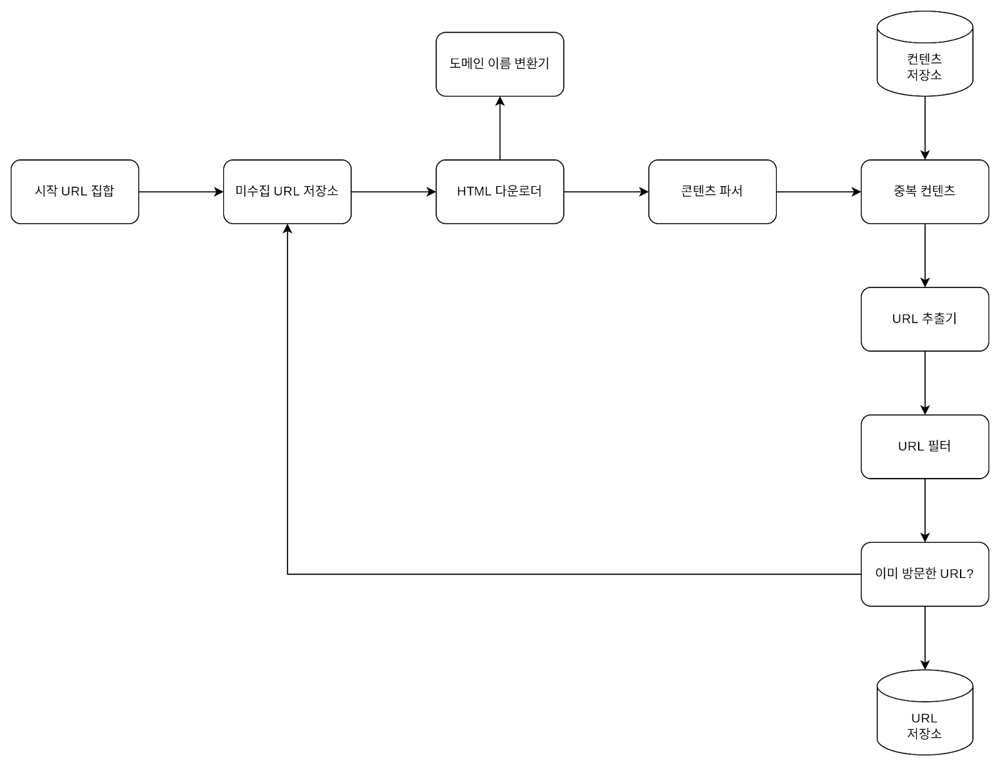
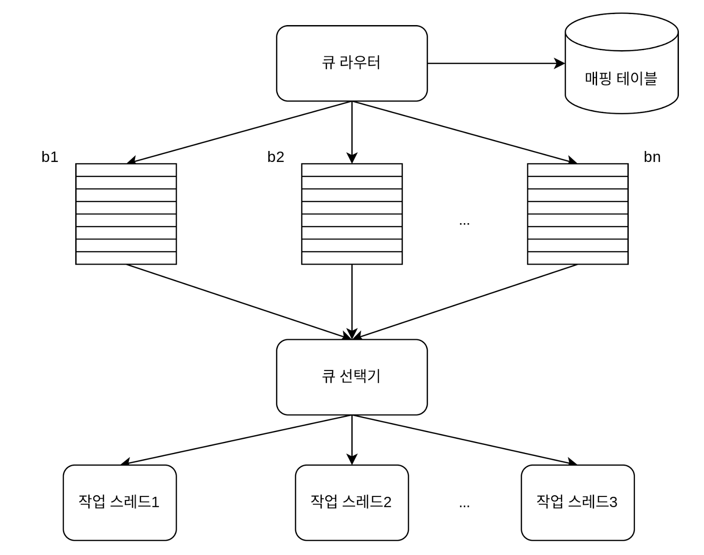
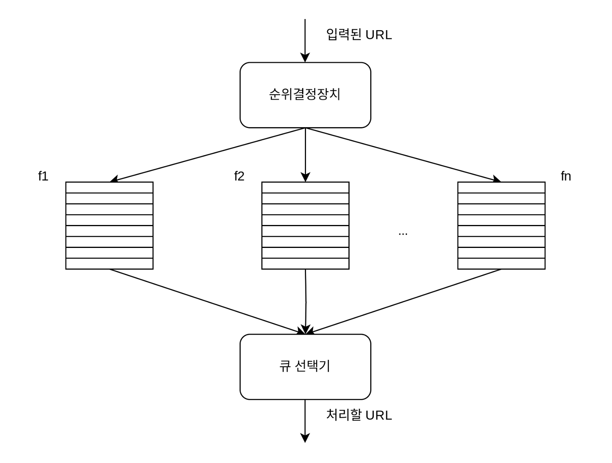
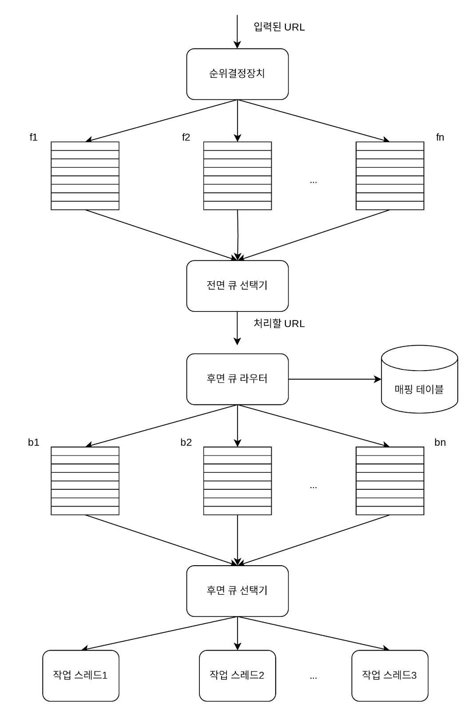
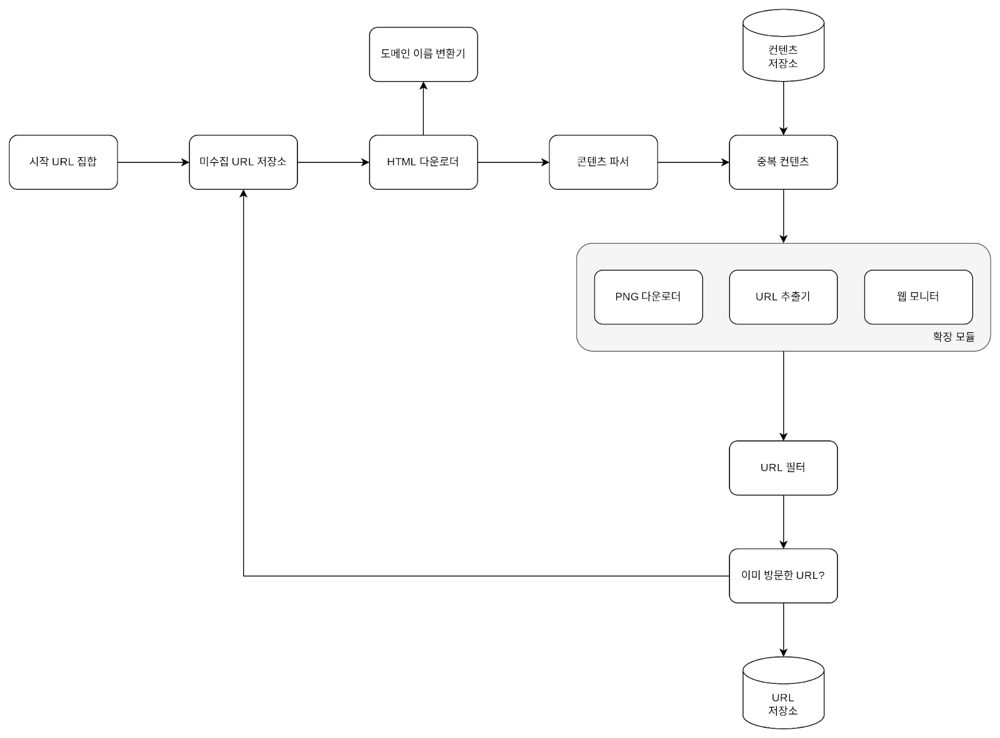

## 09. 웹 크롤러 설계
* 웹 크롤러 = 로봇 = 스파이더 : 검색 엔진에서 널리 쓰는 기술. 웹에 새로 올라오거나 갱신된 콘텐츠를 찾아내는 것이 주된 목적
* 크롤러 종류
    * 검색 엔진 인덱싱 : 웹 페이지를 모아 검색 엔진을 위한 로컬 인덱스 만들기
    * 웹 아카이빙 : 장기보관하기 위해 웹에서 정보를 모으는 절차
    * 웹 마이닝 : 인터넷에서 유용한 지식을 도출해 낼 수 있는 것. (ex.주주총회 자료를 다운받아 기업의 핵심 사업 방향 알아내기 가능)
    * 웹 모니터링 : 인터넷에서 저작권이나 상표권이 침해되는 사례를 모니터링 할 수 있음.
* 웹 크롤러의 복잡도는 웹 크롤러가 처리해야 하는 데이터의 규모에 따라 달라짐

### 1단계: 문제 이해 및 설계 범위 확정
* 웹 크롤러의 기본 알고리즘
    1. URL 집합이 입력으로 주어질 떄, 해당 URL들이 가리키는 모든 웹 페이지를 다운로드한다.
    2. 다운받은 웹 페이지에서 URL을 추출한다
    3. 추출된 URL 들을 다운로드할 URL 목록에 추가하고 1번부터 재시작
* 요구사항 알아내기
    * 크롤러의 주된 용도는? 검색 엔진 인덱스 생성용? 데이터 마이닝? 그외 용도? : 검색 엔진 인덱싱
    * 매달 얼마나 많은 웹 페이지를 수집해야 하는가? : 10억 개의 웹 페이지 수집
    * 새로 만들어진 웹 페이지나 수정된 웹 페이지도 고려해야 하는가? : yes
    * 수집한 웹 페이지는 저장해야 하는가? : 5년간 저장해야 함.
    * 중복된 콘텐츠는 어떻게 하는가? : 중복 콘텐츠의 페이지는 무시해도 됨.
* 좋은 웹 크롤러가 만족시켜야 할 속성에 신경쓰기
    * 규모 확장성 : 병행성을 활용해 보다 효과적으로 웹 크롤링하기
    * 안정성 : 크롤러는 비정상적 입력이나 환경에 잘 대응할 수 있어야 함.
    * 예절 : 크롤러는 수집 대상 웹 사이트에 짧은 시간 동안 너무 많은 요청을 보내서는 안됨.
    * 확장성 : 새로운 형태의 콘텐츠를 지원하기가 쉬워야 함.(ex. 급 이미지도 추가하자고 할 때 새로 설계하게 되면 어려움)

#### 개략적 규모 추정
* 매달 10억개의 웹 페이지를 다운로드
* QPS = 10억 / 30일 / 24시간 / 3600초 = 대략 400페이지/초
* 최대 QPS = 2 X QPS = 800
* 웹 페이지의 크기 평균은 500k라고 가정
* 10억 페이지 X 500K = 500TB/월
* 1개월치 데이터를 보관하는 데는 500TB, 5년간 보관 시 500TB X 12개월 X 5년 = 30PB의 저장용량이 필요함.

### 2단계: 개략적 설계안 제시 및 동의 구하기


#### 시작 URL 집합
* 웹 크롤러가 크롤링을 시작하는 출발점
* 크롤러가 가능한 많은 링크를 탐색할 수 있도록 하는 URL을 고르는 것이 바람직함.
* 일반적으로는 지역적인 측생, 주제별로 다른 시작 URL .. etc

#### 미수집 URL 저장소
* FIFO 큐로 다운로드할 URL을 미수집 URL저장소에 저장하고 관리한다.

#### 도메인 이름 변환기
* 웹 페이지를 다운받기 위해서는 URL->IP 절차가 필요하다.

#### 콘텐츠 파서
* 웹 페이지 다운로드 시 파싱(parsing)과 검증(validation) 절차를 거쳐야 한다.

#### 중복 콘텐츠인가?
* 두 HTML 문서의 문자열로 비교하는 것이 아닌, 웹 페이지의 해시 값을 비교한다.

#### 콘텐츠 저장소
* HTML 문서를 보관하는 시스템 : 저장소를 구현할 때 쓰일 기술 선택 시 저장할 데이터의 유형, 크기, 저장소 접근 빈도, 데이터의 유효 기간 등을 종합적으로 고려해야 함.
* 디스크+메모리 동시 사용하는 저장소 선택 가능
    * 데이터 양이 너무 많아 대부분의 콘텐츠는 디스크에 저장
    * 인기 있는 콘텐츠는 메모리에 두어 접근 지연시간을 줄임

#### URL 추출기
* HTML 페이지를 파싱하여 링크들을 골라내는 역할.
* 상태경로에 있는 값들을 절대경로로 변환함. (```/wiki/aaa``` -> '''https://en.wikipedia.org/wiki/aaa''')

#### URL 필터
* 특정한 콘텐츠 타입이나 파일 확장자를 갖는 URL, 접속 시 오류가 발생하는 URL, 접근 제외 목록에 포함된 URL 등을 크롤링 대상에서 배제하는 역할을 함.

#### 이미 방문한 URL
* 서버 부하를 줄이고 시스템이 무한 루프에 빠지는 일을 방지
* 블룸 필터나 해시 테이블이 널리 쓰임

#### URL 저장소
* 이미 방문한 URL을 보관하는 저장소

### 3단계: 상세 설계
* DFS(Depth-First Search) VS BFS(Breath-First Search)
* 미수집 URL 저장소
* HTML 다운로더
* 안정성 확보 전략
* 문제 있는 콘텐츠 감지 및 회피 전략

#### DFS를 쓸 것인가, BFS를 쓸 것인가?
* 웹 크롤러는 보통 BFS, 즉 너비 우선 탐색법을 사용한다.
* BFS는 FIFO 큐를 사용하는 알고리즘
* 문제점 : 
    * 한 페이지에서 나오는 링크의 상당수는 같은 서버로 되돌아감. : 같은 호스트의 링크를 다운받느라 과부하가 걸림
    * 표준적 BFS 알고리즘은 URL간에 우선순위를 두지 않는다. = 처리 순서에 있어 모든 페이지를 공평하게 대우함. : 패이지 순위, 사용자 트래픽의 양, 업데이트 빈도 등 여러 가지 척도에 비추어 처리 우선순위를 구별하는 것이 온당함.

#### 미수집 URL 저장소
* 미수집 URL 저장소를 활용 시 URL 사이의 우선순위와 신선도를 구별하는 구롤러를 구현할 수 있다.
* **예의**(politeness)
    * 무례한(Dos(Denial-of-Service) 공격) : 짧은 시간 안에 너무 많은 요청을 보내는 것. 사이트 마비.
    * 예의 바른 크롤러를 만드는 데 있어서 지켜야 할 한 가지 원칙 : 동일 웹 사이트에 대해서는 한 번만 요청하기
        * 방법 : 호스트명과 다운로드를 수행하는 작업 스레드 사이의 관계를 유지
        
        - 큐 라우터 : 같은 호스트에 속한 URL은 언제나 같은 큐(b1, b2, … , bn)로 가도록 보장하는 역할을 한다.
        - 매핑 테이블 : 호스트 이름과 큐 사이의 관계를 보관하는 테이블
        - FIFO 큐 (b1, b2, … , bn) : 같은 호스트에 속한 URL은 언제나 같은 큐에 보관된다.
        - 큐 선택기: 큐 선택기는 큐들을 순회하면서 큐에서 URL을 꺼내서 해당 큐에서 나온 URL을 다운로드하도록 지정된 작업 스레드에 전달하는 역할을 한다.
        - 작업 스레드: 작업 스레드는 전달된 URL을 다운로드 하는 작업을 수행한다. 전달된 URL은 순차적으로 처리될 것이며, 작업들 사이에는 일정한 지연시간(delay)을 둘 수 있다.

* **우선순위**
    * 크롤러 입장에서는 중요한 페이지를 먼저 수집하도록 하는 것이 바람직하다.
    * URL의 우선순위 척도 : 페이지랭크, 트래픽 양, 갱신 빈도
    * 순위 결정 장치
        
        - 순위결정장치 : URL을 입력으로 받아 우선순위를 계산
        - 큐(f1, f2, .. fn) : 우선순위별로 큐가 하나씩 할당됨. 우선순위가 높으면 선택될 확률도 올라감
        - 큐 선택기 : 임의 큐에서 처리할 URL을 꺼내는 역할 담당. 순위가 높은 큐에서 더 자주 꺼내도록 프로그램 되어 있음.

* 전체 설계 (예의 + 우선순위위)
    
    * 전면 큐 : 우성순위 결정 과정 처리
    * 후면 큐 : 크롤러가 예의 바르게 동작하도록 보증함.

* **신선도**
    * 데이터의 신선함을 유지하기 위해 : 이미 다운로드한 페이지라고 해도 주기적으로 재수집하기
    * 최적화 방법 : 웹 페이지의 변경 이력 활용, 우선순위를 활용해 중요한 페이지는 좀 더 자주 재수집하기

* **미수집 URL 저장소를 위한 지속성 저장장치**
    * 검색엔진을 위한 크롤러의 경우는 처리해야 하는 URL의 수가 수억 개에 달하므로, 모두 메모리에 보관하는 것은 안정적이지만 규모 확장성 측면에서 바람직하지 않음. : 성능 병목지점이 되기 때문에
    * 본 설계안의 방법(절충안) : 대부분의 URL은 디스크에 두지만 IO비용을 줄이기 위해 메모리 버퍼에 큐를 둔다. 버퍼에 있는 데이터는 주기적으로 디스크에 기록한다.

#### HTML 다운로더
* HTML 다운로더는 HTTP 프로토콜을 통해 웹 페이지를 내려 받음.

* **Robots.txt**
    * 로봇 제외 프로토콜 : 웹사이트가 크롤러와 소통하는 표준적 방법. 이 안에 크롤러가 수집해도 되는 페이지 목록이 들어있음.

* **성능 최적화** : HTML 다운로더를 설계 시 중요함. 아래로는 성능 최적화 기법들임
    1. 분산 크롤링 : 성능을 높이기 위해 크롤링 작업을 여러 서버에 분산하는 방법.
        * 각 서버는 여러 스레드를 돌려 다운로드 작업을 처리함. 이 구성을 위해 URL 공간은 작은 단위로 분할하여, 각 서버는 그 중 일부의 다운로드를 담당하도록 한다.
    2. 도메인 이름 변환 결과 캐시
        * 도메인 이름 변환기 : DNS 요청을 보내고 결과를 받는 작업의 동기적 특성 때문에 크롤러 성능의 병목 중 하나 이다.  => DNS 요청의 결과를 받기 전까지 다음작업 실행 X, 크롤러 스레드 중 하나라도 이 작업을 하고 있으면 다른 스레드의 DNS 요청은 전부 block 됨.
        * 성능을 높이는 방법 : DNS 조회 결과로 얻어진 도메인 이름과 IP 주소 사이의 관계를 캐시에 보관해 놓고 크론 잡 등을 돌려 주기적으로 갱신하도록 하기
    3. 지역성 : 크롤링 작업을 수행하는 서버를 지역별로 분산하는 방법
        * 크롤링 서버가 대상 서버와 지역적으로 가까우면 페이지 다운로드 시간은 줄어들 것이다.
    4. 짧은 타임아웃 : 대시 시간을 최대 얼마나 기다릴지 미리 정해두는 것

* **안정성**
    * 안정 해시 : 다운로더 서버들에 부하를 분산할 때 적용 가능한 기술.
        * 사용시 다운로더 서버를 쉽게 추가하고 삭제할 수 있음.
    * 크롤링 상태 및 수집 데이터 저장 : 장애가 발행한 경우에도 쉽게 복구할 수 있도록 크롤링 상태와 수집된 데이터를 지속적 저장장치에 기록해두는 것이 바람직함.
        * 저장된 데이터를 로딩하고 나면 중단되었던 크롤링을 쉽게 재시작할 수 있음
    * 예외 처리
    * 데이터 검증 : 시스템 오류 방지 수단

* **확장성**
    * 새로운 형태의 콘텐츠를 쉽게 지원할 수 있도록 신경써야 함. 아래는 새로운 모듈을 끼워넣음.
    
    - PNG 다운로더 : PNG 파일 다운로드 플러그인
    - 웹 모니터 : 웹을 모니터링하여 저작권이나 상표권이 침해되는 일을 막는 모듈

* **문제 있는 콘텐츠 감지 및 회피** 
    1. 중복 콘텐츠 : 해시나 체크섬을 사용해 중복 콘텐츠를 보다 쉽게 탐지하기
    2. 거미 덫 : 크롤러를 무한 루프에 빠뜨리도록 설계한 웹 페이지
        * 회피법 : URL의 최대 길이를 제한하기, 덮이 있는 사이트를 크롤러 탐색 대상에서 제외하거나 URL 필터 목록에 걸어두기
    3. 데이터 노이즈 : 광고, 스크립트 코드, 스팸 URL로 제외한다.

### 4단계: 마무리
* 크롤러가 갖춰야 하는 특성 : 규모 확장성, 예의, 확장성, 안정성
* 추가 논의점
    * 서버 측 렌더링 : 많은 웹 사이트가 JS등을 사용해 즉석에서 링크 생성함. 이 문제를 해결하기 위해 페이지를 파싱하기 전에 서버측렌더링(동적 렌더링)을 적용하여 해결한다.
    * 원치 않는 페이지 필터링 : 크롤링에 소요되는 자원은 유한하기 때문에 스팸방지 컴포넌트를 두어 품질이 조악하거나 스팸성인 페이지를 걸러내도록 해 두면 좋음.
    * 데이터베이스 다중화 및 샤딩 : 데이터 계층의 가용성, 규모 확장성, 안정성이 향상됨
    * 수평적 규모 확장성 : 서버가 상태정보를 유지하지 않도록 무상태 서버로 만들어야 함
    * 가용성, 일관성, 안정성
    * 데이터 분석 솔루션
