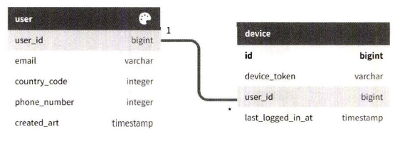

## 10. 알림 시스템 설계
* 고객에게 중요할 만한 정보를 비동기적으로 재공함.
* 알림 시스템의 분류 : 모바일 푸시 알림, SMS 메시지, 이메일

### 1단계: 문제 이해 및 설계 범위 확정
* 하루에 백만 건 이상의 알림을 처리하는 확장성 높은 시스템을 구축하기 쉽지 않음
* 설계 범위 질문
    * 어떤 종류의 알림을 지원하는가? : 푸시 알림, SMS 메시지, 이메일
    * 실시간(real-time) 시스템이여야 하는가? : 연성 실시간(soft real-time) 시스템이라 가정한다. 알림은 가능한 빨리 전달되어야 하지만 시스템에 높은 부하가 걸렸을 때 약간의 지연은 무방함.
    * 어떤 종류의 단말을 지원하는가? : ios, 안드로이드, 랩톱/데스트톱을 지원
    * 사용자에게 보낼 알림은 누가 만드는 것인가? : 클라이언트 애플리케이션 프로그램이 만들수도 있고, 서버 측에서 스케줄링 할 수도 있음.
    * 사용자가 알림을 받지 않도록(opt-our) 설정할 수도 있어야 하는가? : yes
    * 하루에 몇 건의 알림을 보낼 수 있는가? : 천만건의 모바일 푸시 알림, 백만건의 SMS 메시지, 5백만 건의 이메일을 보낼 수 있어야 함.

### 2단계: 개략적 설계안 제시 및 동의 구하기
* 알림 유형별 지원 방안
* 연락처 정보 수집 절차
* 알림 전송 및 수신 절차

#### 알림 유형별 지원 방안
* **IOS 푸시 알림**
    
    - 알림 제공자 : 알림 요청을 만들어 애플 푸시 알림 서비스(APNS)로 보내는 주체
        * 알림 요청 만드는 방법
            * 단말 토큰 : 알림 요청을 보내는데 필요한 고유 식별자
            * 페이로드 : 알림 내용을 담은 JSON 딕셔너리
            ```
            {
                "aps": {
                    "alert": {
                        "title": "Game Request",
                        "body": "Bob wants to play chess",
                        "action-loc-key": "PLAY"
                    },
                    "badge": 5
                }
            }
            ```
    - APNS : 애플이 제공하는 원격 서비스. 푸시 알림을 IOS 장치로 보내는 역할을 담당함.
    - IOS 단말 : 푸시 알림을 수신하는 사용자 단말

* **안드로이드 푸시 알림**
    * APNS 대신 FCM(Firebase Cloud Messaging) 사용
    

* **SMS 메시지**
    * 트윌리오, 넥스모 같은 제3사업자의 서비스를 이용함
    

* **이메일**
    * 센드그리드, 메일침프 등을 사용함 : 전송 성공률도 높고 데이터 분석 서비스도 제공해서
    

* 전체 알림 유형 보이기
    

#### 연락처 정보 수집 절차


* API 서버는 해당 사용자의 정보를 수집하여 DB에 저장한다.
* user 테이블 : 이메일, 전화번호
* device 테이블 : 단말 토큰

#### 알림 전송 및 수신 절차
* **개략적 설계안(초안)**
    
    - 1~N 서비스 : 서비스(마이크로 서비스, 크론잡, 분산 시스템 컴포넌트)의 종류가 다양. (ex.과금 서비스의 비용 알림, 배송 알림)
    - 알림 시스템 : 1~N 서비스에 알림 전송을 위한 API를 제공하고 제3자 서비스에 전달할 알림 페이로드를 만들어 낼 수 있어야 함.
    - 제3자 서비스 : 사용자들에게 알림을 실제로 전달하는 역할. 유의할 점은 확장성.
    - IOS, 안드로이드, SMS, 이메일 단말
    * 이 설계안의 문제점
        * SPOF(Single-Point-of-Failure) : 알림 서비스에 장애가 생기면 전체 서비스의 장애로 이어짐
        * 규모 확장성 : 한 대 서비스로 푸시 알림에 관계된 모든 것을 처리하여 DB나 캐시 등 중요 컴포넌트의 규모를 개별적으로 늘릴 방법이 없음.
        * 성능 병목 : 알림을 처리하고 보내는 것은 자원을 많이 필요로 하는 작업일 수 있음. 모든 것을 한 서버로 처리시 사용자 트래픽이 많이 몰리는 시간에는 시스템 과부하 상태에 빠질 수 있음.

* **개략적 설계안(개선된 버전)**
    * 개선 방향
        * DB와 캐시를 알림 시스템의 주 서버에서 분리함
        * 알림 서버를 증설하고 자동으로 수평적 규모 확장이 이루어질 수 있도록 함.
        * 메시지 큐를 이용해 시스템 컨포넌트 사이의 강한 결합을 끊음.
    
    - 1~N 서비스
    - 알림 서버 : 알림 전송 API(스팸방지를 위해 인증된 클라이언트만 이용가능함), 알림 검증, DB 또는 캐시 질의(알림에 포함시킬 데이터를 가져오는 기능), 알림 전송(알림 데이터를 큐에 넣음. 하나 이상의 MQ를 사용하면 알림을 병렬적으로 처리할 수 있음)
        * ex. 이메일을 형태의 알림 보내기
            * API : POST ```https://api.example.com/v/sms/send```
            * body
                ```
                {
                    "to": [
                        {
                            "user_id": 123456
                        }
                    ],
                    "from": {
                        "email": "from_address@aa.com"
                    },
                    "subject": "Hello, World",
                    "content": [
                        {
                            "type": "text/plain",
                            "value": "Hello, world"
                        }
                    ]
                }
                ```
    - 캐시 : 사용자 정보, 단말 정보, 알림 템플릿 등을 캐시함
    - DB : 사용자, 알림, 설정 등 다양한 정보를 저장함
    - 메시지 큐 : 시스템 컴포넌트 간 의존성을 제거하기 위해 사용함. 다량의 알림이 전송되어야 하는 경우를 대비한 버퍼 역할도 한다. 종류별로 별도의 MQ를 사용할 수 있다.

### 3단계: 상세 설계
* 안정성
* 추가로 필요한 컴포넌트 및 고려사항 : 알림 템플릿, 알림 설정, 전송률 제한, 재시도 메커니즘, 보안 , 큐에 보관된 알림에 대한 모니터링과 이벤트 추적
* 개선된 설계안

#### 안정성
* **데이터 손실 방지** : 어떤 상황에서도 알림이 소실되면 안됨.
    * 만족하려면 알림 데이터를 DB에 보관하고 재시도 매커니즘을 구현해야 함.
    
    * 위는 알림 로그 DB를 유지하는 방법

* **알림 중복 전송 방지** : 중복 발송 빈도를 줄이기 위해 중복을 탐지하는 메커니즘을 도입하고, 오류를 신중히 처리하기
    * 간단한 중복 방지 로직 : 보내야 할 알림이 도착하면 그 이벤트 ID를 검사하여 이전에 본 적있는 이벤트인지 살핀다. 중복된 이벤트라면 버리고, 그렇지 않으면 알림을 발송한다.

#### 추가로 필요한 컴포넌트 및 고려사항
* 알림 템플릿, 알림 설정, 이벤트 추적, 시스템 모니터링, 처리율 제한 등 알림 시스템 구현을 위해 필요한 추가 컴포넌트들

* **알림 템플릿** : 인자나 스타일, 추적 링크를 조정하기만 하연 사전에 지정한 형식에 맞춰 알람을 만들어 내는 틀
    * 장점 : 일관성 있는 전송될 알림들의 형식. 오류 가능성 줄이기. 알림 작성에 드는 시간도 줄이기.

* **알림 설정** : 특정 종류의 알림을 보내기 전에 반드시 해당 사용자가 해당 알림을 켜 두었는지 확인하기
    * user_id(bigint), channel(varchar) : 알림이 전송될 채널(ex. 푸시 알림, 이메일, SMS 등), opt_in(boolean) : 해당 채널로 알림을 받을 것인지의 여부

* **전송률 제한** : 한 사용자가 받을 수 있는 알림의 빈도를 제한하기 
    * why? 알림을 너무 많이보내기 시작하면 사용자가 알림 기능을 아예 꺼버릴수 있음.

* **재시도 방법** : 제3자 서비스가 알림 전송에 실패하면 해당 알림을 재시도 전용 큐에 넣는다. 같은 문제가 계속 발생하면 개발자에게 통지하기

* **푸시 알림과 보안** : 인증된, 승인된 클라이언트만 해당 API를 사용해 알림을 보낼 수 있음

* **큐 모니터링**
    * 알림 시스템을 모니터링 할 때 중요한 메트릭 하나 : 큐에 쌓인 알림의 개수
    * 이 수가 너무 크면 작업 서버들이 이벤트를 빠르게 처리하고 있지 못하다는 것. => 이럴 때는 작업 서버를 증설하는 게 바람직하다.

* **이벤트 추적**
    * 알림 확인율, 클릭율, 실제 앱 사용으로 이어지는 비율같은 메트릭은 사용자를 이해하는데 중요함.
    * 데이터 분석 서비스는 보통 이벤트 추적 기능도 제공한다 => 따라서 알림 시스템을 만들면 데이터 분석 서비스와도 통합해야 함.
    

#### 수정된 설계안

- 알림 서버에 인증과 전송률 제한 기능 추가
- 전송 실패에 대응하기 위한 재시도 기능 추가. => 전송에 실패한 알림은 다시 큐에 넣고 지정된 횟수만큼 재시도하기
- 전송 템플릿을 사용해 알림 생성 과정을 단순화하고 알림 내용의 일관성을 유지함
- 모니터링과 추적 시스템을 추가하여 시스템 상태를 확인하고 추후 시스템을 개선하기 쉽도록 함.

### 4단계: 마무리
* 알림은 중요 정보를 계속 알려준다는 점에서 필요불가결한 기능
* 최적화 기법
    * 안정성 : 메시지 전송 실패율을 낮추기 위한 안정적인 재시도 메커니즘 도입
    * 보안 : 인증된 클라이언트만이 알림을 보낼 수 있도록 appKey, appSecret 등의 메커니즘 이용
    * 이벤트 추적 및 모니터링 : 알림이 만들어진 후 성공적으로 전송되기까지의 과정을 추적하고 시스템 상태를 모니터링하기 위해 알림 전송의 각 단계마다 이벤트를 추적하고 모니터링할 수 있는 시스템 통합.
    * 사용자 설정 : 사용자가 알림 수신 설정을 조정할 수 있도록 함.
    * 전송률 제한 : 사용자에게 보내는 빈도를 제한할 수 있도록 함.