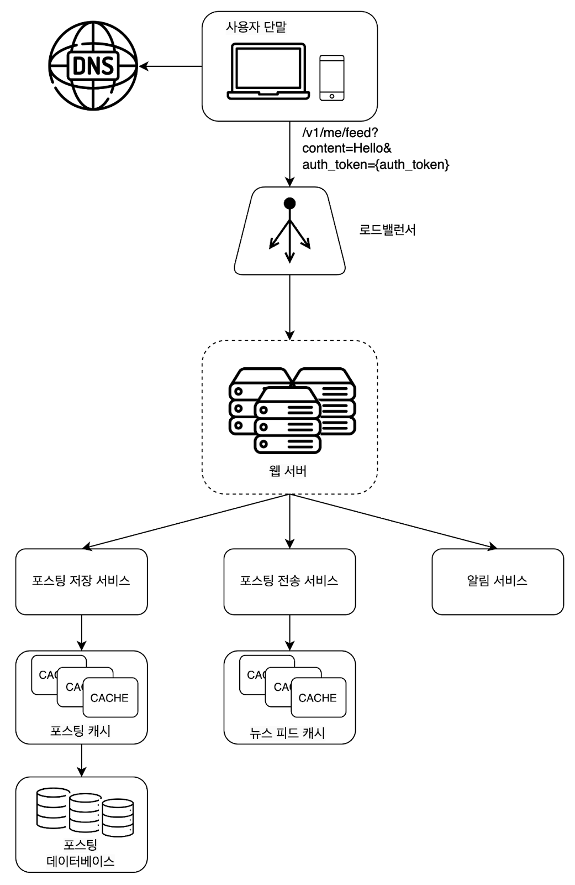
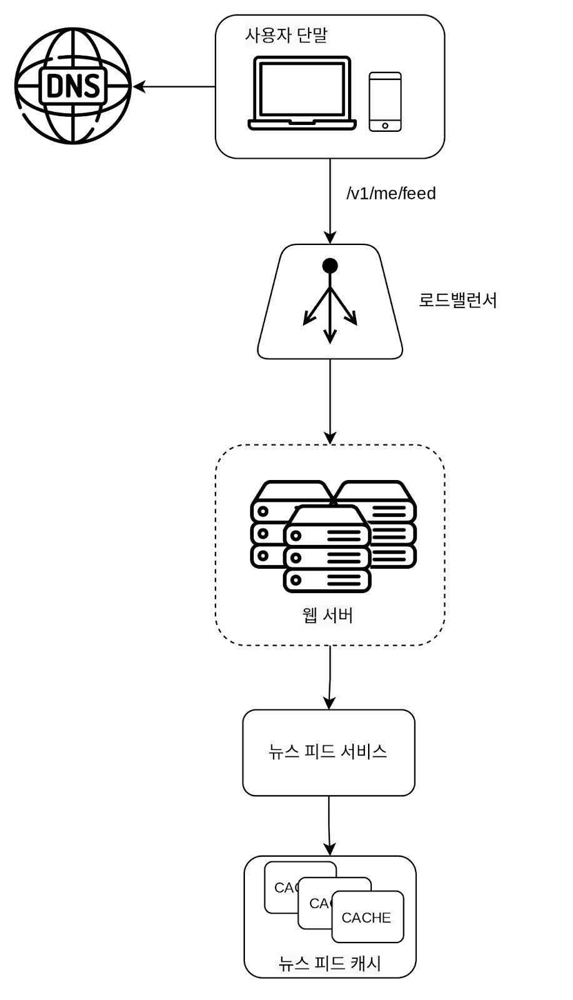
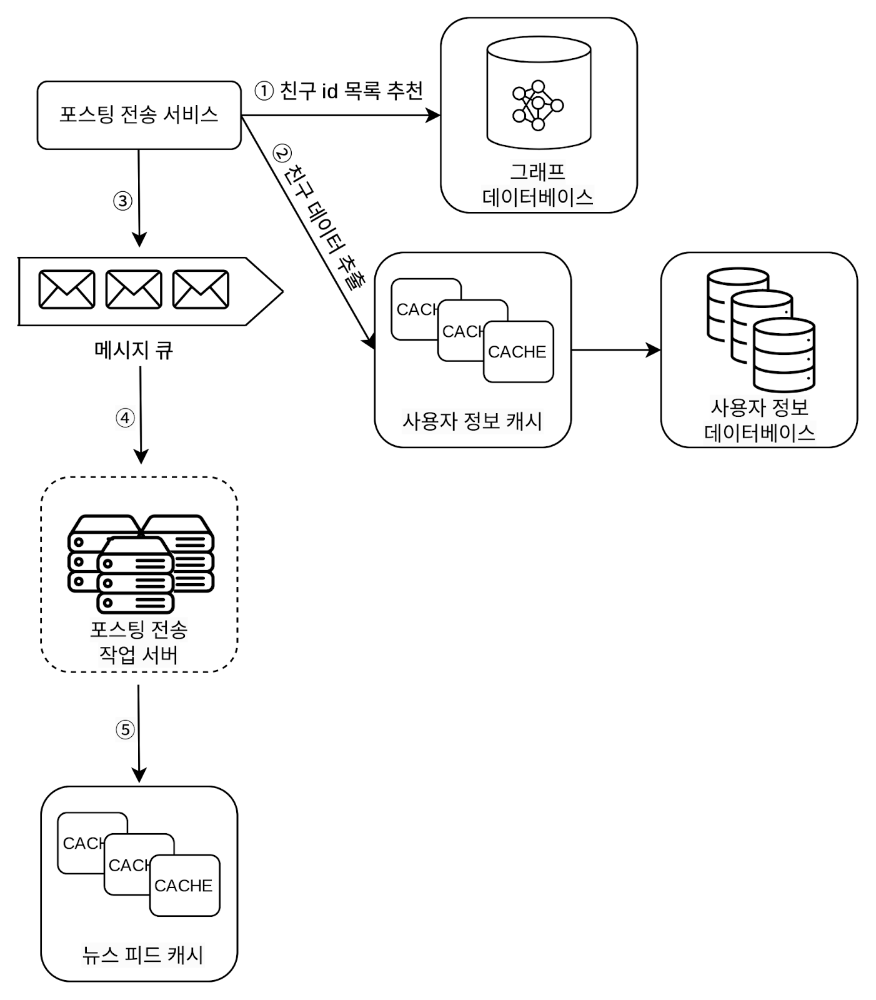
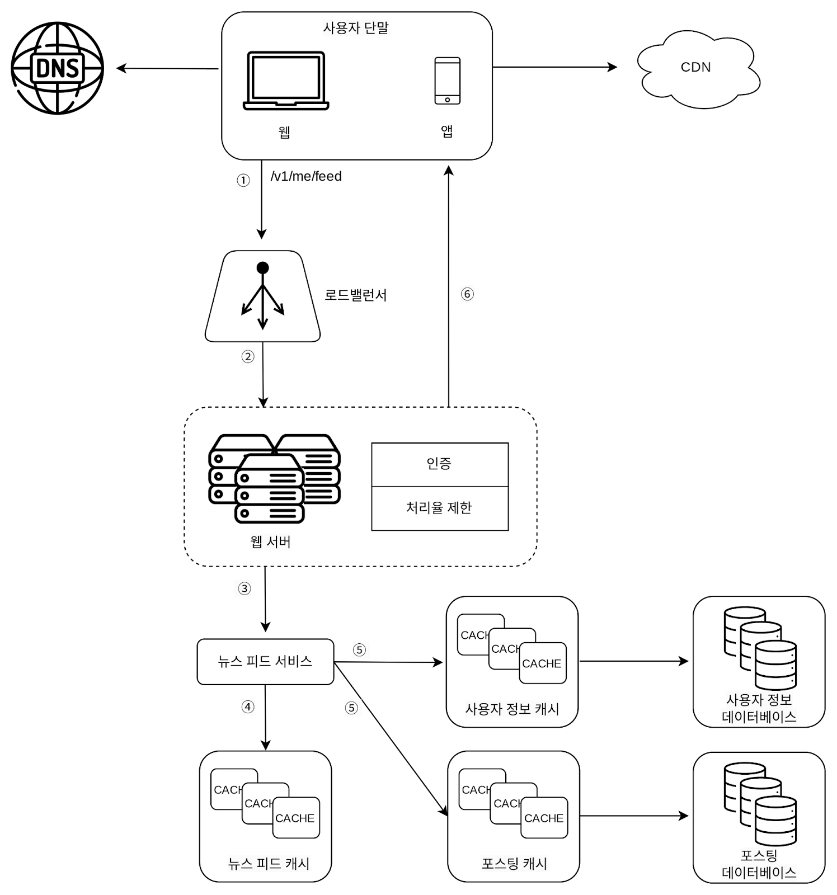
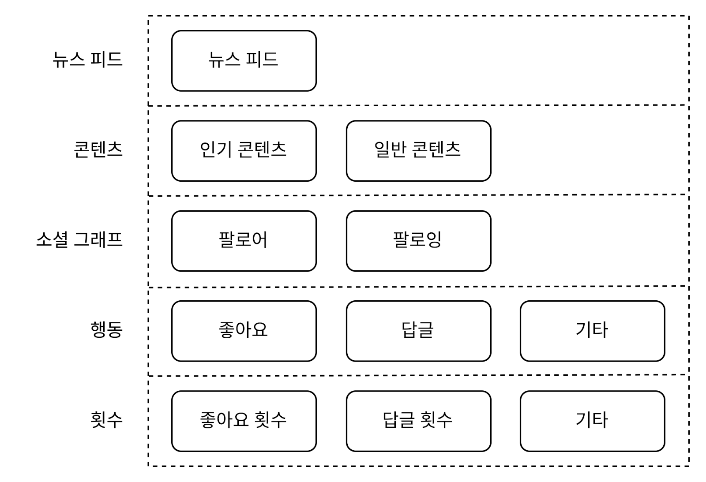

## 11. 뉴스 피드 시스템 설계
* 뉴스 피드 : 홈 페이지 중앙에 지속적으로 업데이트되는 스토리
    * ex. 페이스북 뉴스 피드 설계, 인스타그램 피드 설계, 트위터 타임라인 설계

### 1단계: 문제 이해 및 설계 범위 확정 
* 모바일 앱을 위한 시스템인가? 웹을 위한 인가? : 둘 다 지원해야 함.
* 중요 기능으로는? : 사용자는 뉴스 피드 페이지에 새로운 스토리를 올릴 수 있어야 하고 친구들이 올리는 스토리를 볼 수도 있어야 함.
* 뉴스 피드에 어떤 순서로 스토리가 표시되어야 하나? : 시간 흐름 역순
* 한 명의 사용자는 최대 몇 명의 친구를 가질 수 있는가? : 5000명
* 트래픽 규모는 어느 정도인가? : 매일 천만 명이 방문한다고 가정
* 피드에 이미지나 비디오 스토리도 올라올 수 있는가? : 포함될 수 O

### 2단계: 개략적 설계안 제시 및 동의 구하기
1. 피드 발행 : 사용자가 스토리를 포스팅하면 해당 데이터를 캐시와 DB에 기록한다. 새 포스팅은 친구의 뉴스 피드에도 전송된다.
2. 뉴스 피드 생성 : 지면 관계상 뉴스 피드는 모든 친구의 포스팅을 시간 흐름 역순으로 모아서 만든다고 가정한다.

#### 뉴스 피드 API
* 뉴스 피드 API : 클라이언트가 서버와 통신하기 위해 사용하는 수단.
    * HTTP 프로토콜 기반, 상태 정보를 업데이트, 뉴스 피드를 가져오기, 친구를 추가

* **피드 발행 API** : 새 스토리를 포스팅하기 위한 API
    * POST, ```/v1/me/feed```
    * body : 포스팅 내용
    * Authorization 헤더 : API 호출을 인증하기 위해 사용
* **피드 읽기 API** : 뉴스 피드를 가져오는 API
    * GET, ```/v1/me/feed```
    * Authorization 헤더 : API 호출을 인증하기 위해 사용

#### 피드 발행

* 사용자 : 새 포스팅을 api를 통해 올림
* 로드밸런서 : 트래픽을 웹 서버들로 분산
* 웹 서버 : HTTP 요청을 내부 서비스로 중계
* 포스팅 저장 서비스 : 새 포스팅을 DB와 캐시에 저장
* 포스팅 전송 서비스 : 새 포스팅을 친구의 뉴스피드에 푸시한다. 뉴스 피드 데이터는 캐시에 보관하여 빠르게 읽어갈 수 있도록 한다
* 알림 서비스 : 친구들에게 새 포스팅이 올라왔음을 알리거나, 푸시 알림을 보내는 역할

#### 뉴스 피드 생성

* 사용자 : api를 통해 뉴스 피드를 읽는 주체
* 로드 밸런서 : 트래픽을 웹 서버들로 분산함.
* 웹 서버 : 트래픽을 뉴스 피드 서비스로 보냄
* 뉴스 피드 서비스 : 캐시에서 뉴스 피드를 가져오는 서비스
* 뉴스 피드 캐시 : 뉴스 피드를 렌더링할 때 필요한 피드ID를 보관

### 3단계 상세 설계
#### 피드 발행 흐름 상세 설계
* **웹 서버** : 클라이언트와 통신할 뿐 아니라 인증이나 처리율 제한 등의 기능도 수행함.
    * 올바른 인증 토큰을 Authorization 헤더에 넣고 API를 호출하는 사용자만 포스팅 할 수 있어야 함.
    * 특정 기간 동안 한 사용자가 올릴 수 있는 포스팅의 수에 제한두기

* **포스팅 전송(팬아웃) 서비스** : 어떤 사용자의 새 포스팅을 그 사용자와 친구 관계에 있는 모든 사용자에게 전달하는 과정
    * 모델 종류
        * 쓰기 시점에 팬아웃 하는 모델 : 새롱누 포스팅을 기록하는 시점에 뉴스 피드를 갱신. = 포스팅이 완료되면 바로 해당 사용자의 캐시에 해당 포스팅을 기록하는 것
            * 장점 
                * 뉴스 피드가 실시간으로 갱신되며 친구 목록에 있는 사용자에게 즉시 전송됨.
                * 새 포스팅이 기록되는 순간에 뉴스 피드가 이미 갱신되므로 뉴스 피드를 읽는데 드는 시간이 짧아짐.
            * 단점
                * 친구가 많은 사용자의 경우 피드 갱신에 많은 시간이 소요될 수 있음(= 핫키(hotkey))
                * 서비스를 자주 이용하지 않는 사용자의 피드까지 갱신해야 하므로 컴퓨팅 자원이 낭비됨.
        * 읽기 시점에 팬아웃 하는 모델(=풀 모델) : 피드를 읽어야 하는 시점에 갱신함. = 요청 기반 모델
            * 장점
                * 서비스에 거의 로그인하지 않는 사용자의 경우에 유리 : 로그인하기까지는 어떤 컴퓨팅 자원도 소모하지 않아서
                * 데이터를 친구 각각에 푸시하는 작업이 필요 없으므로 핫키 문제도 생기지 않음.
            * 단점
                * 뉴스 피드를 읽는데 시간이 많이 소요될 수 있음.
    * 결론 : 위의 2가지 방법의 결합
        * 사용자에 대해서는 푸시 모델(뉴스 피드를 빠르게 가져오게) + 친구가 많을 때는 풀 모델을 사용(시스템 과부하 방지) + 안정해시 사용(요청과 데이터를 보다 고르게 분산하여 핫키 문제를 줄여볼 수 있음)
        
            1. 그래프 데이터베이스에서 친구 ID 목록을 가져온다. 그래프 데이터베이스는 친구 관계나 친구 추천을 관리하기 적합하다.
            2. 사용자 정보 캐시에서 친구들의 정보를 가져온다. 그런 후에 사용자 설정에 따라 친구 가운데 일부를 걸러낸다. (ex. 내 글에 대해서 mute 처리한 친구)
            3. 친구 목록과 새 스토리의 포스팅 ID를 메시지 큐에 넣는다.
            4. 포스팅 전송(팬아웃) 작업 서버가 메시지 큐에서 데이터를 꺼내어 뉴스 피드 데이터를 뉴스 피드 캐시에 넣는다.
                * 뉴스피드 캐시는 <포스팅 ID, 사용자 ID>의 순서쌍을 보관하는 매핑 테이블
                * 새로운 포스팅이 만들어질 때마다 이 캐시에 레코드들이 추가될 것이다. (메모리 절약을 위해 최소한의 데이터를 저장한다.)
                * 메모리 크기를 적정 수준으로 유지하기 위해서, 이 캐시의 크기에 제한을 두며, 해당 값은 조정이 가능하도록 한다.
                * 사용자가 수천 개의 스토리를 전부 훑어보는 일이 벌어질 확률은 지극히 낮다.
                * 대부분의 사용자가 보려 하는 것은 최신 스토리다. 따라서 캐시 미스(cache miss)가 일어날 확률은 낮다.

#### 피드 읽기 흐름 상세 설계

* 이미지나 비디오와 같은 미디어 콘텐츠는 CDN에 저장해 빨리 읽어갈 수 있도록 함.
1. 사용자가 뉴스 피드를 읽으려는 요청을 보낸다. 요청은 /v1/me/feed로 전송.
2. 로드밸런서가 요청을 웹 서버 가운데 하나로 보낸다.
3. 웹 서버는 피드를 가져오기 위해 뉴스 피드 서비스를 호출한다.
4. 뉴스 피드 서비스는 뉴스 피드 캐시에서 포스팅 ID 목록을 가져온다.
5. 뉴스 피드에 표시할 사용자 이름, 사용자 사진, 포스팅 콘텐츠, 이미지 등을 사용자 캐시와 포스팅 캐시에서 가져와 완전한 뉴스 피드를 만든다.
6. 생성된 뉴스 피드를 JSON 형태로 클라이언트에게 보낸다. 클라이언트는 해당 피드를 렌더링 한다.

#### 캐시 구조

* 뉴스 피드 : 뉴스 피드의 ID 보관
* 콘텐츠 : 포스팅 데이터를 보관. 인기 콘텐츠는 따로 보관
* 소셜 그래프 : 사용자 간 관계 정보를 보관
* 행동 : 포스팅에 대한 사용자의 행위에 관한 정보를 보관. ex. 포스팅에 대한 좋아요, 답글 등등
* 횟수 : '좋아요' 횟수, 응답 수, 팔로어 수, 팔로잉 수 등의 정보를 보관

### 4단계: 마무리
* 뉴스 피드 발행 + 생성
* 추가 논의
    * DB의 규모 확장
        * 수직적 규모 확장 vs 수평적 규모 확장
        * SQL vs NoSQL
        * 주부(master-slave) 다중화
        * 복제본(replica)에 대한 읽기 연산
        * 일관성 모델(consistency model)
        * 데이터베이스 샤딩(sharding)
    * 웹 계층을 무상태로 운영하기
    * 가능한 한 많은 데이터를 캐시할 방법
    * 여러 데이터 센터를 지원할 방법
    * 메시지 큐를 사용하여 컴포넌트 사이의 결합도 낮추기
    * 핵심 메트리에 대한 모니터링(ex. 트래픽이 몰리는 시간대의 QPS(Queries per second), 사용자가 뉴스 피드를 새로고침 할 때의 지연시간)
     