## 12. 채팅 시스템 설계

### 1단계: 문제 이해 및 설계 범위 확정
* 집중할 수 있는 예시 : 1:1 채팅, 그룹 채팅, 대규모 그룹의 소통과 응답지연이 낮은 음성 채팅
* 설계 범위위
    * 1:1 채팅 앱? 그룹 채팅 앱? : 둘 다 지원
    * 모바일 앱? 웹 앱? : 둘 다
    * 처리해야하는 트래픽의 규모 : 일별 능동 사용자수(DAU : Daily Active User) 기준으로 5천만 명을 처리할 수 있어야 함.
    * 그룹 채팅의 경우 인원제한이 있는가? : 최대 100명까지 참가 가능
    * 중요 기능은? 첨부파일도 지원할 수 있어야 하는가? : 1:1 채팅, 그룹 채팅, 사용자 접속 상태 표시 지원. 텍스트 메시지만 주고받을 수 있음
    * 메시지 길이에 제한은? : 100,000 자 이하
    * 종단 간 암호화(end-to-end encryption)를 지원하는가? : 현재로서는 필요 X
    * 채팅 이력은 얼마나 오래 보관하는가? : 영원히
* 정해진 기능 정리 (페이스북 DM와 유사사)
    * 응답지연이 낮은 1:1 채팅 기능
    * 최대 100명까지 참여할 수 있는 그룹 채팅 기능
    * 사용자의 접속상태 표시 기능
    * 다양한 단말 지원, 하나의 계정으로 여러 단말에 동시 접속 지원
    * 푸시 알림
    * 5천만 DAU

### 2단계: 개략적 설계안 제시 및 동의 구하기
* 채팅 시스템의 경우 클라이언트는 모바일 앱이거나 웹 애플리케이션이며 클라이언트는 서로 직접 통신하지 않음.
* 기본 기능 
    * 클라이언트들로부터 메시지 수신
    * 메시지 수신자(recipient) 결정 및 전달
    * 수신자가 접속(online) 상태가 아닌 경우에는 접속할 때까지 해당 메시지 보관
* 클라이언트(메시지 송신 클라이언트와 수신 클라이언트)와 채팅 서비스 사이의 관계
    
    * 채팅을 시작하려는 클라이언트는 네트워크 통신 프로토콜(HTTP)을 사용하여 서비스에 접속함. (어떤 통신 프로토콜을 사용할 것인지도 상의하기)
    * 메시지 송신 클라이언트 (= 클라이언트)는 채팅 서비스에 HTTP 프로토콜로 연결한 다음 메시지를 수신자에게 전달하라고 알림
    * keep-alive 헤더를 통해 클라이언트와 서버 사이의 연결을 끊지 않고 계속 유지할 수 있고, TCP 접속 과정에서 발생하는 핸드셰이크 횟수를 줄일 수 있다.
        * Keep-Alive는 HTTP/2에서 무시됨
    * 메시지 수신 시나리오 시 복잡함
        * HTTP는 클라이언트가 연결을 만드는 프로토콜이며, 서버에서 클라리언트로 임의 시점에 메시지를 보내는 데 쓸 수 없다.
        * 서버가 연결을 만드는 것처럼 동잘할 수 있도록 하기 위한 많은 기법 : 폴링, 롱 폴링, 웹소켓

#### 폴링
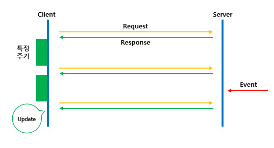
* 폴링 : 클라리언트가 주기적으로 서버에게 새 메시지가 있느냐고 물어보는 방법
* 폴링 비용 : 폴링을 자주하면 할 수록 올라감
* 단점 : 잡해줄 메시지가 없는 경우 서버 자원이 불필요하게 낭비됨

#### 롱 폴링
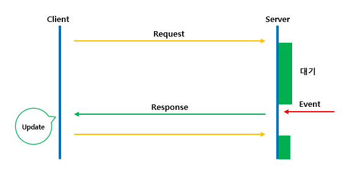
* 롱 폴링 : 클라이언트는 새 메시지가 반환되거나 타임아웃 될 때까지 연결을 유지함. 
    * 클라이언트는 새 메시지를 받으면 기존 연결을 종료하고 서버에 새로운 요청을 보내어 모든 절차를 다시 시작함
* 약점
    * 메시지를 보내는 클라이언트와 수신하는 클라이언트가 같은 채팅 서버에 접속하게 되지 않을 수도 있음. HTTP는 보통 무상태 서버이며 로드밸런싱을 위해 라운드 로빈 알고리즘을 사용하는 경우, 메시지를 받은 서버는 해당 메시지를 수신할 클라이언트와의 롱 폴링 연경을 가지고 있지 않은 서버일 수 있다.
    * 서버 입장에서는 클라이언트가 연결을 해제했는지 아닌지 알 좋은 방법이 없음
    * 비효율적. 메시지를 많이 받지 않는 클라이언트도 타임아웃이 일어날 때마다 주기적으로 서버에 다시 접속한다.

#### 웹 소켓
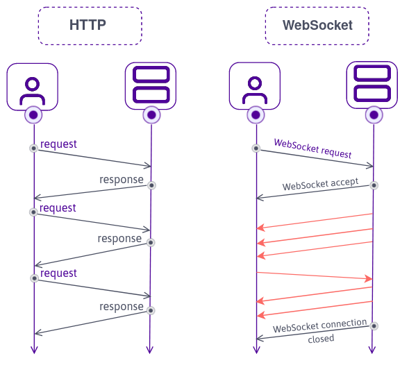
* 웹소켓 : 서버가 클라이언트에게 비동기 메시지를 보낼 때 가장 널리 사용하는 기술
* 연결은 클라이언트가 시작함. 처음에는 HTTP 연결이지만 특정 핸드셰이크 절차를 거쳐 웹소켓 연결로 업그레이드 됨. 한번 맺어진 연결은 양방향이고 서버는 클라이언트에게 비동기적으로 메시지를 전송할 수 있다.
* 웹소켓은 방화벽이 있는 환경에서도 잘 동작함(80,443처럼 HTTP 혹은 HTTPS 프로토콜이 사용하는 기본 포트번호를 그대로 쓰기 때문에)
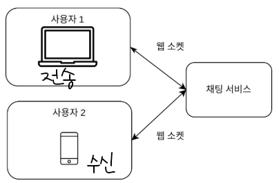
* 웹소켓 이용시 메시지를 보낼 때나 받을 때 동일한 프로토콜을 사용할 수 있음.
* 유의할 점 : 웹소켓 연결은 영구적으로 유지되어야 하기 떄문에 서버 측에서 연결 관리를 효율적으로 해야 한다.

#### 개략적 설계안
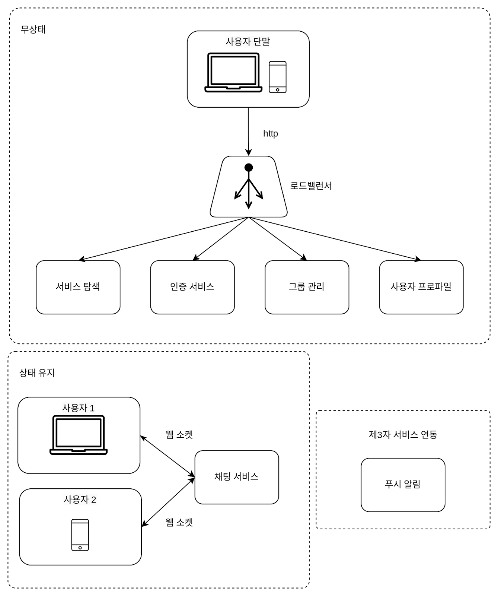
* **무상태 서비스** : 로그인, 회원가입, 사용자 프로파일 표시 등을 처리하는 전통적 요청/응답 서비스
    * 로드밸런서 뒤에 위치하며, 모놀리틱서비스일 수도 마이크로서비스일 수 있음.
    * 서비스 탐색 서비스 : 클라이언트가 접속할 채팅 서버의 DNS 호스트명을 클라이언트에게 알려주는 역할

* **상태 유지 서비스**
    * 채팅 서비스가 유일하게 상태 유지가 필요한 서비스 => why? 각 클라이언트가 채팅 서버와 독립적인 네트워크 연결을 유지해야 하기 떄문에

* **제3자 서비스 연동**
    * 제 3자 서비스 = 푸시 알림
    * 새 메시지를 받았다면 설사 앱이 실행중이지 않더라도 알림을 받아야 함.

* **규모 확장성**
    * 트래픽 규모가 얼마 되지 않을 때는 위의 모든 기능을 서버 1대로 구현 가능함.
    * 접속당 10K의 서버 메모리가 필요하다고 볼 때, 동시 접속자가 1M라면 10GB(10K * 1,000,000) 메모리만 있으면 모든 연결을 다 처리할 수 있다 
    * But, 모든 것을 서버 1대에 담은 설계안을 내밀면 면접에서 좋은 점수를 따기는 어려움. => why? SPOF(Single-Point-Of-Failure) 문제를 생각 안해서 => 그래도 이렇게 시작할 뿐이다라고 얘기하면 괜찮음
    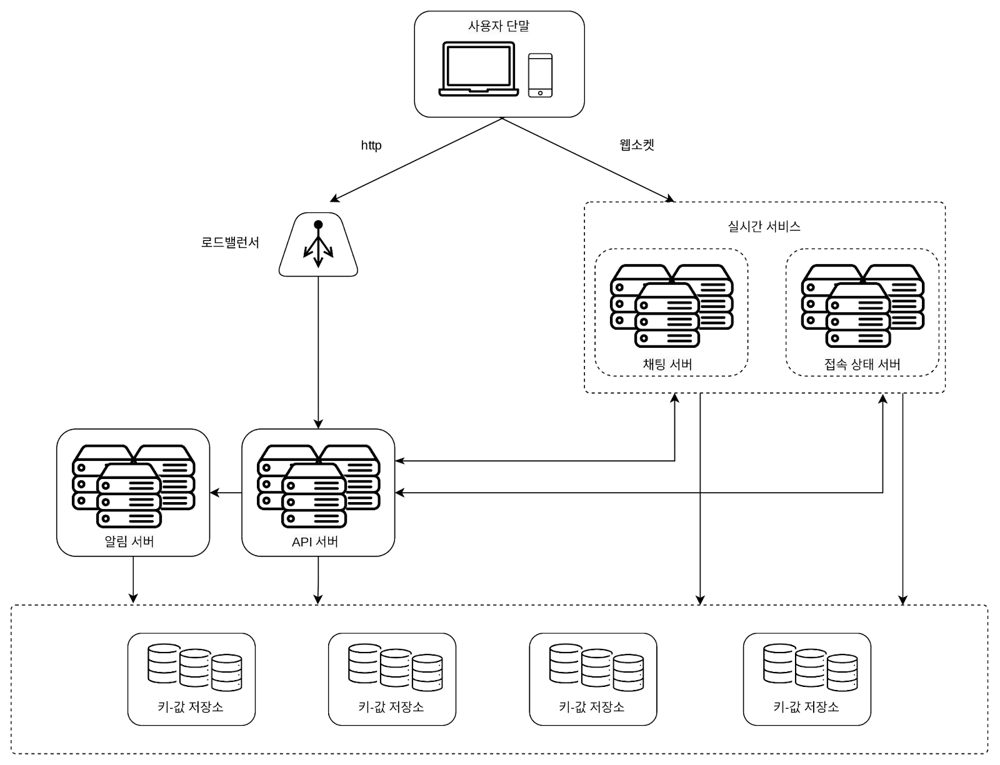
    * 유의점 : 실시간으로 메시지를 주고받기 위해 클라이언트는 채팅 서버와 웹소켓 연결을 끊지 않고 유지한다는 것
    - 채팅 서버 : 클라이언트 사이에 메시지를 중계하는 역할
    - 접속상태 서버 : 사용자의 접속 여부를 관리
    - API 서버 : 로그인, 회원가입, 프로파일 변경 등 그 외 나머지 전부를 처리함
    - 알림 서버 : 푸시 알림을 보냄
    - 키-값 저장소 : 채팅 이력을 보관. 시스템에 접속한 사용자는 이전 채팅 이력을 전부 보게됨.

* **저장소**
    * 어떤 DB를 쓰느냐가 중요 : 관계형 DB? NoSQL? => 데이터의 유형과 읽기/쓰기 연산의 패턴으로 선택
    * 채팅 시스템이 다루는 데이터 : 
        * 사용자 프로파일, 설정, 친구 목록의 데이터는 안정성을 보장하는 관계형 DB에 저장 - 다중화와 샤딩(데이터의 가용성과 규모확장성을 보증하기 위해 보편적으로 사용됨)
        * 채팅 이력은 엄청나기 때문에 키-값 저장소를 추천함.
            * 키-값 저장소는 수평적 규모확장이 쉽다.
            * 키-값 저장소는 데이터 접근 지연시간이 낮다.
            * 관계형 DB는 데이터 가운데 롱 테일에 해당하는 부분을 잘 처리하지 못하는 경향이 있음. 인덱스가 커지면 데이터에 대한 무작위적 접근을 처리하는 비용이 늘어남
            * 많은 안정적인 채팅 시스템은 키-값 저장소를 채택하고 있음. ex. 페이스북 메신저-HBase, 디스코드-카산드라

#### 데이터 모델
* **1:1 채팅을 위한 메시지 테이블**
    |message|형태|
    |-------|--|
    |message_id|bigint|
    |message_from|bigint|
    |message_to|bigint|
    |content|text|
    |created_at|timestamp|
    * 기본키 : message_id

* **그룹 채팅을 위한 메시지 테이블**
    |message|형태|
    |-------|--|
    |channel_id|bigint|
    |message_id|bigint|
    |message_to|bigint|
    |content|text|
    |created_at|timestamp|
    * 기본키 : channel_id + message_id (복합키)

* **메시지 ID**
    * message_id는 고유해야 하며, 시간 순서와 일치아혀 순서를 표현할 수 있어야 함.
    * RDBMS면 auto_increment 이용.
    * NoSQL이면 스노플레이크 같은 '전역적 64-bit 순서 번호 생성기'를 이용하거나 '지역적 순서 번호 생성기'를 이용 (지역적은 같은 채널, 1:1 채팅 세션 안에서만 유지되면 충분해서 이 방법이 통함)

### 3단계: 상세 설계
* 서비스 탐색
* 메시지 전달 흐름
* 사용자 접속 상태를 표시하는 방법

#### 서비스 탐색
* 주된 역할 : 클라이언트에게 가장 적합한 채팅 서버를 추천하는 것
    * 기준 : 클라이언트의 위치, 서버의 용량 etc
* 서비스 탐색기능을 구현하는 데 널리 쓰이는 오픈 소스 솔루션 : 아파치 주키퍼로, 사용 가능한 모든 채팅 서버를 여기 등록시켜 두고 클라이언트가 접속을 시도하면 사전에 정한 기준에 따라 최적의 채팅 서버를 골라준다.
* 주키퍼로 구현한 서비스 탐색 기능
    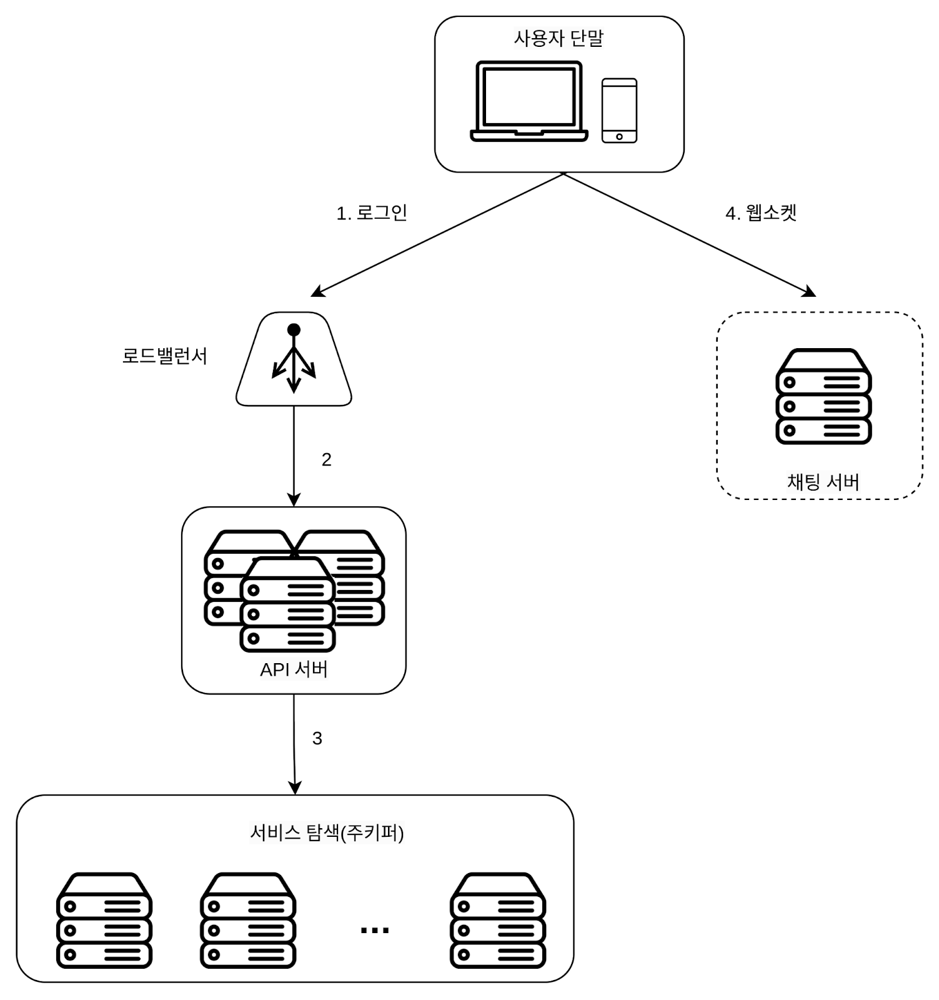
    1. 사용자가 시스템에 로그인을 시도함.
    2. 로드밸런서가 로그인 요청을 API서버들 가운데 하나로 보냄.
    3. API 서버가 사용자 인증을 처리하고 나면 서비스 탐색 기능이 동작하여 해당 사용자를 서비스할 최적의 채팅 서버를 찾음
    4. 사용자는 반환된 서버와 웹소켓 연결을 맺음
    > 로드밸런서 VS 주키퍼
    > * 공통 : 분산 시스템의 성능과 안정성을 향상시키는 데 사용되는 도구
    > * 로드밸런서 : 트래픽이 분산되도록 요청을 여러 서버들에 전달하는 역할 (직접 요청 전달)
    > * 주키퍼 : 시스템의 구성과 상태를 관리하는 용도 (추천 채팅 서버를 반환) 

#### 메시지 흐름
* **1:1 채팅 메시지 처리 흐름**
    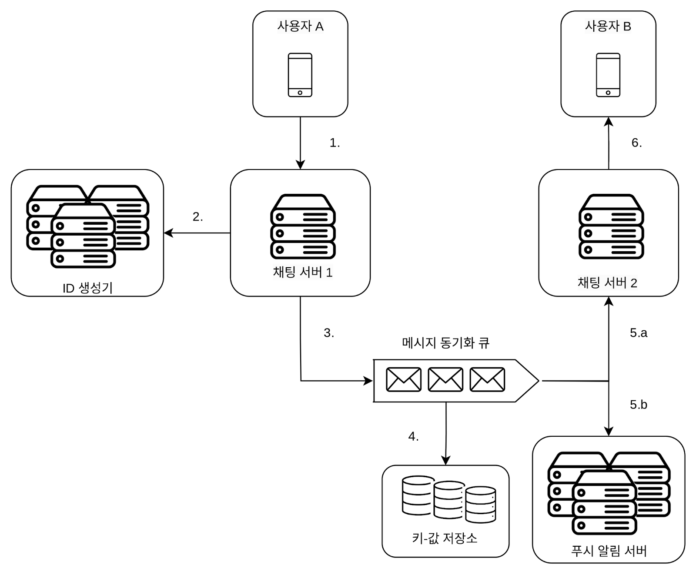
    1. 사용자A가 채팅 서버1로 메시지 전송
    2. 채팅 서버1은 ID 생성기를 사용해 해당 메시지의 ID 결정
    3. 채팅 서버1은 해당 메시지를 메시지 동기화 큐로 전송
    4. 메시지가 키-값 저장소에 보관됨
    5. 
        * (a) 사용자B가 접속중인 경우 사용자B가 접속중인 채팅 서버2로 전송됨.
        * (b) 사용자B가 접속중이 아니라면 푸시 알림 메시지를 푸시 알림 서버로 보냄
    6. 채팅 서버2는 메시지를 사용자에게 전송. 사용자B와 채팅 서버2 사이에는 웹소켓 연결이 있는 상태이므로 그것을 이용용

* **여러 단말 사이의 메시지 동기화**
    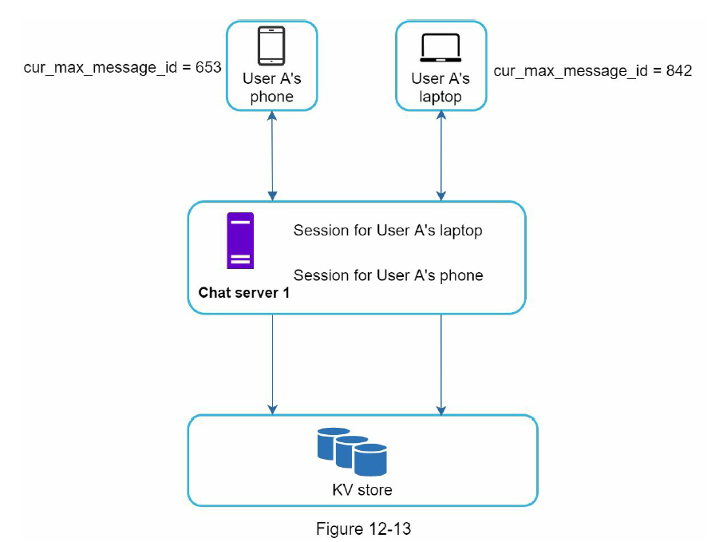
    * 상황
        * 사용자A는 전화기와 랩톱 사용중
        * 전화기에서 채팅 앱에 로그인한 결과로 채팅 서버1과 해당 단말사이에 웹소켓 연결이 생성되고, 랩톱에서 로그인한 결과로 별도 웹소켓이 채팅 서버 1에 연결되어 있는 상황
    * 각 단말은 cur_max_message_id를 유지함. => 이는 해당 단말에서 관측된 가장 최신 메시지의 ID를 추적하는 용도
        * 키-값 저장소에서 새 메시지를 가져오는 동기화 작업도 쉽게 구현할 수 있음.
    * 새 메시지의 조건
        1. 수신자 ID가 현재 로그인한 사용자 ID와 같다.
        2. 키-값 저장소에 보관된 메시지로서, 그 ID가 cur_max_message_id보다 크다.
    
* **소규모 그룹 채팅에서의 메시지 흐름**
    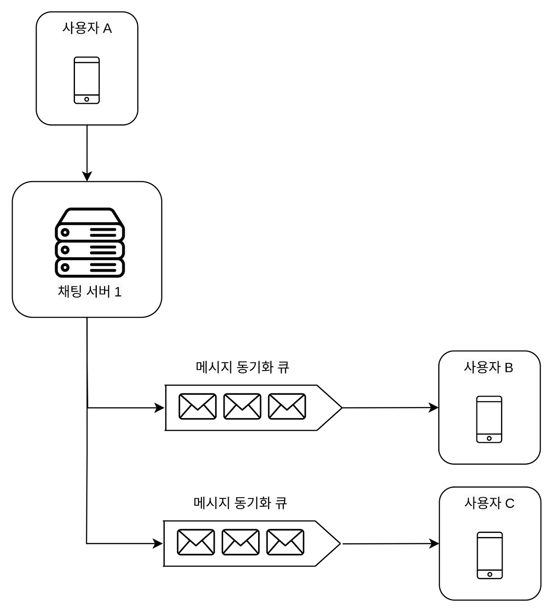
    * 그룹 채팅 방에 사용자 A,B,C가 있을 때, 사용자 A가 보낸 메시지가 사용자 B,C의 메시지 동기화 큐에 복사된다.
        * 이 <u>큐는 사용자 각각에 할당된 메시지 수신함 같은 것으로 생각하기</u> 
    * 위의 설계가 소규모 그룹 채팅에 적합한 이유 (ex. 위챗(그룹의 크기는 500명으로 제한))
        * 새로운 메시지가 왔는지 확인하려면 자기 큐만 보면 되니까 메시지 동기화 플로가 단순하다.
        * 그룹이 크지 않으면 메시지를 수신자별로 복사해서 큐에 넣는 작업의 비용이 문제가 되지 않는다.
    * 수신자 관점
        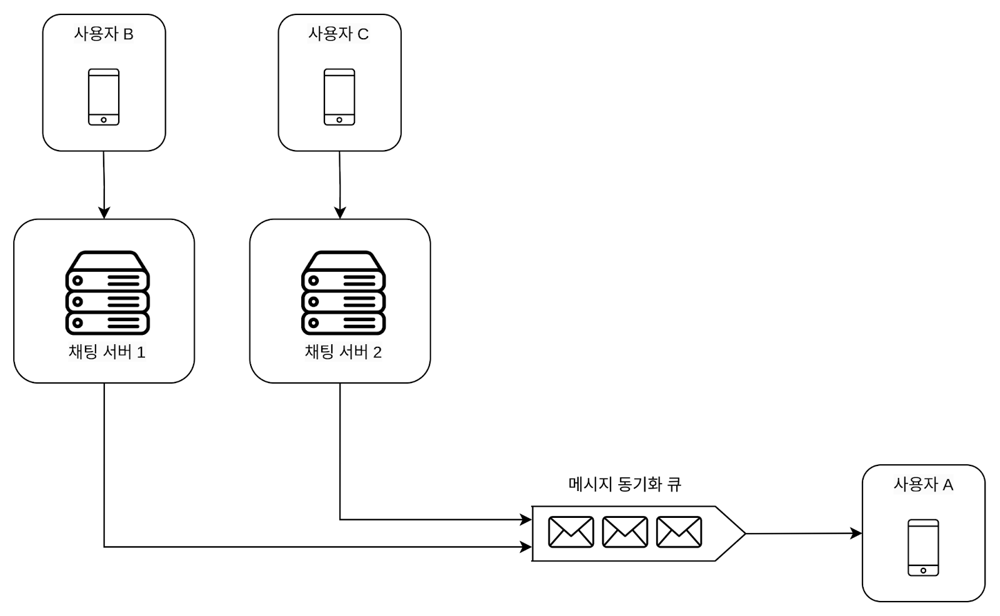
        * 한 수신자는 여러 사용자로부터 오는 메시지를 수신할 수 있어야 한다.
        * 따라서 각 사용자의 수신함, 즉 메시지 동기화 큐는 여러 사용자로부터 오는 메시지를 받을 수 있어야 함.

#### 접속상태 표시
* 접속상태 서버를 통해 사용자의 상태를 관리한다.
* 접속상태 서버는 클라이언트와 웹소켓으로 통신하는 실시간 서비스의 일부이다.

* **사용자 로그인**
    * 클라이언트와 실시간 서비스 사이에 웹소켓 연결이 맺어지고 나면 접속상태 서버는 A의 상태와 last_active_at 타임스탬프 값을 키-값 저장소에 보관함.
    * 사용자 A : {status: online, last_active_at: timestamp}
    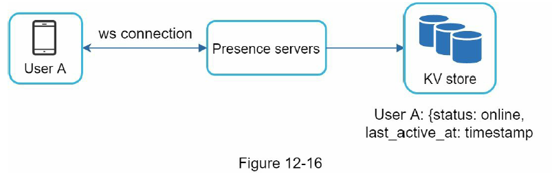

* **로그아웃**
    * 키-값 저장소에 보관된 사용자 상태가 online->offline으로 바뀌게 됨
    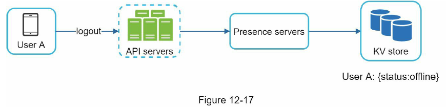

* **접속 장애**
    * 인터넷 연결 끊어짐( = 웹소켓같은 지속성 연결 끊어짐)의 경우 
        * 방법1 : 사용자를 오프라인 상태로 표시하고 연결이 복구되면 돈라인 상태로 변경하기
            * 문제점 : 짧은 시간 내에 접속 장애는 빈번하여 그럴때마다 접속 상태를 변경하면 너무 지나치고, 사용자 경험적 측면에서도 바람직 하지 X
        * 방법2 (추천) : 박동 검사 - 온라인 상태의 클라이언트로 하여금 주기적으로 박동 이벤트를 접속상태 서버로 보내도록 하고, 마지막 이벤트를 받은지 3초 이내에 또 다른 박동 이벤트 메시지를 받으면 해당 사용자의 접속상태를 계속 온라인으로 유지하기
            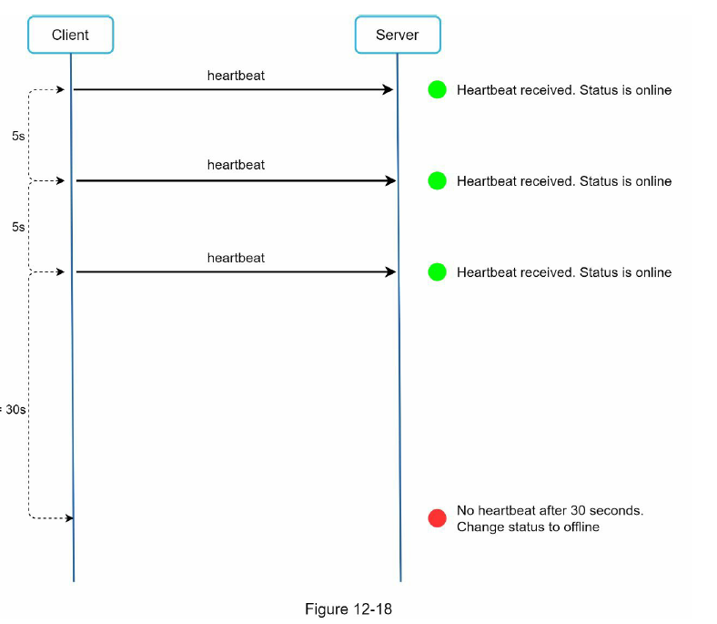
            * ex. 박동 이벤트는 5초마다, 이벤트를 3번 보낸 후 30초동안 아무런 메시지를 보내지 않아 오프라인 상태로 변경

* **상태 정보의 전송**      
    * 사용자 A와 친구 관계에 있는 사용자들은 어떻게 사용자A의 상태 변화를 알 것인가?
    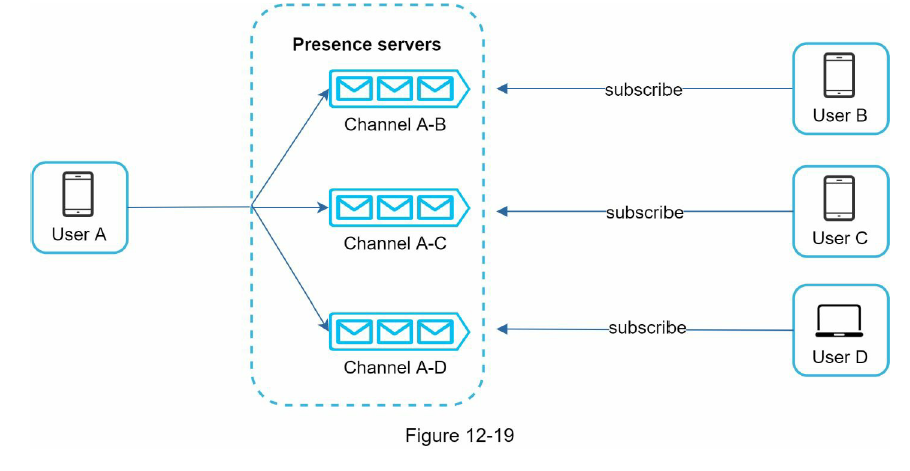
    * 상태정보 서버는 발행-구독 모델을 사용하는데, 즉 각각의 친구관계마다 채널을 하나씩 두는 것이다.
        * ex. 사용자A의 상태 변경 시, 그 사실을 3개의 채널에 쓰는 것
    * A가 채널을 열어주면 B,C,D가 구독하는 방법
    * 클라이언트와 서버 사이의 통신에는 실시간 웹소켓을 사용함.
    * 그룹크기가 작을 때 유용함. 그룹크기가 클 때(그룹 하나에 100,000명)는 사용자가 그룹 채팅에 입장하는 순간에만 상태 정보를 읽어가게 하거나, 친구 리스트에 있는 사용자의 접속상태를 갱신하고 싶으면 수동으로 하도록 유도 하기 

### 4단계: 마무리
* 클라이언트와 서버 사이의 실시간 통신을 가능하도록 하기 위해 웹소켓을 사용.
* 실시간 메시징을 지원하는 채팅 서버, 접속상태 서버, 푸시 알림 서버, 채팅 이력을 보관할 키-값 저장소, 나머지 기능의 API 서버로 이루어짐
* 추가 논의점
    * 채팅 앱을 확장하여 사진이나 비디오 등의 미디어를 지원하도록 하는 방법 : 미디어 파일은 텍스트에 비해 크기가 커서 그와 관련된 압축 방식, 클라우드 저장소, 섬네일 생성 등을 논의할 수 O
    * 종단 간 암호화 지원 : 메시지 발신인과 수신자 이외에는 아무도 메시지 내용을 볼 수 없다.
    * 캐시 : 클라이언트에 이미 읽은 메시지를 캐시해두면 서버와 주고받는 데이터 양을 줄일 수 있음.
    * 로딩 속도 개선 : 슬랙같은 경우 사용자의 데이터, 채널 등을 지역적으로 분산하는 네트워크를 구축하여 앱 로딩 속도를 개선함.
    * 오류 처리 : 
        * 채팅 서버 오류 : 채팅 서버 하나에 수십만 사용자가 접속해 있을 수 있는데, 그런 서버 하나가 죽으면 서비스 탐색 기능(주키퍼)이 동작하여 클라이언트에게 새로운 서버를 배정하고 다시 접속할 수 있도록 해야함.
        * 메시지 재전송 : 재시도(retry)나 큐(queue)는 메시지의 안정적 전송을 보장하기 위해 흔히 사용되는 기법이다.