## 13. 검색어 자동완성 시스템
* 검색어 자동완성 : 검색창에 단어 입력 중 입력중인 글자에 맞는 검색어가 자동으로 완성되어 표시되는 것
* 설계 목표 : 가장 많이 이용된 검색어 k개를 자동완성하여 출력하는 시스템 만들기

### 1단계: 문제 이해 및 설계 범위 확정
* 사용자가 입력하는 단어는 자동완성될 검색어의 첫 부분이어야 하나? 아니면 중간부분이 될 수 있나? : 첫 부분으로 한정
* 몇 개의 자동완성 검색어가 표시되어야 하는가? : 5개
* 자동 완성 검색어 5개를 고르는 기준은 무엇인가? : 질의 빈도에 따라 정해지는 검색어 인기 순위를 기준으로 한다.
* 맞춤법 검사 기능도 제공해야 하는가? : 맞춤법 검사나 자동수정은 지원하지 X
* 질의는 영어인가? : yes, 하지만 시간이 허락하면 다국어 지원을 생각해도 됨.
* 대문자나 특수문자 처리를 해야 하는가? : No. 모든 질의는 영어 소문자로 이루어진다고 가정하기
* 얼마나 많은 사용자를 지원해야 하는가? : 일간 능동 사용자(DAU) 기준으로 천만 명

#### 요구사항 정리
* 빠른 응답 속도 : 시스템 응답속도 100밀리초 이내
* 연관성 : 사용자가 입력한 단어와 연관된 것이여야 함
* 정렬 : 시스템의 계산 결과는 인기도 등의 순위 모델에 의해 정렬되어 있어야 함.
* 규모 확장성 : 시스템은 많은 트래픽을 감당할 수 있도록 확장 가능해야 함.
* 고가용성 : 시스템 일부에 장애가 발생하거나, 느려지거나, 예상치 못한 네트워크 문제가 생겨도 시스템은 계속 사용 가능해야 함.

#### 개략적 규모 추정
* 일간 능동 사용자(DAU) : 천만명
* 평균적으로 한 사용자는 매일 10건의 검색을 수행한다고 가정
* 질의할 때마다 평균적으로 20바이트의 데이터를 입력한다고 가정
    * 문자 인코딩 방법으로는 ASCII를 사용한다고 가정하여, 1문자=1바이트
    * 질의문은 평균적으로 4개 단어로 이루어진다고 가정하며, 각 단어는 평균적으로 5글자로 구성된다고 가정
    * 따라서 질의당 평균 4X5 = 20바이트
* 검색창에 글자를 입력할 때마다 클라이언트는 검색어 자동완성 백엔드에 요청을 보냄. 따라서 평균적으로 1회 검색당 20건의 요청이 백엔드로 전달된다.
    * ex. dinner 검색 시, 6개의 요청이 순차적으로 백엔드에 전송됨 : search?q=d => search?q=di => search?q=din => search?q=dinn => search?q=dinne => search?q=dinner
* 대략 초당 24,000 건의 질의(QPS)가 발생함 (= 10,000,000사용자 X 10질의/일 X 20자 / 24시간 / 3600초)
* 최대 QPS = QPS X 2 = 48000
* 질의 가운데 20% 정도는 신규 검색어라고 가정할 것. 따라서 대략 0.4GB (= 10,000,000사용자 X 10질의/일 X 20자 X 20%). => 매일ㄹ 0.4GB의 신규 데이터가 시스템이 추가된다라는 의미

### 2단계: 개략적 설계안 제시 및 동의 구하기
1. 데이터 수집 서비스 : 사용자가 입력한 질의를 실시간으로 수집하는 시스템
2. 질의 서비스 : 주어진 질의에 5개의 인기 검색어를 정렬해 내놓는 서비스

#### 데이터 수집 서비스
* 질의문과 사용빈도를 저장하는 빈도 테이블이 있다고 가정하자.
* ex. twitch -> twitter -> twitter -> twillo 순으로 검색 시
    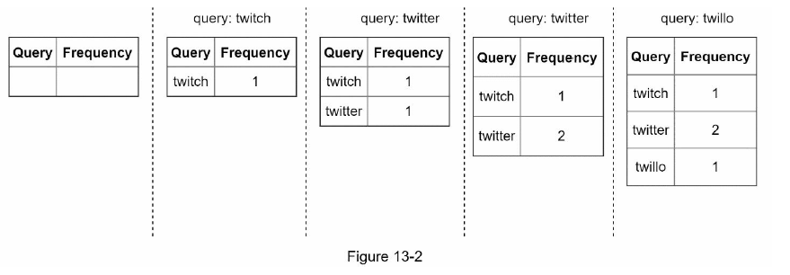

#### 질의 서비스
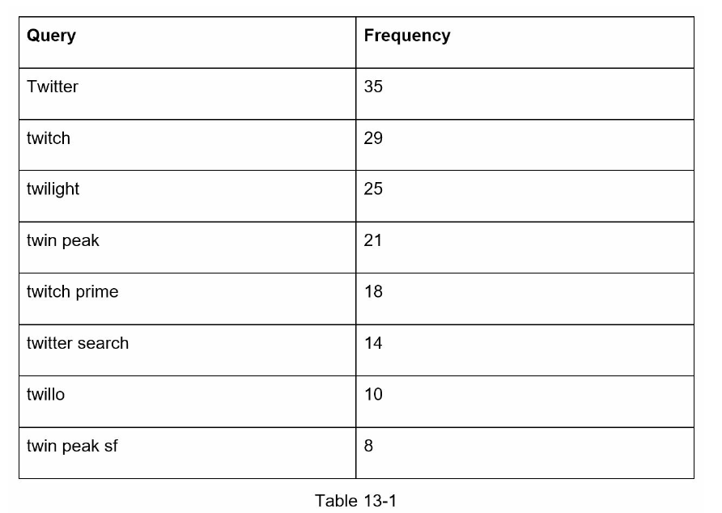
* 빈도 테이블의 필드
    1. query : 질의문을 저장하는 필드
    2. frequency : 질의문이 사용된 빈도를 저장하는 필드
* 이 상태에서 사용자가 검색창에 "tw" 입력 시 "top 5"의 자동완성 검색어가 표시되어야 함.
* top 5의 SQL 질의문
    ```sql
    SELECT * FROM frequency_table
    WHERE query LIKE 'prefix%'
    ORDER BY frequency DESC
    LIMIT 5
    ```
    => 단점 : 데이터가 많아질 때 DB가 병목이 될 수 있음.

### 3단계: 상세 설계
1. 트라이(trie) 자료구조
2. 데이터 수집 서비스
3. 질의 서비스
4. 규모 확장이 가능한 저장소
5. 트라이 연산

#### 트라이 자료구조
* 트라이(trie, 접두어 트리(prefix tree)) : 문자열들을 간랴가게 저장할 수 있는 자료구조. 문자열을 꺼내는 연산에 초점을 맞추어 설계된 자료구조
    * 트라이는 트리 형태의 자료구조다
    * 이 트리의 루트 노드는 빈 문자열을 나타낸다
    * 각 노드는 글자(character) 하나를 저장하며, 26개의 자식 노드를 가질 수 있다.
    * 각 트리 노드는 하나의 단어, 또는 접두어 문자열(prefix string)을 나타낸다
* ex. 'tree', 'try', 'true', 'toy', 'wish', 'win'
    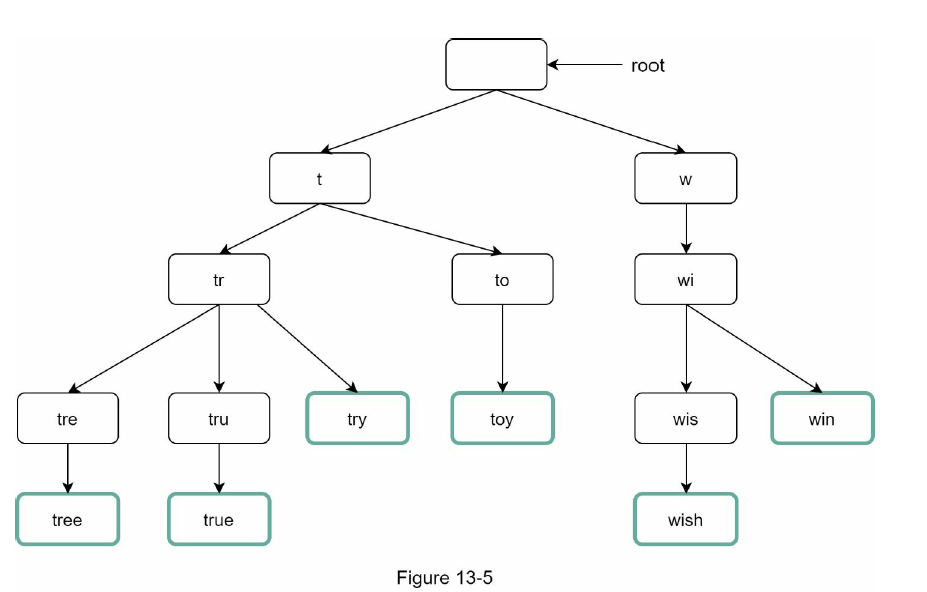
* 기본 트라이 자료구조는 노드에 문자들을 저장하고, 이용빈도에 따라 정렬된 결과를 내놓기 위해서는 노드에 빈도 정보까지 저장할 필요가 있음.
    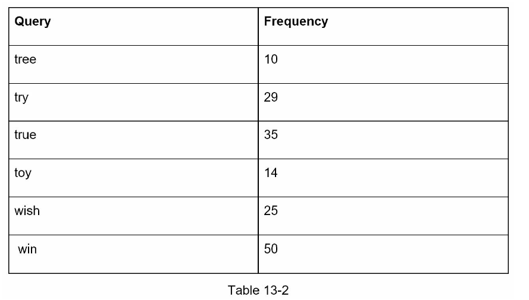
    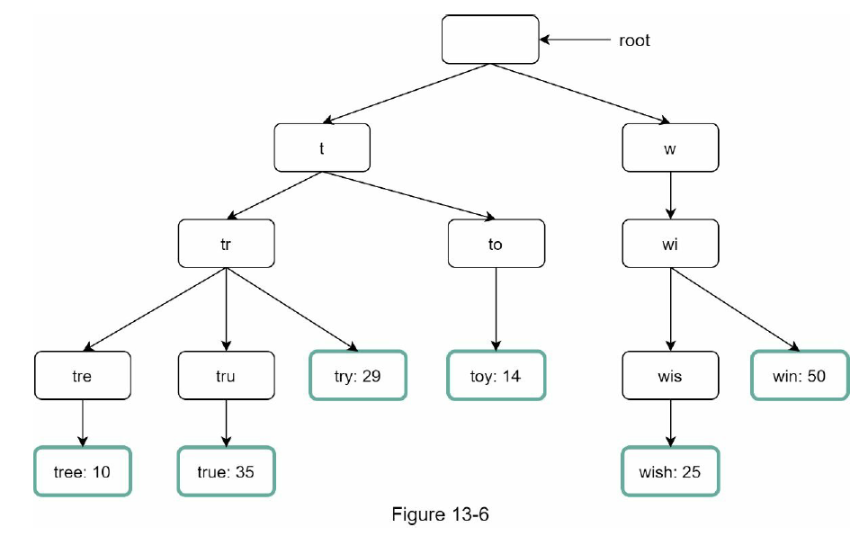
* 가장 많이 사용된 질의어 k개 찾는 방법
    1. 해당 접두어를 표현하는 노드를 찾기. 시간 복잡도:O(p)
    2. 해당 노드부터 시작하는 하위 트리를 탐색하여 모든 유효 노드를 찾음.
        * 유효한 검색 문자열을 구성하는 노드가 유효 노드. 시간 복잡도:O(c)
    3. 유효 노드들을 정렬하여 가장 인기 있는 검색어 k개를 찾는다. 시간 복잡도:O(clogc)
    > * 용어 정리
    >   * p : 접두어의 길이
    >   * n : 트라이 안에 있는 노드 개수
    >   * c : 주어진 노드의 자식 노드 개수
    * ex. k=2, 검색창에 'be' 입력 시
        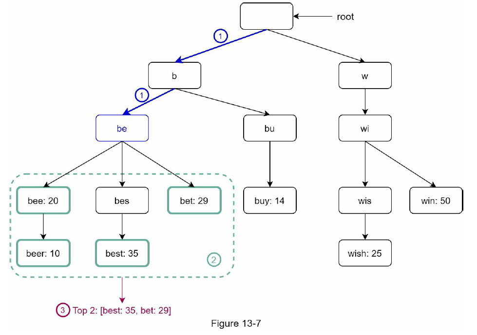
        1. 접두어 노드 'be'를 찾기
        2. 해당 노드부터 시작하는 하위 트리를 탐색하여 모든 유효노드들 찾기 : [bee: 20],[beer: 10],[best: 35],[bet: 29]
        3. 유효노드들을 정렬하여 2개만 골라내기 : [best: 35],[bet: 29]

* 이 알고리즘의 시간 복잡도 : 각 단계에 소요된 시간의 합 = O(p) + O(c) + O(clogc)
* 이 알고리즘의 최악 : k개 결과를 얻으려고 전체 트라이를 다 검색해야 하는 일. 
    * 이 문제를 해결하기 위한 방법
        * 방법1. 접두어의 최대 길이를 제한
        * 방법2. 각 노드에 인기 검색어를 캐시

    * **접두어 최대 길이 제한** : p값은 작은 정수값(50정도)로 가정해도 안전함. 이 경우 "접두어 노드를 찾는" 시간 복잡도 = O(1)
    * **노드에 인기 검색어 캐시** : 각 노드에 k개의 인기 검색어를 저장해 두면 전체 트라이를 검색하는 일을 방지함. 
        * 장점 : "top 5" 검색어를 질의하는 시간 복잡도를 엄청나게 낮출 수 있다, 빠른 응답속도 => "top 5를 찾는" 시간 복잡도 = O(1)
        * 단점 : 각 노드에 질의어를 저장할 공간이 많이 필요하게 된다.
        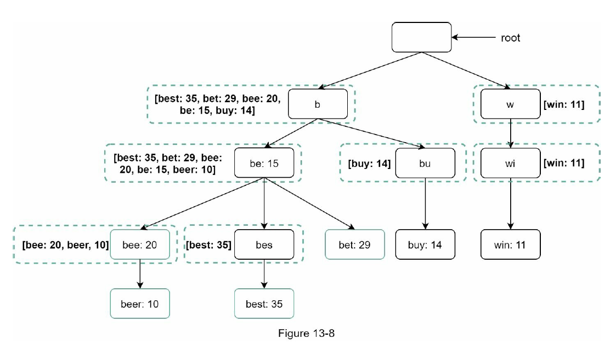
    * => 결국 각 단계의 시간 복잡도가 O(1)로 바뀐 덕분에, 최고 인기 검색어 k개를 찾는 전체 알고리즘의 복잡도도 O(1)로 바뀌게 됨.

#### 데이터 수집 서비스
* 사용자가 검색창에 타이핑할 때마다의 문제점
    * 매일 수천만 건의 질의가 입려고딜 텐데 그때마다 트라이를 갱신하면 질의 서비스는 심각하게 느려지게 됨.
    * 일단 트라이가 만들어지고 나면 인기 검색어는 그다지 자주 바뀌지 않을 것이다. 그러니 트라이는 그렇게 자주 갱신할 필요가 없다.
        * 트위터 같은 실시간 애플리케이션이라면 검색어를 항상 신선하게 유지할 필요가 있을 수 있지만 구글 검색은 자주 바꿔주지 않아도 됨됨
* 트라이를 만드는데 쓰이는 데이터는 보통 데이터 분석 서비스나 로깅 서비스로부터 온다
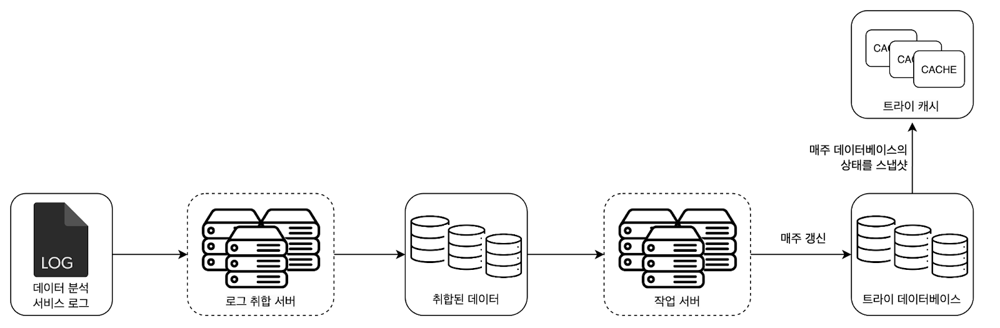

* **데이터 분석 서비스 로그** : 검색창에 입력된 질의에 관한 원본 데이터가 보관됨.
    * 새로운 데이터가 추가될 뿐 수정은 이루어지지 않으며 로그 데이터에는 인덱스를 걸지 않음.
    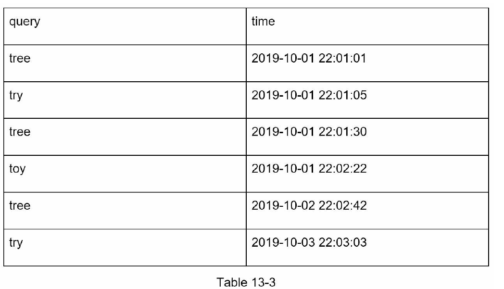

* **로그 취합 로그**
    * 트위터 같은 실시간 앱은 결과를 빨리 보여주는 것이 중요하므로 데이터 취합 주기를 보다 짧게 가져갈 필요가 있고, 대부분은 일주일에 한 번 정도로 로그를 취합해도 충분함.

* **취합된 데이터** : time(해당 주가 시작한 날짜), frequency(해당 질의가 해당 주에 사용된 횟수의 합)
    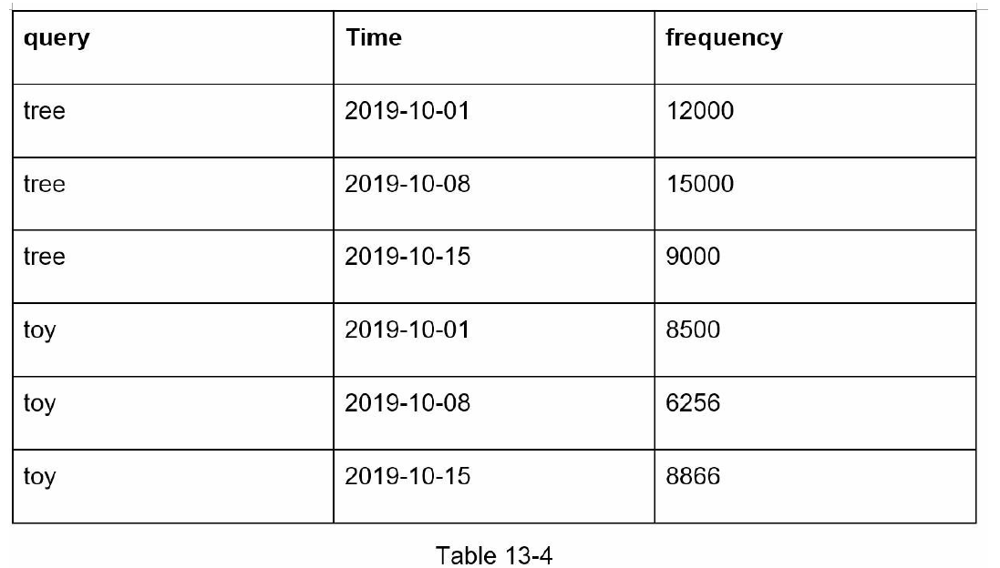

* **작업 서버** : 주기적으로 비동기적 작업(job)을 실행하는 서버 집합
    * 트라이 자료구조를 만들고 트라이 DB애 저장하는 역할을 담당

* **트라이 캐시** : 분산 캐시 시스템으로 트라이 데이터를 메모리에 유지하여 읽기 연산 성능을 높이는 구실을 함. 
    * 매주 트라이 DB의 스냅샷을 떠서 갱신함

* **트라이 데이터베이스** : 지속성 저장소.
    * 트라이 DB 선택지
        1. 문서 저장소(Document store) : 새 트라이를 매주 만들 것이므로, 주기적으로 트라이를 직렬화하여 DB에 편히 저장할 수 있다. (ex. 몽고DB)
        2. 키-값 저장소: 트라이는 아래 로직을 적용하면 해시 테이블 형태로 변환 가능함.
            * 트라이에 보관된 모든 접두어를 해시 테이블 키로 변환
            * 각 트라이 노드에 보관된 모든 데이터를 해시 테이블 값으로 변환
        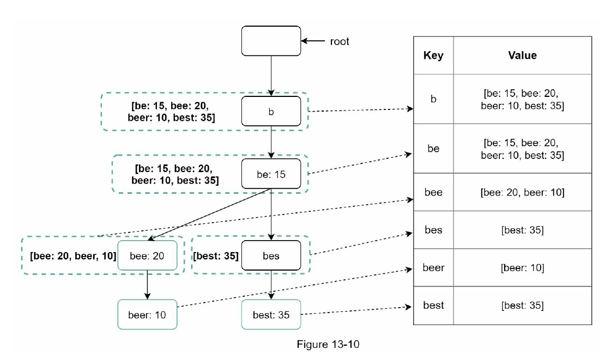   

* **질의 서비스**
    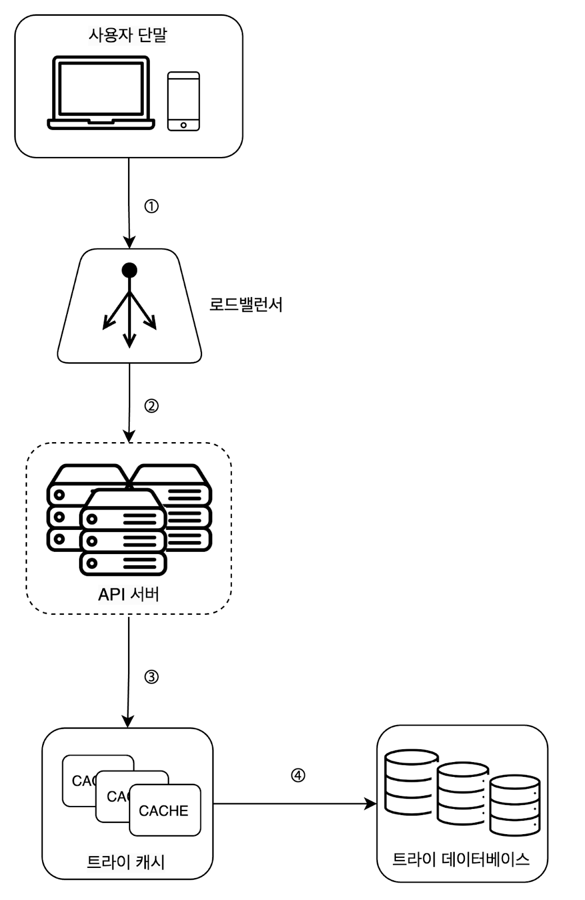
    * 흐름
        1. 검색 질의가 로드 밸런서로 전송
        2. 로드밸런서는 해당 질의를 API 서버로 보냄
        3. API 서버는 트라이 캐시에서 데이터를 가져와 해당 요청에 대한 자동완성 검색어 제안 응답을 구성함.
        4. 데이터가 트라이 캐시에 없는 경우에는 데이터를 데이터베이스에서 가져와 캐시에 채움(추후 속도 개선을 위해). 캐시 미스(cache miss)는 캐시 서버의 메모리가 부족하거나 캐시 서버에 장애가 있어도 발생할 수 있음.
    * 질의 서비스는 번개처럼 빨라야 하며 이에 대한 최적화 방안
        * AJAX 요청 : 요청을 보내고 받기 위해 페이지를 새로고침 할 필요가 없음
        * 브라우저 캐싱 : 제안된 검색어들을 브라우저 캐시에 넣어두면 후속 질의의 결과는 해당 캐시에서 바로 가져갈 수 있음.
            * ex. 구글 검색 엔진 : cache-control의 private(:해당 응답이 요청을 보낸 사용자의 캐시에만 보관될 수 있으며 공통 캐시에 저장되어서는 안된다는 뜻), max-age=3600(: 캐시 항목은 3600초로 1시간동안 유효함)
        * 데이터 샘플링 : N개 요청 가운데 1개만 로깅하도록 하는 것. (대규모 시스템일 때 모든 질의 결과를 로깅하도록 해 놓으면 CPU 자원과 저장공간을 엄청나게 소진하게 되므로 이를 예방)

#### 트라이 연산
* **트라이 생성**
    * 트라이 생성은 작업 서버가 담당하며, 데이터 분석 서비스의 로그나 DB로부터 취합된 데이터를 이용한다.

* **트라이 갱신**
    * 갱신 방법
        * 방법 1(추천). 매주 한 번 갱신하는 방법 : 새로운 트라이를 만든 다음 기존 트라이를 대체함.
        * 방법 2. 트라이의 각 노드를 개별적으로 갱신하는 방법 : 성능은 좋지 않지만 트라이가 작을때는 고민해볼만함. 트라이 노드를 갱신할 때 그 모든 상위 노드도 갱신하는 방법

* **검색어 삭제**
    * 혐오성이 짙거나, 폭력적이거나, 성적으로 노골적이거나, 여러 가지로 위험한 질의어를 자동완성 결과에서 제거하기
    * 방법 : 트라이 캐시 앞에 필터 계층을 두고 부적절한 질의어가 반환되지 않도록 하기
    * 필터 계층의 장점 : 필터 규칙에 따라 검색 결과를 자유롭게 변경할 수 있다.
    * DB에서 해당 검색어를 물리적으로 삭제하는 것은 다음번 업데이터 사이클에 비동기적으로 진행하기
    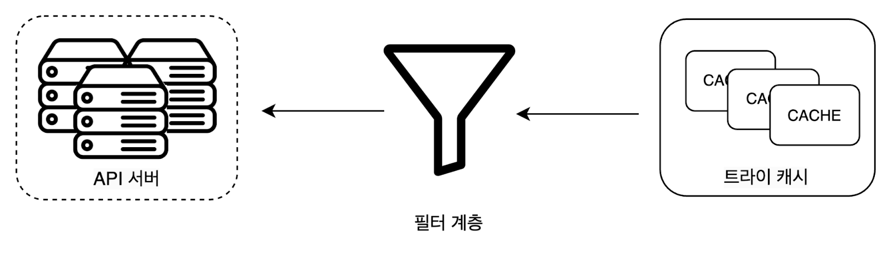

#### 저장소 규모 확장
* 방법 : 첫 글자를 기준으로 샤딩(sharding)하는 방법
    * ex1. 검색어를 보관하기 위해 2대의 서버가 필요하다면 'a'~'m'을 첫번째 서버에 저장하고, 나머지를 2번째 서버에 저장
    * ex2. 3대의 서버가 필요하다면 'a'~'i'를 1번째 서버에, 'j'~'r'까지 2번째 서버에, 나머지를 3번째 서버에 저장
    * 샤딩을 계층적으로 저장 : a로 시작하는 검색어를 4대의 서버에 나눠 보관할 때 'aa'~'ag', 'ah'~'an', 'ao'~'au', 나머지를 각각의 서버에 보관 <br/>
    => but, 'c'로 시작하는 단어가 'x'로 시작하는 단어보다 많다는 것을 감안하면 데이터를 각 서버에 균등하게 배분하기는 불가능함.
    * 위의 문제를 해결하기 위해 과거 질의 데이터의 패턴을 분석하여 샤딩하는 방법을 제안함.
        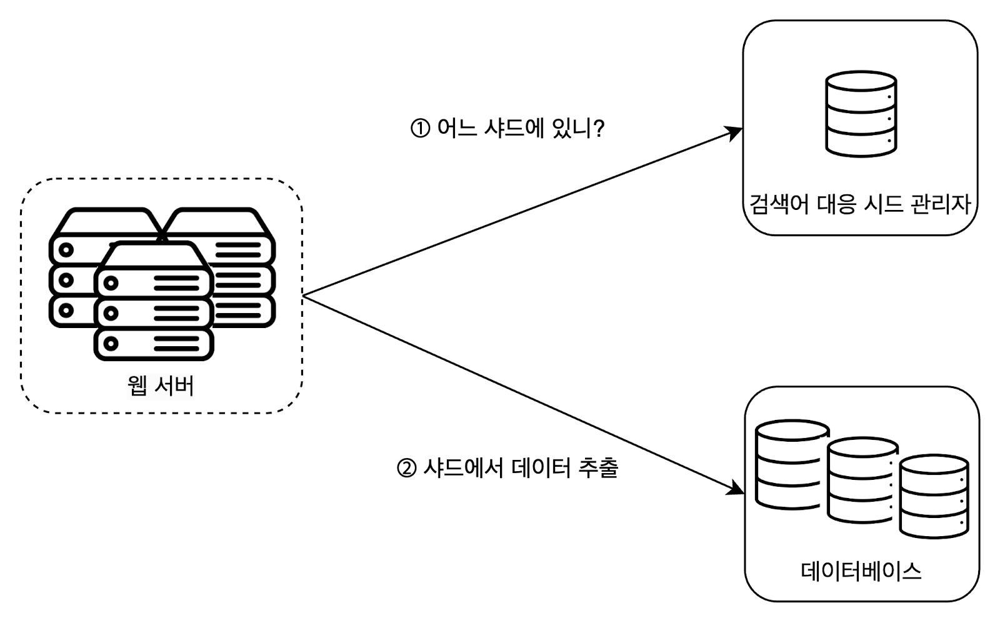
        * 검색어 대응 시드 관리자 : 어떤 검색어가 어느 저장소 서버에 저장되는지에 대한 정보를 관리함.
        * ex. 's'로 시작하는 검색어의 양 == 'u','v','w','x','y','z'로 시작하는 검색어를 전부 합친 양 일 때, 's'에 대한 샤드 하나와 'u'~'z'에 대한 샤드 하나를 두어도 충분할 것임.

### 4단계: 마무리
* 추가 논의점
    * 다국어 지원이 가능하도로 시스템을 확장하는 방법 : 비영어권 국가에서 사용하는 언어를 지원하려면 트라이에 유니코드 데이터를 저장해야 함.
    > 유니코드 : 고금을 막론하고 세상에 존재하는 모든 문자 체계를 지원하는 표준 인코딩 시스템
    * 국가별로 인기 검색어 순위가 다른 경우 : 국가별로 다른 트라이를 사용하도록 한다. 트라이를 CDN에 저장하여 응답속도를 높이는 방법도 생각해볼 수 있음
    * 실시간으로 변하는 검색어의 추이를 반영하기 위한 방법 : 
        * 위의 설계안이 이런 검색어를 지원하기 적합하지 않은 이유 : 
            * 작업 서버가 매주 한번씩만 도도록 되어 있어서 시의 적절하게 트라이를 갱신할 수 없다. 
            * 설사 때맞춰 서버가 실행된다 해도, 트라이를 구성하는데 너무 많은 시간이 소요된다.
        * 실시간 검색어 자동완성 시스템 구축 아이디어
            * 샤딩을 통하여 작업 대상 데이터의 양을 줄인다.
            * 순위 모델(ranking model)를 바꾸어 최근 검색어 보다 높은 가중치를 주도록 한다
            * 데이터가 스트림 형태로 올 수 있다는 점, 즉 한번에 모든 데이터를 동시에 사용할 수 없을 가능성이 있다는 점을 고려해야 한다. (데이터가 스트링밍 = 데이터가 지속적으로 생성된다는 것)
            * 스트림 프로세싱에는 특별한 종류의 시스템이 필요함. : 아파치 하둡 맵리듀스, 아파치 스파크 스트리밍, 아파치 스톰, 아파치 카프카 등