## 14. 유튜브 설계
* 유튜브 통계자료
    * 월간 능동 사용자 수 : 20억
    * 매일 재생되는 비디오 수 : 50억
    * 미국 성인 가운데 73%가 유튜브 이용
    * 5천만 명의 창작자
    * 유튜브의 광고 수입 : $150억
    * 모바일 인터넷 트래픽 중 37%
    * 80개 언어로 이용 가능

### 1단계: 문제 이해 및 설계 범위 확정
* 논의
    * 어떤 기능이 가장 중요한가? : 비디오를 올리는 기능과 시청하는 기능
    * 어떤 클라이언트를 지원하는가? : 모바일 앱, 웹 브라우저, 스마트 TV
    * 일간 능동 사용자 수는 몇 명인가? : 500만
    * 사용자가 이 제품에 평균적으로 소비하는 시간은 얼마인가? : 30분
    * 다국어 지원이 필요한가? : yes
    * 어떤 비디오 헤상도를 지원해야 하는가? : 현존하는 모든 비디오 종류와 해상도 대부분
    * 암호화가 필요한가? : yes
    * 비디오 파일 크기에 제한이 있는가? : 작은 비디오나 중간 크기 비디오에 초점을 맞추며, 비디오 크기는 최대 1GB로 제한
    * 아마존, 구글, 마이크로소프트가 제공하는 클라우드 서비스를 활용해도 되는가? : yes
* 요구사항
    * 빠른 비디오 업로드
    * 원활한 비디오 재생
    * 재생 품질 선택 기능
    * 낮은 인프라 비용
    * 높은 가용성과 규모 확장성, 그리고 안정성
    * 지원 클라이언트 : 모바일 앱, 웹브라우저, 스마트 TV

#### 개략적 규모 추정
* 일간 능동 사용자 수 : 500만
* 한 사용자는 하루 평균 5개의 비디오를 시청
* 10%의 사용자가 하루에 1비디오를 업로드
* 비디오 평균 크기는 300MB
* 비디오 저장을 위해 매일 새로 요구되는 저장 용량 = 500만 X 10% X 300MB = 150TB
* CDN 비용
    * 클라우드 CDN을 통해 비디오를 서비스할 경우 CDN에서 나가는 데이터의 양에 따라 과금한다.
    * AWS의 CloudFount 사용할 경우, 100% 트래픽이 미국에서 발생한다면 1GB 당 $0.02의 요금이 과금됨.
    * 따라서 매일 발생하는 요금은 500만 X 5비디오 X 0.3GB X $0.02 = $150,000

### 2단계: 개략적 설계안 제시 및 동의 구하기
* CDN + BLOB 스토리지 사용
    * 이유 : 주어진 시간 안에 적절한 기술을 골라 설계를 바치는 것이 중요함
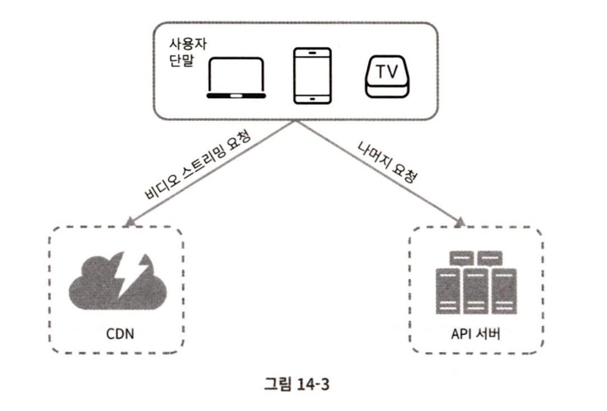
* 단말 : 컴퓨터, 핸드폰, 스마트 TV를 통해 유튜브 시청
* CDN : 비디오가 저장될 위치. 재생 버튼 클릭 시 CDN으로부터 스트리밍이 이루어짐
* API 서버 : 비디오 스트리밍을 제외한 모든 요청은 API 서버가 처리함. ex. 피드 추천, 비디오 업로드 URL 생성, 메타데이터 데이터베이스와 캐시 갱신, 사용자 가입 etc

#### 비디오 업로드 절차
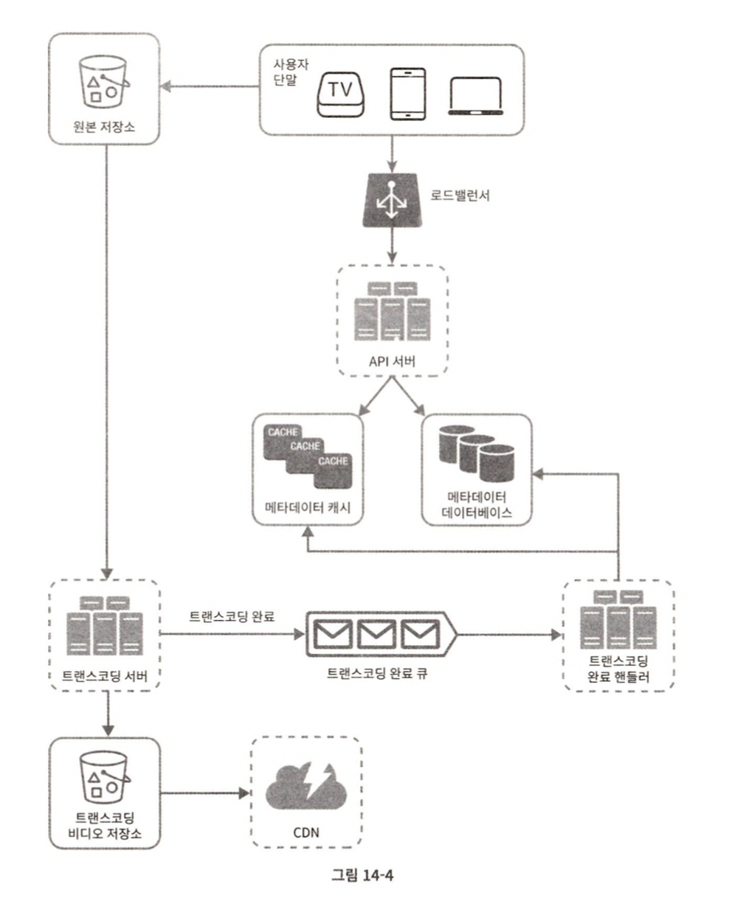
* 메타데이터 DB : 비디오의 메타데이터를 보관함. 샤딩과 다중화를 적용하여 성능 및 가용성 요구사항을 충족함.
* 메타데이터 캐시 : 성능을 높이기 위해 비디오 메타데이터와 사용자 객체는 캐시한다.
* 원본 저장소 : 원본 비디오를 보관할 대형 이진 파일 저장소(BLOB : Binary Large Object storage) 시스템
    > BLOB 저장소 : 이진 데이터를 하나의 개체로 보관하는 데이터베이스 관리 시스템
* 트랜스코딩 서버 : 비디오 트랜스코딩( = 비디오 인코딩)은 비디오 포맷을 변환하는 절차. 단말이나 대역폭 요구사항에 맞는 최적의 비디오 스티림을 제공하기 위해 필요함.
* 트랜스코딩 비디오 저장소 : 트랜스코딩이 완료된 비디오를 저장하는 BLOB 저장소
* CDN : 비디오를 캐시하는 역할. 사용자가 재생 버튼을 클릭시 비디오 스트리밍이 CDN을 통해 이루어짐.
* 트랜스코딩 완료 큐 : 비디오 트랜스코딩 완료 이벤트들을 보관할 메시지 큐
* 트랜스코딩 완료 핸들러 : 트랜스코딩 완료 큐에서 이벤트 데이터를 꺼내어 메타데이터 캐시와 데이터베이스를 갱신할 작업 서버들

* 비디오 업로드가 처리되는 방법 : 아래 두 프로세스가 병렬적으로 수행됨
    * 비디오 업로드
    * 비디오 메타데이터 갱신. 메타데이터에는 비디오 URL, 크기, 해상도, 포맷, 사용자 정보가 포함됨.

* **프로세스 a:비디오 업로드**
    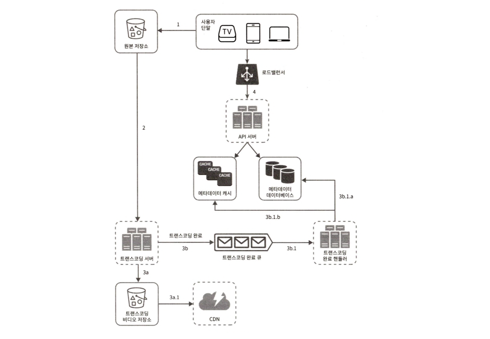
    1. 비디오를 원본 저장소에 업로드
    2. 트랜스코딩 서버는 원본 저장소에서 해당 비디오를 가져와 트랜스코딩 시작
    3. 트랜스코딩이 완료되면 아래 2절차가 병렬적으로 수행됨.
        * 3a. 완료된 비디오를 트랜스코딩 비디오 저장소로 업로드한다.
            * 3a.1. 트랜스코딩이 끝난 비디오를 CDN에 올린다.
        * 3b. 트랜스코딩 완료 이벤트를 트랜스코딩 완료 큐에 넣는다.
            * 3b.1. 완료 핸들러가 이벤트 데이터를 큐에서 꺼낸다.
                * 3b.1.a, 3b.1.b. 완료 핸들러가 메타데이터 DB와 캐시를 갱신한다.
    4. API 서버가 단말에게 비디오 업로드가 끝나서 스트리밍 준비가 되었음을 알린다.

* **프로세스 b:메타데이터 갱신**
    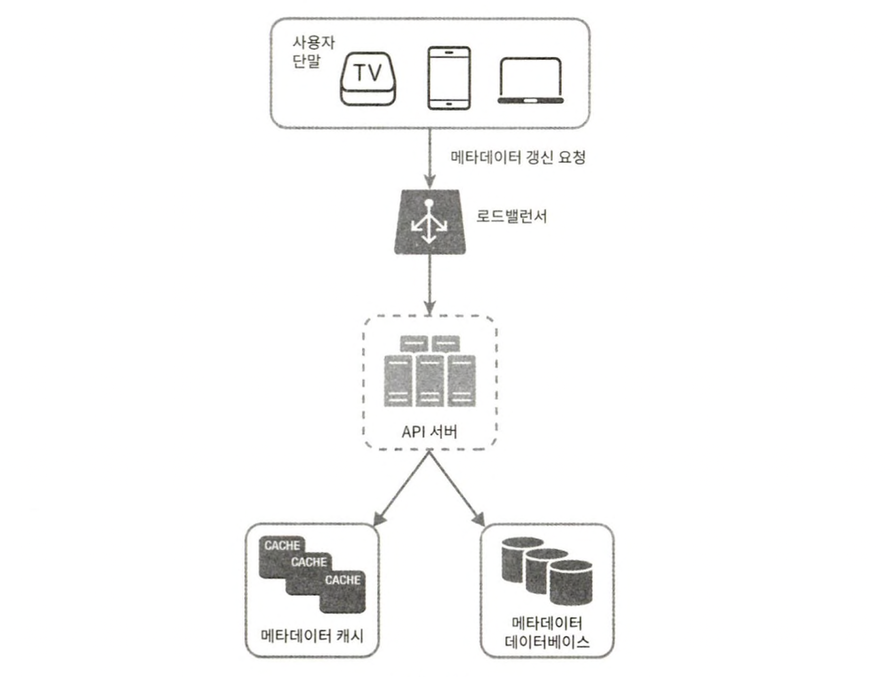
    * 원본 저장소에 파일이 업로드되는 동안, 단말은 병렬적으로 비디오 메타데이터 갱신 요청을 API서버에 보낸다. 
    * 이 요청에 포함된 메타데이터 : 파일 이름, 크기, 포맷 등의 정보가 들어있음.
    * API 서버는 이 정보로 메타데이터 캐시와 DB를 업데이트한다.

#### 비디오 스트리밍 절차
* 다운로드 : 비디오를 단말로 내려 받는 것
* 스트리밍 : 단말이 원격지의 비디오로부터 지속적으로 비디오 스트림을 전송받아 영상을 재생하는 것
* 스트리밍 프로토콜 : 비디오 스트리밍을 위해 데이터를 전송할 때 쓰이는 표준화된 통신방법
    * MPEG-DASH
    * 애플 HLS
    * 마이크로소프트 스무드 스트리밍
    * 어도비 HTTP 동적 스트리밍밍
* 프로토콜마다 지원하는 비디오 인코딩이 다르고 플레이어도 다름. => 따라서 비디오 스트리밍 서비스를 설계할 때는 서비스의 용례에 맞는 프로토콜을 잘 골라야 함.
* 비디오는 CDN에서 바로 스트리밍되며, 사용자의 단말에 가장 가까운 CDN 에지 서버가 비디오 전송을 담당할 것이임. 따라서 전송지연은 아주 낮음
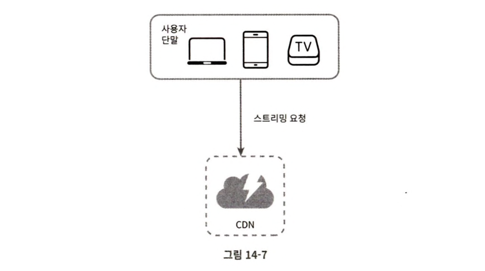

### 3단계: 상세 설계
* 비디오 업로드, 비디오 스트리밍 의 최적화 방안과 오류 처리 메커니즘

#### 비디오 트랜스코딩
* 비트레이트 : 비디오를 구성하는 비트가 얼마나 빨리 처리되어야 하는지를 나타내는 단위
    * 비트레이트가 높을 때 : 고화질 비디오 -> 높은 성능의 컴퓨팅 파워와 빠른 인터넷 속도가 필요함.
* 비디오 트랜스코딩이 중요한 이유
    * 가공되지 않은 원본 비디오는 저장 공간을 많이 차지함.
    * 호환성 문제를 해결하려면 하나의 비디오를 여러 포맷으로 인코딩해 두는 것이 바람직함.
    * 사용자에게 끊김 없는 고화질 비디오 재생을 보장하기 위해 네트워크 대역폭이 충분하지 않은 사용자에게는 저화질 비디오를, 대역폭이 충분한 사용자에게는 고화질 비디오를 보내는 것이 바람직함.
    * 비디오가 끊김 없이 재생되도록 하기 위해서는 비디오 화질을 자동으로 변경하거나 수동으로 변경할 수 있도록 하는 것이 바람직함.
* 인코딩 포맷의 구성
    * 컨테이너 : 비디오 파일, 오디오, 메타데이터를 담는 바구니 같은 것
    * 코덱(codec) : 비디오 화질은 보존하면서 파일 크기를 줄일 목적으로 고안된 압축 및 압축 해제 알고리즘(ex. H.264, VP9, HEVC)

#### 유향 비순환 그래프(DAG) 모델
* 비디오를 트랜스코딩하는 것은 컴퓨팅 자원을 많이 소모할 뿐 아니라 시간도 많이 드는 작업임.
* 각기 다른 유형의 비디오 프로세싱 파이프라인을 지원하는 한편 처리 과정의 병렬성을 높이기 위해서 적절한 수준의 추상화를 도입하여 클라이언트 프로그래머로 하여금 실행할 작업을 손수 정의할 수 있도록 해야함.
    * ex. 페이스북의 스트리밍 비디오 엔진 : 유향 비순환 그래프(DAG: Directed Acyclic Graph) 프로그래밍 모델 도입 => 작업을 단계별로 배열할 수 있도록 하여 해당 작업들이 순차적으로 또는 병렬적으로 실행될 수 있도록 한다.
* 장점 : 유연성, 병렬성
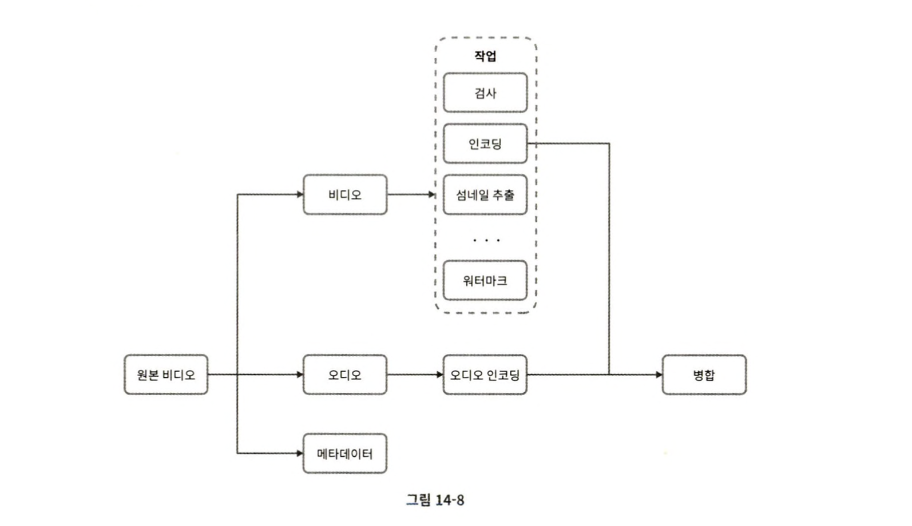
* 원본 비디오 : 비디오, 오디오, 메타데이터
* 비디오
    - 검사 : 품질, 손상도 확인
    - 비디오 인코딩 : 비디오를 다양한 해상도, 코덱, 비트레이트 조합으로 인코딩하는 작업
    - 섬네일 : 업로드한 이미지나 비디오에서 자동 추출된 이미지로 섬네일 지정
    - 워터마크 : 비디오에 대한 식별정보를 이미지 위에 오버레이 형태로 띄워 표시하는 작업

#### 비디오 트랜스코딩 아키텍쳐
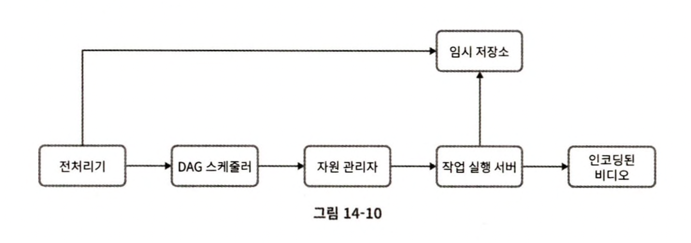
* **전처리기**
    1. 비디오 분할 : 비디오 스트림을 GOP의 단위로 쪼갬
        > GOP(Group Of Pictures) : 특정 순서로 배열된 프레임 그룹
    2. DAG 생성 : 클라이언트 프로그래머가 작성한 설정 파일에 따라 DAG 만들어내기
    3. 데이터 캐시 : 전처리기는 분할된 비디오의 캐시이기도 함. 안정성을 높이기 위해 전처리기는 GOP와 메타데이터를 임시 저장소에 보관함. 비디오 인코딩 실패시 시스템은 이렇게 보관괸 데이터를 활용해 인코딩을 재개함.
* **DAG 스케줄러**
    * DAG 스케줄러는 DAG 그래프를 몇 개 단계로 분할한 다음에 그 각각을 자원 관리자의 작업 큐에 집어넣음.
    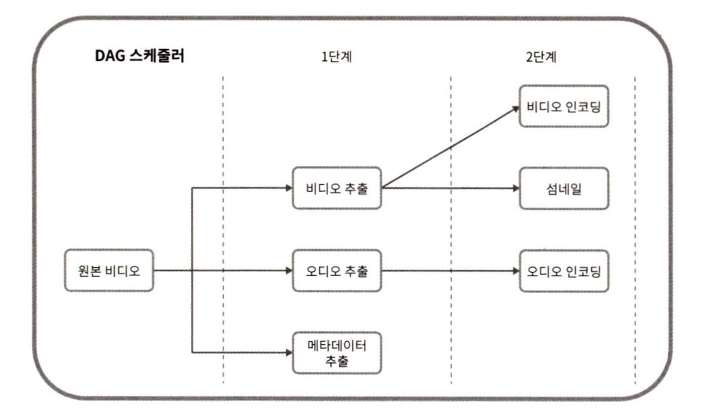
    * 하나의 DAG 그래프를 2개 작업 단개로 쪼갠 사례례
* **자원 관리자**
    * 자원 관리자 : 자원 배분을 효과적으로 수행하는 역할
        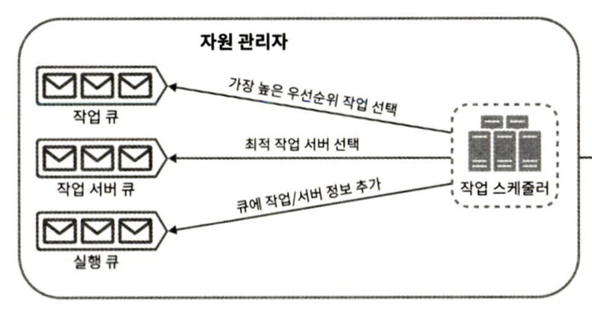
        * 작업 큐 : 실핼할 작업이 보관되어 있는 우선순위 큐
        * 작업 서버 큐 : 작업 서버의 가용 상태 정보가 보관되어 있는 우선순위 큐
        * 실행 큐 : 현재 실행중인 작업 및 자겅ㅂ 서버 정보가 보관되어 있는 큐
        * 작업 스케줄러 : 최적의 작업/서버 조합을 골라, 해당 작업 서버가 작업을 수행하도록 지시하는 역할
    * 작업 관리자의 동작 : 작업 큐에서 우선순위 작업 꺼내기 -> 작업을 위한 작업 서버 선택 -> 스케줄러가 작업 실행을 지시 -> 스케줄러가 해당 작업이 어떤 서버에 할당되었는지에 대한 정보를 실행 큐에 넣음 -> 스케줄러는 작업이 완료되면 해당 작업을 실행 큐에서 제거함.
* **작업 실행 서버**
    * 작업 서버는 DAG에 정의된 작업을 수행함.
    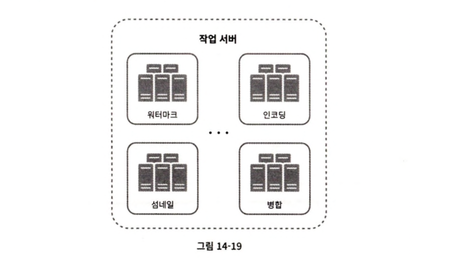
    * 작업 종류에 따라 작업 서버도 구분하여 관리함
* **임시 저장소**
    * 임시 저장소 구현에는 여러 저장소 시스템을 활용할 수 있음. (저장할 데이터의 유형, 크기, 이용 빈도, 데이터 유효기간 등 고려)
    * ex. 메타데이터는 자주 참조되며 크기도 작아 메모리에 캐시, 비디오/오디오 데이터는 BLOB 저장소
    * 임시 저장소에 보관된 데이터는 비디오 프로세싱이 완료되면 삭제함.
* **인코딩된 비디오**
    * 인코딩된 비디오 : 인코딩 파이프라인의 최종 결과물(ex. funny_720p.mp4)

#### 시스템 최적화
* 속도, 안정성, 비용 측면에서의 최적화

* **속도 최적화 : 비디오 병렬 업로드**
    * 비디오 전부를 업로드 한번에 올리는 것이 아닌, 작은 GOP들로 분할하여 병렬적으로 업로드 
* **속도 최적화 : 업로드 센터를 사용자 근거리에 지정**
    * 업로드 센터를 여러 곳에 두기 위해 CDN을 업로드 센터로 이용한다
* **속도 최적화 : 모든 절차를 병렬화**
    * 느슨하게 결합괸 시스템을 만들어서 병렬성을 높이기.
    * 시스템의 결합도를 낮추기 위해 MQ 도입.
        * MQ를 도입 전 : 인코딩 모듈은 다운로드 모듈의 작업이 끝나기를 기다려야 함.
        * MQ 도입 후 : MQ에 보관된 이벤트 각각을 인코딩 모듈은 병렬적으로 처리할 수 있게 되어, 기다릴 필요가 없어짐
        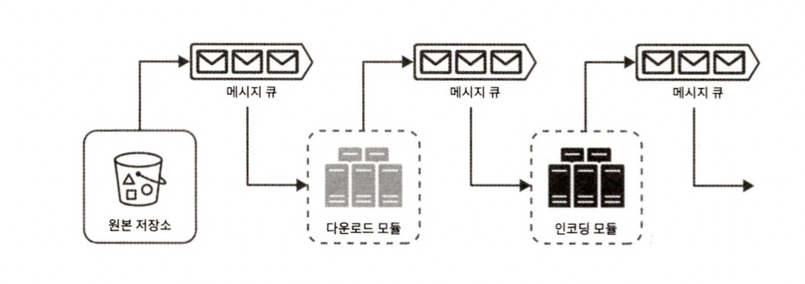

* **안정성 최적화 : 미리 사인된 업로드 URL**    
    * 허가받은 사용자만이 올바른 장소에 비디오를 업로드할 수 있도록 하기 위해, 미리 사인된 업로드 URL 이용하기
    * 업로드 절차 : 클라이언트는 HTTP 서버에 POST 요청을 하여 미리 사인된 URL 받기 -> API 서버가 미리 사인된 URL을 돌려줌 -> 클라이언트가 그 URL이 가리키는 위치에 비디오를 업로드 한다.
* **안정성 최적화 : 비디오 보호**    
    * 비디오의 원본을 도난당하면 안됨!
    * 비디오의 저작권 지키기
        * 디지털 저작권 관리(DRM : Digital Rights Management) 시스템 도입
        * AES 암호화 : 비디오를 암호화하고 접근 권한을 설정하는 방식. 암호화된 비디오는 재생 시에만 복호화됨. 허락된 사용자만 암호화된 비디오를 시청할 수 있음
        * 워터마크 : 비디오 위에 소유자 정보를 포함하는 이미지 오버레이를 올리는 것. 

* **비용 최적화**    
    * CDN은 위의 시스템의 핵심부분이지만 비싸다. 
    * 비용을 낮출 수 있는 방법
        * 대전제 : 유튜브는 롱테일 분포를 따라 인기있는 비디오는 빈번히 재생되지만, 나머지는 거의 재생되지 않음.
        * 인기 비디오는 CDN을 통해 재생하되 다른 비디오는 비디오 서버를 통해 재생하기
        * 인기가 별로 없는 비디오는 인코딩 할 필요가 없을 수도 있음. 짧은 비디오라면 필요할 때 인코딩해서 재생할 수 있음.
        * 어떤 비디오는 특정 지역에서만 인기가 높아 이런 비디오는 다른 지역에 옮길 필요가 없음.
        * CDN을 직접 구축하고 인터넷 서비스 제공자와 제휴한다

#### 오류 처리
* 장애를 잘 감내하는 시스템을 만드려면 오류를 빠르게 처리하고 회복시켜야 한다
* 시스템 오류 2가지 & 회복 방법법
    * 회복 가능 오류 : 재시도. 하지만 계속해서 실패하여 복구가 어렵다고 판단되면 클라이언트에게 적절한 오류 코드를 반환하기. (ex. 특정 비디오 세그먼트를 트랜스코딩하다 실패)
    * 회복 불가능 오류 : 시스템은 해당 비디오에 대한 작업을 중단하고 클라이언트에게 적절한 오류 코드를 반환하기 (ex. 비디오 포맷이 잘못됨)
* 시스템 컴포넌트 각각에 발생할 수 이쓴ㄴ 오류에 대한 전형적 해결 방법
    * 업로드 오류 : 재시도
    * 비디오 분할 오류 : 전체 비디오를 서버로 전송하고 서버가 해당 비디오 분할을 처리하도록 함.
    * 트랜스코딩 오류 : 재시도
    * 전처리 오류 : DAG 그래프를 재생성
    * DAG 스케줄러 오류 : 작업을 다시 스케줄링
    * 자원 관리자 큐에 장애 발생 : 사본을 이용
    * 작업 서버 장애 : 다른 서버에서 해당 작업을 재시도
    * API 서버 장애 : API 서버는 무상태 서버이므로 신규 요청은 다른 API 서버로 우회
    * 메타데이터 캐시 서버 장애 : 데이터는 다중화되어 있으므로 다른 노드에서 데이터를 여전히 가져올 수 있음. 장애난 캐시 서버는 새로운 것으로 교채
    * 메타데이터 데이터베이스 서버 장애 : 
        * 주 서버가 죽었다면 부 서버 가운데 하나를 주 서버로 교체
        * 부 서버가 죽었다면 다른 부 서버를 통해 읽기 연산을 처리하고 죽은 서버는 새것으로 교체

### 4단계: 마무리
* 추가 논의점
    * API 계층의 규모 확장성 확보 방안 : API 서버는 무상태 서버이므로 수평적 규모 확장이 가능하다는 사실 언급
    * 데이터베이스 계층의 규모 확장성 확보 방안 : DB의 다중화와 샤딩 방법 언급
    * 라이브 스트리밍 : 비디오를 실시간으로 녹화하고 방송하는 절차로, 
        * 응답지연이 좀 더 낮아야 함. 따라서 스트리밍 프로토콜 선정에 유의해야 함.
        * 작은 단위의 데이터를 실시간으로 빨리 처리해야 해서 병렬화 필요성이 떨어진다. 
        * 오류 처리 방법을 달리해야 한다. 너무 많은 시간이 걸리는 방안은 사용하기 어렵다.
    * 비디오 삭제 : 문제가 있는 비디오는 내려야 한다. 내릴 비디오는 업로드 과정에서 식별해 낼 수도 있지만, 사용자의 신고 절차를 통해 판별할 수 있다.