## 15. 구글 드라이브 설계
* 구글 드라이브 : 파일 저장 및 동기화 서비스로 문서, 사진, 비디오, 기타 파일을 클라우드에 보관할 수 있도록 함. 또한 이 파일은 컴퓨터, 스마트폰, 태블릿 등 어떤 단말에서도 이용 가능해야 하며 보관된 파일은 친구, 가족, 동료 들과 손쉽게 공유할 수 있어야 함.

### 1단계: 문제 이해 및 설계 범위 확정
* 설계 범위
    * 가장 중요하게 지원해야 할 기능들 : 파일 업로드/다운로드, 파일 동기화, 알림
    * 모바일 앱, 웹 지원? : 둘 다 지원하기
    * 파일은 암호화? : yes
    * 파일 크기에 제한이 있는지? : 10GB 제한
    * 사용자 수는? : DAU(일간 능동 사용자) 기준으로 천만명
* 주요사항
    * 파일 추가. drop-down
    * 파일 다운로드
    * 여러 단말에 파일 동기화. 한 단말에서 파일을 추가하면 다른 단말에도 자동으로 동기화되기
    * 파일 갱신 이력 조회
    * 파일 공유
    * 파일이 편집되거나 삭제되거나 새롭게 공유되었을 때 알림 표시
* 제외 사항 : 구글 문서 편집 및 협업 기능
* 비-기능적 요구사항
    * 안정성 : 데이터 손실이 없는 저장소 시스템에서의 안정성
    * 빠른 동기화 속도 : 파일 동기화에 시간이 너무 많이 걸리면 사용자는 인내심을 잃고 해당 제품을 더 이상 사용하지 않게 될 것임
    * 네트워크 대역폭 : 불필요한 네트워크 대역폭을 많이 사용하진 x
    * 규모 확장성 : 많은 양의 트래픽도 처리 가능해야 함.
    * 높은 가용성 : 일부 서버에 장애가 발생하거나, 느려지거나, 네트워크 일부가 끊겨도 시스템은 계속 사용 가능해야 함.

#### 개략적 추정치
* 가입 사용자는 5000만명이고 1000만명의 DAU가 있다고 가정
* 모든 사용자에 10GB의 무료 저장공간 할당
* 매일 각 사용자가 평균 2개의 파일을 업로드한다고 가정. 각 파일의 평균 크기는 500KB
* 읽기:쓰기 = 1:1
* 필요한 저장공간 총량 = 5000만 사용자 X 10GB = 500페타바이트  
* 업로드 API QPS = 1000만 사용자 X 2회 업로드 / 24시간 / 3600 초 = 약 240
* 최대 QPS = QPS X 2 = 480

### 2단계: 개략적 설계안 제시 및 동의 구하기
* 모든 것을 담은 한 대 서버 -> 점진적으로 첨만 사용자 지원이 가능한 시스템으로 발전시켜 나가기
* 한 대의 서버의 구성
    * 파일 업로드/다운로드 처리의 웹 서버
    * 메타데이터를 보관할 DB
    * 파일을 저장할 저장소 시스템.
    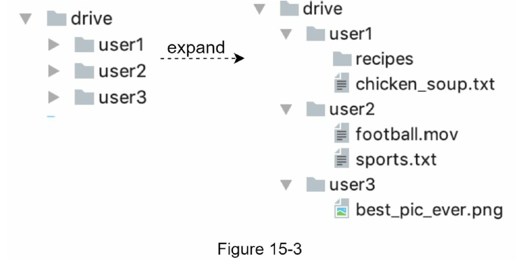

#### API 
* **1. 파일 업로드 API**
    * 단순 업로드 : 파일 크기가 작을 때 사용
    * 이어 올리기 : 파일 사이즈가 크고 네트워크 문제로 업로드가 중단될 가능성이 높다고 생각되면 사용
        * ex. https://api.example.com/files/upload?uploadType=resumable
        * params : uploadType=resumable , data=업로드할 로컬 파일
        * 3단계 절차
            1. 이어 올리기 URL을 받기 위한 최조 요청 전송
            2. 데이터를 업로드하고 업로드 상태 모니터링
            3. 업로드에 장애가 발생하면 장애 발생시점부터 업로드를 재시작

* **2. 파일 다운로드 API**
    * ex. https://api.example.com/files/download
    * params : path:다운로드할 파일의 경로
        * ex. {"path": "/recipes/soup/best_soup.txt"}

* **3. 파일 갱신/히스토리 API**
    * ex. https://api.example.com/files/list_revisions
    * params : path:갱신 히스토리를 가져올 파일의 경로, limit:히스토리 길이의 최대치
        * ex. {"path": "/recipes/soup/best_soup.txt", "limit":20}

* 사용자 인증 필요.
* HTTPS 프로토콜 사용 : SSL 를 지원하는 프로토콜의 사용 이유 - 클라이언트와 백엔드 서버가 주고받는 데이터를 보호하기 위함.

#### 한 대 서버의 제약 극복
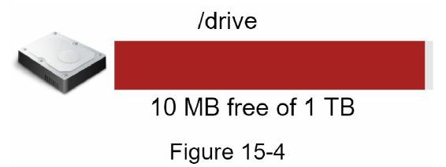
* 업로드되는 파일이 많아지다 보면 결국 파일 시스템은 가득 차게 됨.
* 위의 해결 방법 : 
    * 데이터를 샤딩하여 여러 서버에 나누어 저장하기
        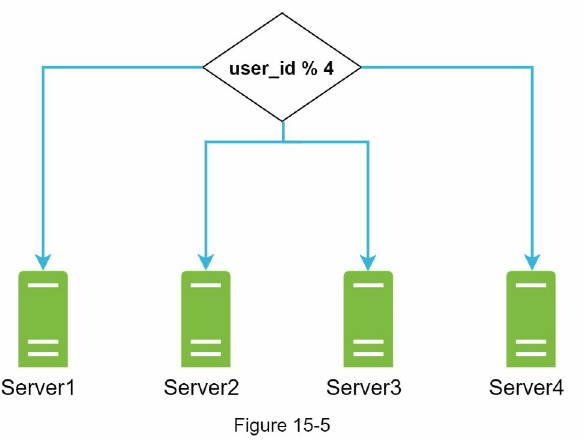
    * 아마존 S3(Simple Storage Service)를 사용 - 규모 확장성, 가용성, 보안, 성능을 제공하는 객체 저장소 서비스 
        * 다중화 지원(같은 지역 안, 여러 지역에 걸쳐) - 데이터 손실을 막고 가용성을 최대한 보장할 수 있음
        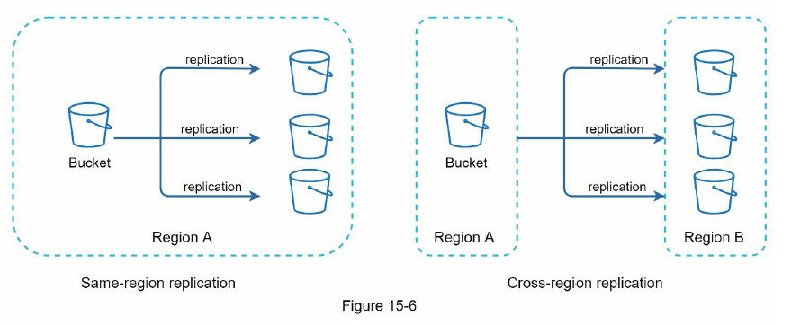

* 로드밸런서 : 네트워크 트래픽을 분산할 수 O, 특정 웹 서버에 장애가 발생하면 자동으로 해당 서버를 우회함
* 웹서버 : LB를 추가하고 나면 더 많은 웹 서버를 손쉽게 추가할 수 있음 -> 따라서, 트래픽이 폭증해도 쉽게 대응이 가능함.
* 메타데이터 DB : DB를 파일 저장 서버에서 분리하여 SPOF를 회피함. 아울러 다중화 및 샤딩 정책을 적용하여 가용성과 규모 확장성 요구사항에 대응하기
* 파일 저장소 : S3을 파일 저장소로 사용하고 가용성과 데이터 무손실을 보장하기 위해 2개 이상의 지역에 데이터를 다중화함.

#### 동기화 충돌
* 동기화 충돌 : 2명 이상의 사용자가 같은 파일이나 폴더를 동시에 업데이트하려고 하는 경우
* 전략: 먼저 처리되는 변경은 성공한 것으로 보고, 나중에 처리되는 변경은 충돌이 발생한 것으로 표시함
    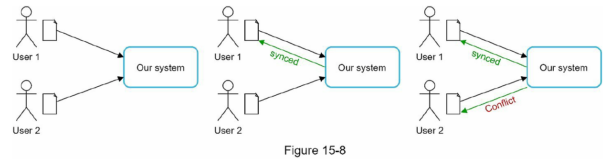
* 동기화 충돌 오류 발생 시 오류의 해결 방법 : 오류가 발생한 시점에 이 시스템에는 같은 파일의 2가지 버전이 존재하게 됨. (사용자2가 가지고 있는 로컬 사본과 서버에 있는 최신 버전) 이 2파일을 합칠지 대체할 지 결정해야 함.

#### 개략적 설계안
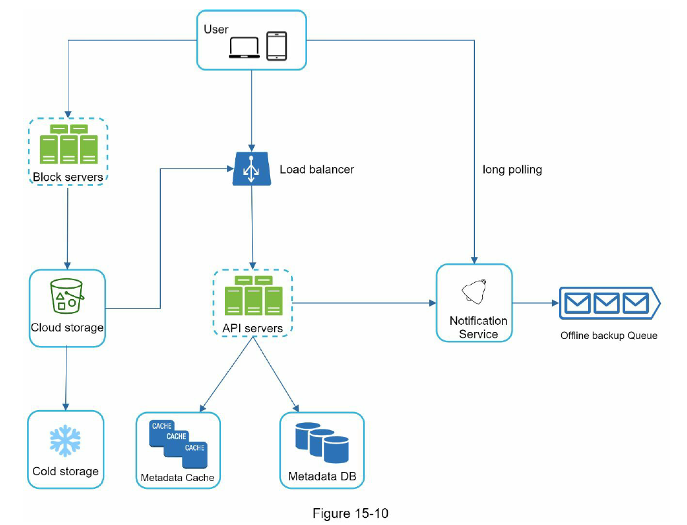
* 블록 저장소 서버(block servers)(= 블로 수준 저장소) : 파일 블록을 클라우드 저장소에 업로드하는 서버. 클라우드 환경에서 데이터 파일을 저장하는 기술
    * 이 저장소는 파일을 여러 개의 블로으로 나눠 저장하며, 각 블록에는 고유한 해시값이 할당됨.
    * 이 해시갑은 메타데이터 DB에 저장됨.
    * 각 블록은 독립적인 객체로 취급되며 클라우드 저장소 시스템(S3)에 보관됨.
    * 파일을 재구성하려면 블록들을 원래 순서대로 합쳐야 함.
* 클라우드 저장소 : 파일은 블록 단위로 나눠져 클라우드 저장소에 보관됨.
* 아카이빙 저장소(cold storage) : 오랫동안 사용되지 않은 비활성 데이터를 저장하기 위한 컴퓨터 시스템
* API 서버 : 파일 업로드 외 거의 모든 것을 담당하는 서버 (사용자 인증, 사용자 프로파일 관리, 파일 메타데이터 갱신)
* 메타데이터 DB : 사용자, 파일, 블록, 버전 등의 메타데이터 정보를 관리함. 실제 파일은 클라우드에 보관하며, 이 DB에는 오직 메타데이터만 둔다
* 메타데이터 캐시 : 성능을 높이기 위해 자주 쓰이는 메타데이터는 캐시함.
* 알림 서비스 : 특정 이벤트가 발생했음을 클라이언트에게 알리는데 쓰이는 발생/구독 프로토콜 기반 시스템 (클라이언트에게 파일이 추가되었거나, 편집되었거나, 삭제되었을을 알려 파일의 최신 상태를 확인하도록 하는데 쓰임)
* 오프라인 사용자 백업 큐 : 클라이언트가 접속 중이 아니라서 파일의 최신 상태를 확인할 수 없을 떄는 해당 정보를 이 큐에 두어 나중에 클라이언트가 접속했을 때 동기화 될 수 있도록 함.

### 3단계: 상세 설계
* 블록 저장소 서버
* 메타데이터 DB
* 업로드 절차
* 다운로드 절차
* 알림 서비스
* 파일 저장소 공간 및 장애 처리 흐름

#### 블록 저장소 서버
* 전체 파일을 서버로 보내면 네트워크 대역폭을 많이 잡아먹게 되어 이를 최적화 하는 방법
    * 델타 동기화 : 파일이 수정되면 전체 파일 대신 수정이 일어난 블록만 동기화하기
    * 압축 : 블록 단위로 압축해두면 데이터 크기를 많이 줄일 수 있음. 압축 알고리즘 사용
        * ex. 텍스트 : gzip, bzip2  | 이미지,비디오 : 다른 압축 알고리즘 사용
* 블록 저장소 서버는 파일 업로드에 관계된 힘든 일을 처리하는 컴포넌트.
* 역할 : 클라이언트가 보낸 파일을 블록 단위로 나눠야 하고, 각 블록에 압축 알고리즘을 적용해야 하고, 암호화까지 해야하며, 아울러 전체 파일을 저장소 시스템으로 보내는 대신 수정된 블록만 전송해야 함.
* 새 파일이 추가되었을 때 블록 저장소 서버의 동작 방법
    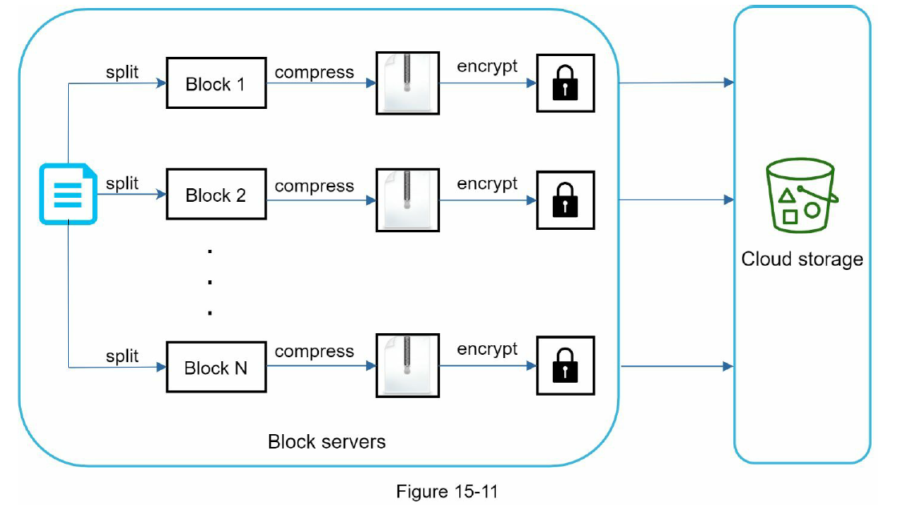
    1. 주어진 파일을 작은 블록들로 분할
    2. 각 블록을 압축
    3. 클라우드 저장소로 보내기 전 암호화 진행
    4. 클라우드 저장소로 전송
* 델타 동기화 전략 : 갱신된 부분만 동기화
    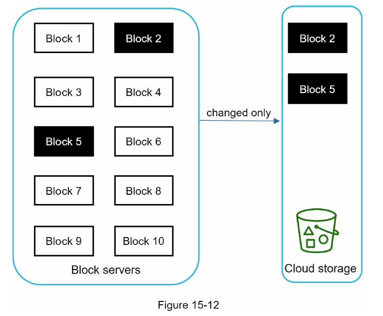
    => 네트워크 대역폭 사용량을 절감할 수 있음.

#### 높은 일관성 요구사항
* 강한 일관성 모델을 지원해야 함 : 같은 파일이 단말이나 사용자에 따라 다르게 보니는 것은 허용할 수 없다는 뜻 (메타데이터 캐시와 DB계층에도 같은 원칙이 적용되기)
* 메모리 캐시는 보통 최종 일관성 모델을 지원함
    * 캐시에 보관된 사본과 DB에 있는 원본이 일치함.
    * DB에 보관된 원본에 변경 발생 시 캐시에 있는 사본을 무효화함.
* 관계형 DB는 ACID를 보장하므로 강한 일관성을 보장하기 쉽다. But, NoSQL DB는 이를 기본으로 지원하지 않으므로 동기화 로직 안에 프로그램해 넣어야 함.

#### 메타데이터 데이터베이스
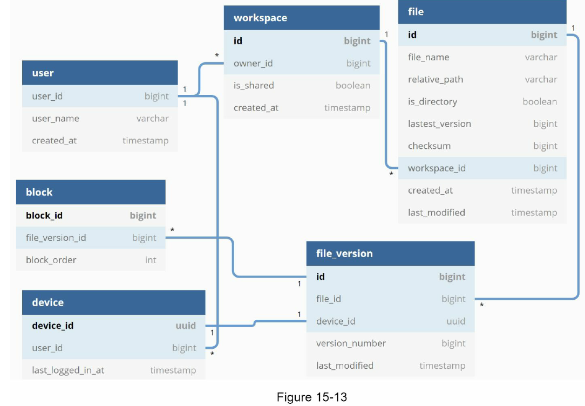
* user : 사용자에 관계된 기본적 정보들
* device : 단말정보. push_id는 모바일 푸시 알림을 보내고 받기 위한 것(1명이 여러대의 단말을 가질 수 있음)
* namespace : 사용자의 루트 디렉터리 정보가 보관됨
* file : 파일의 최신 정보가 보관됨
* file_version : 파일의 갱신 이력이 보관되는 테이블. 읽기 전용
* block : 파일 블록에 대한 정보를 보관하는 테이블. 특정 버전의 파일은 파일 블록을 올바른 순서로 조합하기만 하면 복원해 낼 수 있음

#### 업로드 절차
* 2개의 요청이 병렬적으로 전송될 때 (파일 업로드 시 상황)
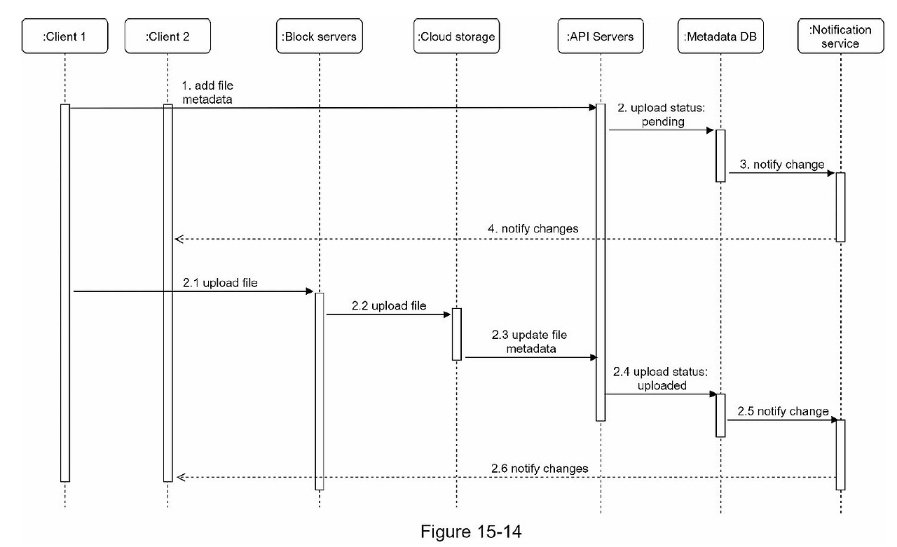
* 파일 메타데이터 추가
    1. 클라이언트1이 새 파일의 메타데이터를 추가하기 위한 요청 전송
    2. 새 파일의 메타데이터를 DB에 저장하소 업로드 상태를 대기중으로 변경
    3. 새 파일이 추가되었음을 알림 서비스에 통지
    4. 알림 서비스는 관련된 클라이언트(클라이언트2)에게 파일이 업로드되고 있음을 알림
* 파일을 클라우드 저장소에 업로드
    * 2.1. 클라이언트 1이 파일을 블록 저장소 서버에 업로드
    * 2.2. 블록 저장소 서버는 파일을 블록 단위로 쪼갠 다음 압축하고 암호화 한 다음에 클라우드 저장소에 전송
    * 2.3. 업로드가 끝나면 클라우드 스토리지는 완료 콜백을 호축. 이 콜백 호출은 API 서버로 전송됨
    * 2.4. 메타데이터 DB에 기록된 해당 파일의 상태를 완료로 변경
    * 2.5. 알림 서비스에 파일 업로드가 끝났음을 통지
    * 2.6. 알림 서비스는 관련된 클라이언트(클라이언트2)에게 파일 업로드가 끝났음을 알림

#### 다운로드 절차
* 파일 다운로드는 파일이 새로 추가되거나 편집되면 자동으로 시작됨
* 다른 클라이언트가 파일을 편집하거나 추가했다는 사실을 감지하는 방법
    * 클라이언트 A가 접속 중이고 다른 클라이언트가 파일을 변경하면 알림 서비스가 클라이언트 A에게 변경이 발생했으니 새 버전을 끌어가야 한다고 알림
    * 클라이언트 A가 네트워크에 연결된 상태가 아닐 경우에는 데이터는 캐시에 보관될 것임. 해당 클라이언트의 상태가 접속 중으로 바뀌면 그 때 해당 클라이언트는 새 버전을 가져가기
* 어떤 파일이 변경되었음을 감지한 클라이언트는 우선 API 서ㅏ버를 통해 메타데이터를 새로 가져가야 하고, 그 다음에 블록들을 다운받아 파일을 재구성해야 함.
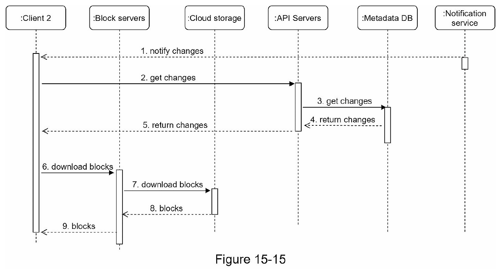
1. 알릶 서비스가 클라이언트 2에게 누군가 파일을 변경했음을 알림
2. 알림을 확인한 클라이언트 2는 새로운 메타데이터를 요청
3. API 서버는 메타데이터 DB에게 새 메타데이터 요청
4. API 서버에게 새 메타데이터가 반환됨
5. 클라이언트2 에게 새 메타데이터가 반환됨
6. 클라이언트2는 새 메타데이터를 받는 즉시 블록 다운로드 요청 전송
7. 블록 저장소 서버는 클라우드 저장소에서 블록 다운로드
8. 클랄우드 저장소는 블록 서버에 요청된 블록 반환
9. 블록 저장소 서버는 클라이언트에게 요청된 블록 반환. 클라이언트2는 전송된 블록을 사용하여 파일 재구성

#### 알림 서비스
* 목적 : 파일의 일관성 유지를 위해, 클라이언트는 로컬에서 파일이 수정되었음을 감지하는 순간 다른 클라이언트에게 그 사실을 알려 충돌 가능성을 줄여야 함
* 사용방법
    * 롱 폴링 : dropbox가 채택 중
    * 웹소켓 : 클라이언트와 서버 사이에 지속적인 통신 채널을 제공하여 양방향 통신이 가능함
* 롱 폴링 사용이유
    * 양방향 통신이 필요하지 X
    * 웹소켓은 실시간 양방향 통신이 요구되는 채팅 같은 응용에 적합하다. 구글 드라이브의 경우 알림을 보낼 일은 그렇게 자주 발생하지 않으며, 알림을 보내야 하는 경우에도 단시간에 많은 양의 데이터를 보낼일은 없다
* 롱 폴링 동작 방법 : 
    1. 각 클라이언트는 알림 서버와 롱 폴링용 연결을 유지하다가 특정 파일에 대한 변경을 감지하면 해당 연결을 끊음. 
    2. 이 때 클라이언트는 반드시 메타데이터 서버와 연결해 파일의 최신 내역을 다운로드해야함. 
    3. 해당 다운로드 작업이 끝났거나 연결 타임아웃 시간에 도달한 경우에는 즉시 새요청을 보내어 롱 폴링 연결을 복원하고 유지하기

#### 저장소 공간 절약
* 파일의 여러 버전을 여러 데이터 센터에 보관하기 : 파일 갱신 이력을 보존하고 안정성을 보장하기 위해
* 비용 절감 방법
    * 중복 제거 : 중복된 파일 블록을 해시값을 비교해 계정 차원에서 제거.
    * 지능적 백업 전략 도입
        * 한도 설정 : 보관해야 하는 파일 버전 개수에 상한을 두는 것
        * 중요한 버전만 보관
    * 자주 쓰이지 않는 데이터는 아카이빙 저장소로 옮긴다. (ex. AWS S3 글래시어)

#### 장애 처리
* 로드밸런서 장애 : 로드밸런서에 장애가 발생할 경우 부 로드밸런서가 활성화되어 트래픽을 이어받아야 함. 로드밸런서끼리는 보통 박동 신호를 주기적으로 보내 상태를 모니터링함
* 블록 저장소 서버 장애 : 블록 저장소 서버에 장애 발생 시 다른 서버가 미완료 상태 또는 대기 상태인 작업을 이어받아야 함.
* 클라우드 저장소 장애: S3 버킷은 여러 지역에 다중화할 수 있으므로, 한 지역에서 장애가 발생 시 다른 지역에서 가져오기
* API 서버 장애 : API 서버는 무상태 서버라서, 로드밸런서는 장애가 난 API 서버로 트래픽을 보내지 않음으로써 장애 서버를 격리
* 메타데이터 캐시 장애 : 메타데이터 캐시 서버도 다중화함. 따라서 한 노드에 장애가 생겨도 다른 노드에서 데이터를 가져올 수 있음. (장애가 발생한 서버는 새 서버로 교체)
* 메타데이터 DB 장애
    * 주 DB 서버 장애 : 부 DB 서버 가운데 하나를 주 DB 서버로 바꾸고, 부 DB 서버를 새로 하나 추가함.
    * 부 DB 서버 장애 : 다른 부 DB 서버가 읽기 연산을 처리하도록 하고 그동안 장애 서버는 새 것으로 교체하기
* 알림 서비스 장애 : 접속 중인 모든 사용자는 알림 서버와 롱 폴링 연결을 하나씩 유지한다. 따라서 알림 서비스는 많은 사용자와의 연결을 유지하고 관리해야 한다. 만약 한 대가 100만개의 연결을 하고 있다면 그 서버에 장애 발생 시 100만명의 사용자의 롱 폴링 연결을 다시 만들어야 함.
    * 주의점 : 한 대 서버로 100만개의 접속을 유지하는 것은 가능하지만, 동시에 100만개의 접속을 '시작'하는 것은 불가능 => 즉, 롱 폴링 연결을 복구하는 것은 상대적으로 느릴 수 있음
* 오프라인 사용자 백업 큐 장애 : 이 큐 또한 다중화해두기. 큐에 장애가 발생하면 구독중인 클라이언트들은 백업 큐로 구독 관계를 재설정해야 한다

### 4단계: 마무리
* 높은 수준의 일관성, 낮은 네트워크 지연, 빠른 동기화
* 크게 2가지 부분 : 파일의 메타데이터를 관리, 파일 동기화를 처리
* 알림서비스로 롱 폴링을 사용해 클라이언트로 하여금 파일 상태를 최신으로 유지함
* 추가 논의점
    * 블록 저장소 서버를 거치지 않고 파일을 클라우드 저장소에 직접 업로드 한다면?
        * 장점 : 파일 전송을 클라우드 저장소로 직접하면 돼서 업로드 시간이 빨라짐
        * 단점 : 
            * 분할, 압축, 암호화 로직을 클라이언트 안에 두어야 해서 플랫폼별로 따로 구현해야 함.
            * 클라이언트가 해킹 당할 가능성이 있어 암호화 로직을 클라이언트 안에 두는 것은 적절치 않다
    * 접속상태를 관리하는 로직을 별도 서비스로 옮기는 것